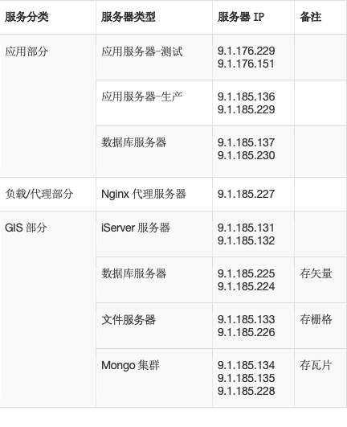

# 概述
为更好的提供稳定、安全持续的防灾防损服务,安心防平台采用服务化架构开发,应用平台及相关中间件均采用高可用方案部署,应用部署升级可做到不停机,无感知.平台整体部署架构如下:
	


具体机器分配如下表:



# 环境准备
平台功能定位于面向公司理赔条线内部用户，提供现场风险查勘资料的在线采集和上传,客户风险档案数字化存储、分析、展示功能,从技术角度主要使用SupperMap国产GIS平台,Postgresql+PostGIS数据中间件和基于J2EE的应用服务平台,下面将分别介绍相关平台的环境准备:

##  SupperMap部署
超图产品部署详见超图产品官网: http://support.supermap.com.cn/product/zhidao.aspx?PRODUCT_TYPE=1#pro_name
## Postgresql+PostGIS 数据库部署
### 前提准备

更新安装包

``` sh?linenums
yum clean all && yum makecache && yum update -y
```
同步时间 （避免某些证书过期）
```sh?linenums
date -s "2020-03-03 10:00:20" && clock -w
yum install ntp -y
ntpdate -u 0.centos.pool.ntp.org
```
###  创建postgres用户
```sh?linenums
groupadd postgres
useradd -g postgres postgres
```
###  安装

> 可参加 [postgresql官网](https://www.postgresql.org/download/linux/redhat/)安装说明。


##### install the repository RPM

```sh?linenums
yum install https://download.postgresql.org/pub/repos/yum/reporpms/EL-7-x86_64/pgdg-redhat-repo-latest.noarch.rpm -y
//或
yum install http://download.postgresql.org/pub/repos/yum/reporpms/EL-7-x86_64/pgdg-redhat-repo-latest.noarch.rpm -y
```

##### Install the client packages

```sh?linenums
yum install postgresql12 -y
```

##### Optionally install the server packages

```sh?linenums
yum install postgresql12-server -y
```

##### 部分工具、开发包

```sh?linenums
yum install postgresql12-contrib -y

yum install postgresql12-devel -y
//或进一步安装
yum install postgresql12 postgresql12-server postgresql12-contrib postgresql12-devel -y
```

##### 初始化数据库
###### 路径问题

 1. 使用默认路径，适用于单节点
   

``` sh?linenums
/usr/pgsql-12/bin/postgresql-12-setup initdb
```

 2. 指定路径，适用于主从复制（本文默认）

``` sh?linenums
# 数据目录

mkdir -p /app/pgsql/data && chown postgres:postgres /app/pgsql/data

# 用于归档的目录（主从复制时用） 
mkdir -p /app/pgsql/pg_archive && chown postgres:postgres /app/pgsql/pg_archive cd /app/pgsql && chmod 700 data; cd /app/pgsql && chmod 700 pg_archive

su - postgres

/usr/pgsql-12/bin/initdb -D /app/pgsql/data/
```

 3. 修改数据库路径，以root身份

``` sh?linenums
vim /usr/lib/systemd/system/postgresql-12.service

# Location of database directory

Environment=PGDATA=/app/pgsql/data/

```
##### enable automatic start，以root身份
```sh?linenums
systemctl enable postgresql-12

systemctl start postgresql-12
```

##### 登录postgresql并设置密码，postgresql在安装时默认添加用户postgres

```sh?linenums
# su - postgres

psql

ALTER USER postgres WITH PASSWORD '123456';
\q
```
##### 允许远程登录
1）修改pg_hba.conf文件

```sh?linenums
# 默认路径时：

vi /var/lib/pgsql/12/data/pg_hba.conf

# 指定路径时：

vi /app/pgsql/data/pg_hba.conf

# IPv4 local connections:

host all all 0.0.0.0/0 md5


```
2） 修改postgresql.conf
```sh?linenums
# 默认路径时：

vi /var/lib/pgsql/12/data/postgresql.conf

#指定路径时：

vi /app/pgsql/data/postgresql.conf

listen_addresses = '*'
```
3）重启服务
```sh?linenums
systemctl restart postgresql-12

netstat -ltpn | grep 5432
```
4）防火墙
```sh?linenums
firewall-cmd --zone=public --add-port=5432/tcp --permanent

firewall-cmd --reload
```

##### 主服务器配置
1.添加用于pg同步的用户信息

```sh?linenums
su postgres
psql
# 创建具有复制流操作的用户：replica
CREATE ROLE replica login replication encrypted password '123456';
```
2.配置文件修改

```sh?linenums
vi /app/pgsql/data/postgresql.conf

# 新增或修改下列属性设置（使用命令“/”来查找，否则眼花）

listen_addresses = '*' # （修改）监听所有IP

max_connections = 100 # （修改）最大连接数，据说从机需要大于或等于该值


archive_mode = on # （修改）开启归档

archive_command = 'test ! -f /app/pgsql/pg_archive/%f && cp %p /app/pgsql/pg_archive/%f'

 
wal_level = replica # （添加）

wal_keep_segments = 16 # （修改）暂时还不知道设置为多大合适

wal_sender_timeout = 60s # （修改）

```
3.重启服务
```sh?linenums
systemctl restart postgresql-12
```
4.在从节点上验证访问
```sh?linenums
psql -h 192.168.100.103 -U postgres

# 如果发现不知道密码或密码不正确，修改postgres用户密码（数据库）
ALTER USER postgres WITH PASSWORD '你的密码';
```
##### 从服务器配置

1.停止服务
```sh?linenums
systemctl stop postgresql-12
```
2.切换用户（一定要）
```sh?linenums
su - postgres
```
3.清空数据文件夹（是这样的，没错）
```sh?linenums
rm -rf /app/pgsql/data/*

cd /app/pgsql/data
```
4.从主节点获取数据
```sh?linenums
# 使用replica用户，从主节点获取备份数据（这条命令建议照抄，有兴趣在深究内部参数）

pg_basebackup -h 192.168.100.103 -p 5432 -U replica -Fp -Xs -Pv -R -D /app/pgsql/data
```
5.编辑standby.signal文件（就在数据文件夹内，以此标识从节点，当从节点提升为主节点后会自动删除）
```sh?linenums
# 添加
standby_mode = 'on'
```
6.修改postgresql.conf文件
```sh?linenums
vi /app/pgsql/data/postgresql.conf

primary_conninfo = 'host=192.168.100.103 port=5432 user=replica password=123456'

recovery_target_timeline = latest # 默认

max_connections = 120 # 大于等于主节点，正式环境应当重新考虑此值的大小

hot_standby = on

max_standby_streaming_delay = 30s

wal_receiver_status_interval = 10s

hot_standby_feedback = on
```
7.重新启动从节点
```sh?linenums
systemctl start postgresql-12
```
##### 验证主从

1. 方法一：登录主节点数据库执行如下命令
  ```sh?linenums
  su postgres
  psql
  select client_addr,sync_state from pg_stat_replication;
  #结果如下：
  postgres=# select client_addr,sync_state from pg_stat_replication;
  client_addr | sync_state

---------------+------------

192.168.100.104 | async

(1 row)
#说明104服务器是从节点，在接收流，而且是异步流复制
 ```
2. 方法二：在主节点与从节点分别执行如下命令
 
 ```sh?linenums
 ps -ef | grep postgres

#可以看到主节点有wal receiver进程

postgres 2638 2606 0 17:12 ? 00:00:00 postgres: walsender replica 192.168.100.104(51504) streaming 0/7000660

#可以看到从节点有wal receiver进程

postgres 1960 1953 0 17:12 ? 00:00:02 postgres: walreceiver streaming 0/7000660

 ```
 ##### 主备切换（主库出现故障时）
 
 当主库出现故障时，我们需要将备库提升为主库进行读写操作。

0、在pg12之前我们一般使用2种方式：

1）pg_ctl 方式: 在备库主机执行 pg_ctl promote shell 脚本

2）触发器文件方式: 备库配置 recovery.conf 文件的 trigger_file 参数，之后在备库主机上创建触发器文件

 

1、pg12开始新增了一个pg_promote()函数，让我们可以通过SQL命令激活备库。

pg_promote()语法：

pg_promote(wait boolean DEFAULT true, wait_seconds integer DEFAULT 60)

两个参数：

wait: 表示是否等待备库的 promotion 完成或者 wait_seconds 秒之后返回成功，默认值为 true。

wait_seconds: 等待时间，单位秒，默认 60
2、切换举例：

1）主库操作：关闭主库，模拟主库故障：

systemctl stop postgresql-12

2）备库操作：激活备库：

su postgres

psql

select pg_promote(true,60);

 

4、验证：

/usr/pgsql-12/bin/pg_controldata /app/pgsql/data

主备库英文显示如下：

Database cluster state: in production

Database cluster state: in archive recovery

主备库中文显示如下：

数据库簇状态: 在运行中

数据库簇状态: 正在归档恢复

##### 原主库修复后降为备库
（其实大部分操作与建立备库时一样，只是修改几个IP地址）

1、新主库(104)：

```sh?linenums
# vi /app/pgsql/data/pg_hba.conf

host replication replica 192.168.100.103/32 trust

# systemctl restart postgresql-12
```
 2、新备库（103）：
 
 ```sh?linenums
 # systemctl stop postgresql-12

# su - postgres

# rm -rf /app/pgsql/data/*

# cd /app/pgsql/data

# pg_basebackup -h 192.168.100.104 -p 5432 -U replica -Fp -Xs -Pv -R -D /app/pgsql/data

# vi standby.signal

# 添加

standby_mode = 'on'


vi /app/pgsql/data/postgresql.conf

primary_conninfo = 'host=192.168.100.104 port=5432 user=replica password=123456'


# systemctl start postgresql-12
 ```
 
 ##### 再次将老主库切回主库
 
 1、当前备库：

> 停止服务
> 删除“/app/pgsql/data/standby.signal”文件
> 启动服务

2、当前主库：

> 停止服务
> 以“postgres”用户创建“/app/pgsql/data/standby.signal”文件，添加内容：standby_mode = 'on'
> 启动服务

# 应用启动及维护
平台应用为使用J2EE体系spring-boot技术栈开发的java应用,为方便维护和保障安全,使用配置外化和脚本化一键启动,同时在启动脚本使用javaagent机制集成pinpoint监控体系,具体过程如下:

## 应用配置
应用配置文件为~/fzpt/application.yml文件,配置内容完全满足spring-boot应用配置规范,具体配置项见下表:
### 应用服务器配置


### mybatis配置


### spring配置


### servlet配置


### 数据源配置


### 日志配置


### minio图片存储配置


### ROP协议配置


### 访问白名单及代理配置


### 内部系统配置


### 外部系统配置


## 应用启动/升级
1.打包
 项目使用spring-boot开发,采用maven进行打包,在源代码目录执行以下命令进行项目打包 :
1.mvn clean package -Dmaven.test.skip=true 
2.上传
 使用ftp工具将打包产生的jar包文件上传到应用服务${user.home}目录
3.启动
 执行服务器上启动脚本进行服务启动:
1.~/fzpt/start.sh 
**注意**: 两台应用服务器的启动需要保证有一台是运行状态,不然用户会有系统瞬间不可用的情况发生

## 日志查看
执行如下命令进行日志查看:
```sh?linenums
1.tail -1000f ~/logs/survey-assistant.log 
```
如需要查询日志中指定内容执行如下命令即可:
```sh?linenums
1.cat ~/logs/survey-assistant.log |grep 'keyword' -C 100 
```
# 数据初始化
风勘小助手生产环境上线时，需要对模板、人员的数据进行初始化，以下分别是对模板、人员的数据化的说明。

## 模板数据初始化
模板数据初始化，需要在应用上线后对模板数据进行导入，以下为模板数据初始化部分样例，详见数据初始化脚本中模板数据初始化部分。

## 人员数据初始化

人员数据初始化，需要在应用上线后对人员数据通过页面导入功能进行导入人员excel数据，详见数据初始化脚本中的人员数据初始化部分。