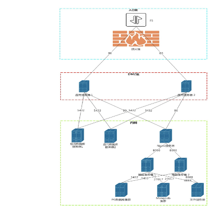

# 概述
为更好的提供稳定、安全持续的防灾防损服务,安心防平台采用服务化架构开发,应用平台及相关中间件均采用高可用方案部署,应用部署升级可做到不停机,无感知.平台整体部署架构如下:
	


具体机器分配如下表:


# 环境准备
平台功能定位于面向公司理赔条线内部用户，提供现场风险查勘资料的在线采集和上传,客户风险档案数字化存储、分析、展示功能,从技术角度主要使用SupperMap国产GIS平台,Postgresql+PostGIS数据中间件和基于J2EE的应用服务平台,下面将分别介绍相关平台的环境准备:

##  SupperMap部署
超图产品部署详见超图产品官网: http://support.supermap.com.cn/product/zhidao.aspx?PRODUCT_TYPE=1#pro_name
## Postgresql+PostGIS 数据库部署
### 前提准备

更新安装包

``` sh?linenums
yum clean all && yum makecache && yum update -y
```
同步时间 （避免某些证书过期）
```sh?linenums
date -s "2020-03-03 10:00:20" && clock -w
yum install ntp -y
ntpdate -u 0.centos.pool.ntp.org
```
###  创建postgres用户
```sh?linenums
groupadd postgres
useradd -g postgres postgres
```
###  安装

> 可参加 [postgresql官网](https://www.postgresql.org/download/linux/redhat/)安装说明。


##### install the repository RPM

```sh?linenums
yum install https://download.postgresql.org/pub/repos/yum/reporpms/EL-7-x86_64/pgdg-redhat-repo-latest.noarch.rpm -y
//或
yum install http://download.postgresql.org/pub/repos/yum/reporpms/EL-7-x86_64/pgdg-redhat-repo-latest.noarch.rpm -y
```

##### Install the client packages

```sh?linenums
yum install postgresql12 -y
```

##### Optionally install the server packages

```sh?linenums
yum install postgresql12-server -y
```

##### 部分工具、开发包

```sh?linenums
yum install postgresql12-contrib -y

yum install postgresql12-devel -y
//或进一步安装
yum install postgresql12 postgresql12-server postgresql12-contrib postgresql12-devel -y
```

##### 初始化数据库
###### 路径问题

 1. 使用默认路径，适用于单节点
   

``` sh?linenums
/usr/pgsql-12/bin/postgresql-12-setup initdb
```

 2. 指定路径，适用于主从复制（本文默认）

``` sh?linenums
# 数据目录

mkdir -p /app/pgsql/data && chown postgres:postgres /app/pgsql/data

# 用于归档的目录（主从复制时用） 
mkdir -p /app/pgsql/pg_archive && chown postgres:postgres /app/pgsql/pg_archive cd /app/pgsql && chmod 700 data; cd /app/pgsql && chmod 700 pg_archive

su - postgres

/usr/pgsql-12/bin/initdb -D /app/pgsql/data/
```

 3. 修改数据库路径，以root身份

``` sh?linenums
vim /usr/lib/systemd/system/postgresql-12.service

# Location of database directory

Environment=PGDATA=/app/pgsql/data/

```
##### enable automatic start，以root身份
```sh?linenums
systemctl enable postgresql-12

systemctl start postgresql-12
```

##### 登录postgresql并设置密码，postgresql在安装时默认添加用户postgres

```sh?linenums
# su - postgres

psql

ALTER USER postgres WITH PASSWORD '123456';
\q
```
##### 允许远程登录
1）修改pg_hba.conf文件

```sh?linenums
# 默认路径时：

vi /var/lib/pgsql/12/data/pg_hba.conf

# 指定路径时：

vi /app/pgsql/data/pg_hba.conf

# IPv4 local connections:

host all all 0.0.0.0/0 md5


```
2） 修改postgresql.conf
```sh?linenums
# 默认路径时：

vi /var/lib/pgsql/12/data/postgresql.conf

#指定路径时：

vi /app/pgsql/data/postgresql.conf

listen_addresses = '*'
```
3）重启服务
```sh?linenums
systemctl restart postgresql-12

netstat -ltpn | grep 5432
```
4）防火墙
```sh?linenums
firewall-cmd --zone=public --add-port=5432/tcp --permanent

firewall-cmd --reload
```

##### 主服务器配置
1.添加用于pg同步的用户信息

```sh?linenums
su postgres
psql
# 创建具有复制流操作的用户：replica
CREATE ROLE replica login replication encrypted password '123456';
```
2.配置文件修改

```sh?linenums
vi /app/pgsql/data/postgresql.conf

# 新增或修改下列属性设置（使用命令“/”来查找，否则眼花）

listen_addresses = '*' # （修改）监听所有IP

max_connections = 100 # （修改）最大连接数，据说从机需要大于或等于该值


archive_mode = on # （修改）开启归档

archive_command = 'test ! -f /app/pgsql/pg_archive/%f && cp %p /app/pgsql/pg_archive/%f'

 
wal_level = replica # （添加）

wal_keep_segments = 16 # （修改）暂时还不知道设置为多大合适

wal_sender_timeout = 60s # （修改）

```
3.重启服务
```sh?linenums
systemctl restart postgresql-12
```
4.在从节点上验证访问
```sh?linenums
psql -h 192.168.100.103 -U postgres

# 如果发现不知道密码或密码不正确，修改postgres用户密码（数据库）
ALTER USER postgres WITH PASSWORD '你的密码';
```
##### 从服务器配置

1.停止服务
```sh?linenums
systemctl stop postgresql-12
```
2.切换用户（一定要）
```sh?linenums
su - postgres
```
3.清空数据文件夹（是这样的，没错）
```sh?linenums
rm -rf /app/pgsql/data/*

cd /app/pgsql/data
```
4.从主节点获取数据
```sh?linenums
# 使用replica用户，从主节点获取备份数据（这条命令建议照抄，有兴趣在深究内部参数）

pg_basebackup -h 192.168.100.103 -p 5432 -U replica -Fp -Xs -Pv -R -D /app/pgsql/data
```
5.编辑standby.signal文件（就在数据文件夹内，以此标识从节点，当从节点提升为主节点后会自动删除）
```sh?linenums
# 添加
standby_mode = 'on'
```
6.修改postgresql.conf文件
```sh?linenums
vi /app/pgsql/data/postgresql.conf

primary_conninfo = 'host=192.168.100.103 port=5432 user=replica password=123456'

recovery_target_timeline = latest # 默认

max_connections = 120 # 大于等于主节点，正式环境应当重新考虑此值的大小

hot_standby = on

max_standby_streaming_delay = 30s

wal_receiver_status_interval = 10s

hot_standby_feedback = on
```
7.重新启动从节点
```sh?linenums
systemctl start postgresql-12
```
##### 验证主从

1. 方法一：登录主节点数据库执行如下命令
  ```sh?linenums
  su postgres
  psql
  select client_addr,sync_state from pg_stat_replication;
  #结果如下：
  postgres=# select client_addr,sync_state from pg_stat_replication;
  client_addr | sync_state

---------------+------------

192.168.100.104 | async

(1 row)
#说明104服务器是从节点，在接收流，而且是异步流复制
 ```
2. 方法二：在主节点与从节点分别执行如下命令
 
 ```sh?linenums
 ps -ef | grep postgres

#可以看到主节点有wal receiver进程

postgres 2638 2606 0 17:12 ? 00:00:00 postgres: walsender replica 192.168.100.104(51504) streaming 0/7000660

#可以看到从节点有wal receiver进程

postgres 1960 1953 0 17:12 ? 00:00:02 postgres: walreceiver streaming 0/7000660

 ```
 ##### 主备切换（主库出现故障时）
 
 当主库出现故障时，我们需要将备库提升为主库进行读写操作。

0、在pg12之前我们一般使用2种方式：

1）pg_ctl 方式: 在备库主机执行 pg_ctl promote shell 脚本

2）触发器文件方式: 备库配置 recovery.conf 文件的 trigger_file 参数，之后在备库主机上创建触发器文件

 

1、pg12开始新增了一个pg_promote()函数，让我们可以通过SQL命令激活备库。

pg_promote()语法：

pg_promote(wait boolean DEFAULT true, wait_seconds integer DEFAULT 60)

两个参数：

wait: 表示是否等待备库的 promotion 完成或者 wait_seconds 秒之后返回成功，默认值为 true。

wait_seconds: 等待时间，单位秒，默认 60
2、切换举例：

1）主库操作：关闭主库，模拟主库故障：

systemctl stop postgresql-12

2）备库操作：激活备库：

su postgres

psql

select pg_promote(true,60);

 

4、验证：

/usr/pgsql-12/bin/pg_controldata /app/pgsql/data

主备库英文显示如下：

Database cluster state: in production

Database cluster state: in archive recovery

主备库中文显示如下：

数据库簇状态: 在运行中

数据库簇状态: 正在归档恢复

##### 原主库修复后降为备库
（其实大部分操作与建立备库时一样，只是修改几个IP地址）

1、新主库(104)：

```sh?linenums
# vi /app/pgsql/data/pg_hba.conf

host replication replica 192.168.100.103/32 trust

# systemctl restart postgresql-12
```
 2、新备库（103）：
 
 ```sh?linenums
 # systemctl stop postgresql-12

# su - postgres

# rm -rf /app/pgsql/data/*

# cd /app/pgsql/data

# pg_basebackup -h 192.168.100.104 -p 5432 -U replica -Fp -Xs -Pv -R -D /app/pgsql/data

# vi standby.signal

# 添加

standby_mode = 'on'


vi /app/pgsql/data/postgresql.conf

primary_conninfo = 'host=192.168.100.104 port=5432 user=replica password=123456'


# systemctl start postgresql-12
 ```
 
 ##### 再次将老主库切回主库
 
 1、当前备库：

> 停止服务
> 删除“/app/pgsql/data/standby.signal”文件
> 启动服务

2、当前主库：

> 停止服务
> 以“postgres”用户创建“/app/pgsql/data/standby.signal”文件，添加内容：standby_mode = 'on'
> 启动服务

# 应用启动及维护
平台应用为使用J2EE体系spring-boot技术栈开发的java应用,为方便维护和保障安全,使用配置外化和脚本化一键启动,同时在启动脚本使用javaagent机制集成pinpoint监控体系,具体过程如下:

## 应用配置
应用配置文件为~/fzpt/application.yml文件,配置内容完全满足spring-boot应用配置规范,具体配置项见下表:
### 应用服务器配置


### mybatis配置


### spring配置


### servlet配置


### 数据源配置


### 日志配置


### minio图片存储配置


### ROP协议配置


### 访问白名单及代理配置


### 内部系统配置


### 外部系统配置


## 应用启动/升级
1.打包
 项目使用spring-boot开发,采用maven进行打包,在源代码目录执行以下命令进行项目打包 :
1.mvn clean package -Dmaven.test.skip=true 
2.上传
 使用ftp工具将打包产生的jar包文件上传到应用服务${user.home}目录
3.启动
 执行服务器上启动脚本进行服务启动:
1.~/fzpt/start.sh 
**注意**: 两台应用服务器的启动需要保证有一台是运行状态,不然用户会有系统瞬间不可用的情况发生

## 日志查看
执行如下命令进行日志查看:
```sh?linenums
1.tail -1000f ~/logs/survey-assistant.log 
```
如需要查询日志中指定内容执行如下命令即可:
```sh?linenums
1.cat ~/logs/survey-assistant.log |grep 'keyword' -C 100 
```
# 数据初始化
风勘小助手生产环境上线时，需要对模板、人员的数据进行初始化，以下分别是对模板、人员的数据化的说明。

## 模板数据初始化
模板数据初始化，需要在应用上线后对模板数据进行导入，以下为模板数据初始化部分样例，详见数据初始化脚本中模板数据初始化部分。
```sql?linenums
INSERT INTO "public"."s_scene"("id", "s_type", "s_org_code", "s_version", "s_status", "d_create_time", "d_update_time", "s_show") VALUES (213, 'FIRE', '35020000', '20210407113248', 'RELEASE', '2021-04-07 11:32:48.42', '2021-04-07 13:31:52.07', 't');
INSERT INTO "public"."s_scene"("id", "s_type", "s_org_code", "s_version", "s_status", "d_create_time", "d_update_time", "s_show") VALUES (114, 'TYPHOON', '35020000', '20210319093721', 'RELEASE', '2021-03-19 09:37:21.419', '2021-03-19 09:37:59.416', 't');


INSERT INTO "public"."s_step"("id", "s_scene_id", "s_index", "s_title", "s_description", "s_type", "d_create_time", "d_update_time") VALUES (1784, '213', '1', '近年受灾情况', '', 'SINGLE', '2021-04-07 11:32:48.431', '2021-04-07 11:32:48.431');
INSERT INTO "public"."s_step"("id", "s_scene_id", "s_index", "s_title", "s_description", "s_type", "d_create_time", "d_update_time") VALUES (1785, '213', '2', '设施情况', '', 'SINGLE', '2021-04-07 11:32:48.448', '2021-04-07 11:32:48.448');
INSERT INTO "public"."s_step"("id", "s_scene_id", "s_index", "s_title", "s_description", "s_type", "d_create_time", "d_update_time") VALUES (1786, '213', '3', '消防措施', '', 'SINGLE', '2021-04-07 11:32:48.478', '2021-04-07 11:32:48.478');
INSERT INTO "public"."s_step"("id", "s_scene_id", "s_index", "s_title", "s_description", "s_type", "d_create_time", "d_update_time") VALUES (1787, '213', '4', '安保措施', '', 'SINGLE', '2021-04-07 11:32:48.531', '2021-04-07 11:32:48.531');
INSERT INTO "public"."s_step"("id", "s_scene_id", "s_index", "s_title", "s_description", "s_type", "d_create_time", "d_update_time") VALUES (1788, '213', '5', '安全设备', '', 'SINGLE', '2021-04-07 11:32:48.556', '2021-04-07 11:32:48.556');
INSERT INTO "public"."s_step"("id", "s_scene_id", "s_index", "s_title", "s_description", "s_type", "d_create_time", "d_update_time") VALUES (1789, '213', '6', '建筑情况', '', 'SINGLE', '2021-04-07 11:32:48.583', '2021-04-07 11:32:48.583');
INSERT INTO "public"."s_step"("id", "s_scene_id", "s_index", "s_title", "s_description", "s_type", "d_create_time", "d_update_time") VALUES (1790, '213', '7', '存货情况', '', 'SINGLE', '2021-04-07 11:32:48.612', '2021-04-07 11:32:48.612');
INSERT INTO "public"."s_step"("id", "s_scene_id", "s_index", "s_title", "s_description", "s_type", "d_create_time", "d_update_time") VALUES (1791, '213', '8', '防汛措施', '', 'SINGLE', '2021-04-07 11:32:48.621', '2021-04-07 11:32:48.621');
INSERT INTO "public"."s_step"("id", "s_scene_id", "s_index", "s_title", "s_description", "s_type", "d_create_time", "d_update_time") VALUES (1792, '213', '9', '回访评价', '', 'SINGLE', '2021-04-07 11:32:48.631', '2021-04-07 11:32:48.631');
INSERT INTO "public"."s_step"("id", "s_scene_id", "s_index", "s_title", "s_description", "s_type", "d_create_time", "d_update_time") VALUES (952, '114', '6', '货物贮存', '', 'SINGLE', '2021-03-19 09:37:21.43', '2021-03-19 09:37:21.43');
INSERT INTO "public"."s_step"("id", "s_scene_id", "s_index", "s_title", "s_description", "s_type", "d_create_time", "d_update_time") VALUES (953, '114', '9', '作业管理', '', 'SINGLE', '2021-03-19 09:37:21.464', '2021-03-19 09:37:21.464');
INSERT INTO "public"."s_step"("id", "s_scene_id", "s_index", "s_title", "s_description", "s_type", "d_create_time", "d_update_time") VALUES (954, '114', '8', '自然灾害及其他危险', '', 'SINGLE', '2021-03-19 09:37:21.487', '2021-03-19 09:37:21.487');
INSERT INTO "public"."s_step"("id", "s_scene_id", "s_index", "s_title", "s_description", "s_type", "d_create_time", "d_update_time") VALUES (955, '114', '7', '电气设备', '', 'SINGLE', '2021-03-19 09:37:21.513', '2021-03-19 09:37:21.513');
INSERT INTO "public"."s_step"("id", "s_scene_id", "s_index", "s_title", "s_description", "s_type", "d_create_time", "d_update_time") VALUES (956, '114', '5', '周边环境', '', 'SINGLE', '2021-03-19 09:37:21.536', '2021-03-19 09:37:21.536');
INSERT INTO "public"."s_step"("id", "s_scene_id", "s_index", "s_title", "s_description", "s_type", "d_create_time", "d_update_time") VALUES (957, '114', '4', '生产状况', '', 'SINGLE', '2021-03-19 09:37:21.549', '2021-03-19 09:37:21.549');
INSERT INTO "public"."s_step"("id", "s_scene_id", "s_index", "s_title", "s_description", "s_type", "d_create_time", "d_update_time") VALUES (958, '114', '3', '防火措施', '', 'SINGLE', '2021-03-19 09:37:21.581', '2021-03-19 09:37:21.581');
INSERT INTO "public"."s_step"("id", "s_scene_id", "s_index", "s_title", "s_description", "s_type", "d_create_time", "d_update_time") VALUES (959, '114', '1', '保险标的和投保情况', '', 'SINGLE', '2021-03-19 09:37:21.611', '2021-03-19 09:37:21.611');
INSERT INTO "public"."s_step"("id", "s_scene_id", "s_index", "s_title", "s_description", "s_type", "d_create_time", "d_update_time") VALUES (960, '114', '2', '建筑结构', '', 'MULTIPLE', '2021-03-19 09:37:21.627', '2021-03-19 09:37:21.627');


INSERT INTO "public"."s_question"("id", "q_step_id", "q_index", "q_type", "q_key", "q_title", "q_json", "d_create_time", "d_update_time") VALUES (19904, '1784', '0', 'RADIO', 'RADIO_1613984671840', '近三年是否发生过火灾或汛灾', '{"type":"RADIO","title":"近三年是否发生过火灾或汛灾","selectItem":"","options":{"disabled":false,"direction":1,"options":[{"key":"key_1","name":"是","disabled":false,"extend":[],"relationKey":["INPUT_1613984724348","INPUT_1613984723660","INPUT_1613984722830","INPUT_1613984721740"],"warnLevel":0},{"key":"key_2","name":"否","disabled":false,"extend":[],"relationKey":[],"warnLevel":0}]},"imgList":null,"key":"RADIO_1613984671840","mode":"RADIO_1613984671840","rules":"required","extend":[],"isExtendWithOption":false,"isRelationShip":true,"isDispaly":true}', '2021-04-07 11:32:48.434', '2021-04-07 11:32:48.434');
INSERT INTO "public"."s_question"("id", "q_step_id", "q_index", "q_type", "q_key", "q_title", "q_json", "d_create_time", "d_update_time") VALUES (19905, '1784', '1', 'INPUT', 'INPUT_1613984721740', '发生原因', '{"type":"INPUT","label":"发生原因","options":{"type":"textarea","value":"","placeholder":"请输入","clearable":false,"maxlength":200,"showWordLimit":true,"isLayoutColumn":true,"hidden":false,"disabled":false,"readOnly":false,"required":true,"rightType":null,"rightText":"","autosize":true},"imgList":null,"key":"INPUT_1613984721740","mode":"INPUT_1613984721740","rules":"required","extend":[],"isExtendWithOption":false,"isRelationShip":false,"isDispaly":false,"isListTitleKey":false}', '2021-04-07 11:32:48.437', '2021-04-07 11:32:48.437');
INSERT INTO "public"."s_question"("id", "q_step_id", "q_index", "q_type", "q_key", "q_title", "q_json", "d_create_time", "d_update_time") VALUES (19906, '1784', '2', 'INPUT', 'INPUT_1613984722830', '受灾财产', '{"type":"INPUT","label":"受灾财产","options":{"type":"textarea","value":"","placeholder":"请输入","clearable":false,"maxlength":200,"showWordLimit":true,"isLayoutColumn":true,"hidden":false,"disabled":false,"readOnly":false,"required":true,"rightType":null,"rightText":"","autosize":true},"imgList":null,"key":"INPUT_1613984722830","mode":"INPUT_1613984722830","rules":"required","extend":[],"isExtendWithOption":false,"isRelationShip":false,"isDispaly":false,"isListTitleKey":false}', '2021-04-07 11:32:48.438', '2021-04-07 11:32:48.438');
INSERT INTO "public"."s_question"("id", "q_step_id", "q_index", "q_type", "q_key", "q_title", "q_json", "d_create_time", "d_update_time") VALUES (19907, '1784', '3', 'INPUT', 'INPUT_1613984723660', '损失程度', '{"type":"INPUT","label":"损失程度","options":{"type":"textarea","value":"","placeholder":"请输入","clearable":false,"maxlength":200,"showWordLimit":true,"isLayoutColumn":true,"hidden":false,"disabled":false,"readOnly":false,"required":true,"rightType":null,"rightText":"","autosize":true},"imgList":null,"key":"INPUT_1613984723660","mode":"INPUT_1613984723660","rules":"required","extend":[],"isExtendWithOption":false,"isRelationShip":false,"isDispaly":false,"isListTitleKey":false}', '2021-04-07 11:32:48.44', '2021-04-07 11:32:48.44');
INSERT INTO "public"."s_question"("id", "q_step_id", "q_index", "q_type", "q_key", "q_title", "q_json", "d_create_time", "d_update_time") VALUES (19908, '1784', '4', 'INPUT', 'INPUT_1613984724348', '现采取的防范措施', '{"type":"INPUT","label":"现采取的防范措施","options":{"type":"textarea","value":"","placeholder":"请输入","clearable":false,"maxlength":200,"showWordLimit":true,"isLayoutColumn":true,"hidden":false,"disabled":false,"readOnly":false,"required":true,"rightType":null,"rightText":"","autosize":true},"imgList":null,"key":"INPUT_1613984724348","mode":"INPUT_1613984724348","rules":"required","extend":[],"isExtendWithOption":false,"isRelationShip":false,"isDispaly":false,"isListTitleKey":false}', '2021-04-07 11:32:48.441', '2021-04-07 11:32:48.441');
INSERT INTO "public"."s_question"("id", "q_step_id", "q_index", "q_type", "q_key", "q_title", "q_json", "d_create_time", "d_update_time") VALUES (19909, '1785', '0', 'RADIO', 'RADIO_1613985044423', '电线保护情况', '{"type":"RADIO","title":"电线保护情况","selectItem":"","options":{"disabled":false,"direction":1,"options":[{"key":"key_1","name":"穿铁管","disabled":false,"extend":["photo"],"relationKey":[],"warnLevel":1},{"key":"key_2","name":"穿塑胶管","disabled":false,"extend":[],"relationKey":[],"warnLevel":0},{"key":"radio_key_4991","name":"电缆","disabled":false,"extend":[],"relationKey":[],"warnLevel":0}]},"imgList":{"list":[],"maxSize":3,"maxCount":4,"minCount":1,"rules":"requiredImg|betweenImg:1,4","description":"","isExamplePhoto":true,"examplePhotoUrl":"18f823cb07b40e0c6e50b7d7de47aaf8"},"key":"RADIO_1613985044423","mode":"RADIO_1613985044423","rules":"required","extend":["photo"],"isExtendWithOption":true,"isRelationShip":false,"isDispaly":true}', '2021-04-07 11:32:48.45', '2021-04-07 11:32:48.45');
INSERT INTO "public"."s_question"("id", "q_step_id", "q_index", "q_type", "q_key", "q_title", "q_json", "d_create_time", "d_update_time") VALUES (19910, '1785', '1', 'RADIO', 'RADIO_1613985125936', '电线老化损坏现象', '{"type":"RADIO","title":"电线老化损坏现象","selectItem":"","options":{"disabled":false,"direction":1,"options":[{"key":"key_1","name":"有","disabled":false,"extend":["photo"],"relationKey":[],"warnLevel":1},{"key":"key_2","name":"轻微","disabled":false,"extend":[],"relationKey":[],"warnLevel":0},{"key":"radio_key_4991","name":"无","disabled":false,"extend":[],"relationKey":[],"warnLevel":0}]},"imgList":{"list":[],"maxSize":3,"maxCount":4,"minCount":1,"rules":"requiredImg|betweenImg:1,4","description":"","isExamplePhoto":true,"examplePhotoUrl":"1b97f2f5aa5ecfa6bb5973f306880b33"},"key":"RADIO_1613985125936","mode":"RADIO_1613985125936","rules":"required","extend":["photo"],"isExtendWithOption":true,"isRelationShip":false,"isDispaly":true}', '2021-04-07 11:32:48.452', '2021-04-07 11:32:48.452');
INSERT INTO "public"."s_question"("id", "q_step_id", "q_index", "q_type", "q_key", "q_title", "q_json", "d_create_time", "d_update_time") VALUES (19911, '1785', '2', 'RADIO', 'RADIO_1613985127029', '电线临时乱拉乱接现象', '{"type":"RADIO","title":"电线临时乱拉乱接现象","selectItem":"","options":{"disabled":false,"direction":1,"options":[{"key":"key_1","name":"有","disabled":false,"extend":["photo"],"relationKey":[],"warnLevel":1},{"key":"key_2","name":"轻微","disabled":false,"extend":[],"relationKey":[],"warnLevel":0},{"key":"radio_key_4991","name":"无","disabled":false,"extend":[],"relationKey":[],"warnLevel":0}]},"imgList":{"list":[],"maxSize":3,"maxCount":4,"minCount":1,"rules":"requiredImg|betweenImg:1,4","description":"","isExamplePhoto":true,"examplePhotoUrl":"5f1735053dea5b15dde486d96c4a83d9"},"key":"RADIO_1613985127029","mode":"RADIO_1613985127029","rules":"required","extend":["photo"],"isExtendWithOption":true,"isRelationShip":false,"isDispaly":true}', '2021-04-07 11:32:48.453', '2021-04-07 11:32:48.453');
INSERT INTO "public"."s_question"("id", "q_step_id", "q_index", "q_type", "q_key", "q_title", "q_json", "d_create_time", "d_update_time") VALUES (19912, '1785', '3', 'RADIO', 'RADIO_1613985268461', '配电设备保护装置类型', '{"type":"RADIO","title":"配电设备保护装置类型","selectItem":"","options":{"disabled":false,"direction":1,"options":[{"key":"key_1","name":"保险丝","disabled":false,"extend":[],"relationKey":[],"warnLevel":0},{"key":"key_2","name":"短路保护","disabled":false,"extend":[],"relationKey":[],"warnLevel":0},{"key":"radio_key_4991","name":"漏电保护","disabled":false,"extend":[],"relationKey":[],"warnLevel":0}]},"imgList":null,"key":"RADIO_1613985268461","mode":"RADIO_1613985268461","rules":"required","extend":[],"isExtendWithOption":false,"isRelationShip":false,"isDispaly":true}', '2021-04-07 11:32:48.455', '2021-04-07 11:32:48.455');
INSERT INTO "public"."s_question"("id", "q_step_id", "q_index", "q_type", "q_key", "q_title", "q_json", "d_create_time", "d_update_time") VALUES (19913, '1785', '4', 'RADIO', 'RADIO_1613985269212', '电气设备、装置（开关、配电柜、变压器）附近存放可燃或易燃物', '{"type":"RADIO","title":"电气设备、装置（开关、配电柜、变压器）附近存放可燃或易燃物","selectItem":"","options":{"disabled":false,"direction":1,"options":[{"key":"key_1","name":"是","disabled":false,"extend":["photo"],"relationKey":[],"warnLevel":1},{"key":"key_2","name":"否","disabled":false,"extend":[],"relationKey":[],"warnLevel":0}]},"imgList":{"list":[],"maxSize":3,"maxCount":4,"minCount":1,"rules":"requiredImg|betweenImg:1,4","description":"","isExamplePhoto":false,"examplePhotoUrl":"img/samplepicture.bd522160.png"},"key":"RADIO_1613985269212","mode":"RADIO_1613985269212","rules":"required","extend":["photo"],"isExtendWithOption":true,"isRelationShip":false,"isDispaly":true}', '2021-04-07 11:32:48.458', '2021-04-07 11:32:48.458');
INSERT INTO "public"."s_question"("id", "q_step_id", "q_index", "q_type", "q_key", "q_title", "q_json", "d_create_time", "d_update_time") VALUES (19914, '1785', '5', 'RADIO', 'RADIO_1613985583299', '主配电位置', '{"type":"RADIO","title":"主配电位置","selectItem":"","options":{"disabled":false,"direction":1,"options":[{"key":"key_1","name":"安全的房间","disabled":false,"extend":[],"relationKey":[],"warnLevel":0},{"key":"key_2","name":"无遮掩的区域","disabled":false,"extend":["photo"],"relationKey":[],"warnLevel":1}]},"imgList":{"list":[],"maxSize":3,"maxCount":4,"minCount":1,"rules":"requiredImg|betweenImg:1,4","description":"","isExamplePhoto":true,"examplePhotoUrl":"e597c3558ba6beec28f261e484d7371f"},"key":"RADIO_1613985583299","mode":"RADIO_1613985583299","rules":"required","extend":["photo"],"isExtendWithOption":true,"isRelationShip":false,"isDispaly":true}', '2021-04-07 11:32:48.46', '2021-04-07 11:32:48.46');
INSERT INTO "public"."s_question"("id", "q_step_id", "q_index", "q_type", "q_key", "q_title", "q_json", "d_create_time", "d_update_time") VALUES (19915, '1785', '6', 'RADIO', 'RADIO_1613985627500', '照明设施类型', '{"type":"RADIO","title":"照明设施类型","selectItem":"","options":{"disabled":false,"direction":1,"options":[{"key":"key_1","name":"防爆","disabled":false,"extend":[],"relationKey":[],"warnLevel":0},{"key":"key_2","name":"普通","disabled":false,"extend":[],"relationKey":[],"warnLevel":0},{"key":"radio_key_4991","name":"其他","disabled":false,"extend":[],"relationKey":[],"warnLevel":0}]},"imgList":null,"key":"RADIO_1613985627500","mode":"RADIO_1613985627500","rules":"required","extend":[],"isExtendWithOption":false,"isRelationShip":false,"isDispaly":true}', '2021-04-07 11:32:48.462', '2021-04-07 11:32:48.462');
INSERT INTO "public"."s_question"("id", "q_step_id", "q_index", "q_type", "q_key", "q_title", "q_json", "d_create_time", "d_update_time") VALUES (19916, '1785', '7', 'RADIO', 'RADIO_1613985656516', '厂（车间）内清洁情况', '{"type":"RADIO","title":"厂（车间）内清洁情况","selectItem":"","options":{"disabled":false,"direction":1,"options":[{"key":"key_1","name":"整洁","disabled":false,"extend":[],"relationKey":[],"warnLevel":0},{"key":"key_2","name":"混乱","disabled":false,"extend":["photo"],"relationKey":[],"warnLevel":1},{"key":"radio_key_4991","name":"一般","disabled":false,"extend":[],"relationKey":[],"warnLevel":0}]},"imgList":{"list":[],"maxSize":3,"maxCount":4,"minCount":1,"rules":"requiredImg|betweenImg:1,4","description":"","isExamplePhoto":true,"examplePhotoUrl":"b21e89213ea1ef0f3b492ba3c060e126"},"key":"RADIO_1613985656516","mode":"RADIO_1613985656516","rules":"required","extend":["photo"],"isExtendWithOption":true,"isRelationShip":false,"isDispaly":true}', '2021-04-07 11:32:48.464', '2021-04-07 11:32:48.464');
INSERT INTO "public"."s_question"("id", "q_step_id", "q_index", "q_type", "q_key", "q_title", "q_json", "d_create_time", "d_update_time") VALUES (19917, '1785', '8', 'RADIO', 'RADIO_1613985737747', '车间内高温设备距离存货间距', '{"type":"RADIO","title":"车间内高温设备距离存货间距","selectItem":"","options":{"disabled":false,"direction":1,"options":[{"key":"key_1","name":"<0.5米","disabled":false,"extend":[],"relationKey":[],"warnLevel":1},{"key":"key_2","name":">0.5米","disabled":false,"extend":[],"relationKey":[],"warnLevel":0}]},"imgList":null,"key":"RADIO_1613985737747","mode":"RADIO_1613985737747","rules":"required","extend":[],"isExtendWithOption":false,"isRelationShip":false,"isDispaly":true}', '2021-04-07 11:32:48.466', '2021-04-07 11:32:48.466');
INSERT INTO "public"."s_question"("id", "q_step_id", "q_index", "q_type", "q_key", "q_title", "q_json", "d_create_time", "d_update_time") VALUES (19918, '1785', '9', 'RADIO', 'RADIO_1613985864403', '压力容器定期检验', '{"type":"RADIO","title":"压力容器定期检验","selectItem":"","options":{"disabled":false,"direction":1,"options":[{"key":"key_1","name":"是","disabled":false,"extend":["photo"],"relationKey":[],"warnLevel":0},{"key":"key_2","name":"否","disabled":false,"extend":[],"relationKey":[],"warnLevel":1}]},"imgList":{"list":[],"maxSize":3,"maxCount":4,"minCount":1,"rules":"requiredImg|betweenImg:1,4","description":"","isExamplePhoto":false,"examplePhotoUrl":"img/samplepicture.bd522160.png"},"key":"RADIO_1613985864403","mode":"RADIO_1613985864403","rules":"required","extend":["photo"],"isExtendWithOption":true,"isRelationShip":false,"isDispaly":true}', '2021-04-07 11:32:48.468', '2021-04-07 11:32:48.468');
INSERT INTO "public"."s_question"("id", "q_step_id", "q_index", "q_type", "q_key", "q_title", "q_json", "d_create_time", "d_update_time") VALUES (19919, '1786', '0', 'RADIO', 'RADIO_1613986048620', '吸烟管制', '{"type":"RADIO","title":"吸烟管制","selectItem":"","options":{"disabled":false,"direction":1,"options":[{"key":"key_1","name":"有","disabled":false,"extend":["photo"],"relationKey":[],"warnLevel":0},{"key":"key_2","name":"无","disabled":false,"extend":[],"relationKey":[],"warnLevel":1}]},"imgList":{"list":[],"maxSize":3,"maxCount":4,"minCount":1,"rules":"requiredImg|betweenImg:1,4","description":"请上传一张图片","isExamplePhoto":false,"examplePhotoUrl":"img/samplepicture.bd522160.png"},"key":"RADIO_1613986048620","mode":"RADIO_1613986048620","rules":"required","extend":["photo"],"isExtendWithOption":true,"isRelationShip":false,"isDispaly":true}', '2021-04-07 11:32:48.48', '2021-04-07 11:32:48.48');
INSERT INTO "public"."s_question"("id", "q_step_id", "q_index", "q_type", "q_key", "q_title", "q_json", "d_create_time", "d_update_time") VALUES (19920, '1786', '1', 'RADIO', 'RADIO_1613986220188', '车间防火标语', '{"type":"RADIO","title":"车间防火标语","selectItem":"","options":{"disabled":false,"direction":1,"options":[{"key":"key_1","name":"较多","disabled":false,"extend":[],"relationKey":[],"warnLevel":0},{"key":"key_2","name":"一般","disabled":false,"extend":[],"relationKey":[],"warnLevel":0},{"key":"radio_key_5742","name":"无","disabled":false,"extend":[],"relationKey":[],"warnLevel":0}]},"imgList":null,"key":"RADIO_1613986220188","mode":"RADIO_1613986220188","rules":"required","extend":[],"isExtendWithOption":false,"isRelationShip":false,"isDispaly":true}', '2021-04-07 11:32:48.483', '2021-04-07 11:32:48.483');
INSERT INTO "public"."s_question"("id", "q_step_id", "q_index", "q_type", "q_key", "q_title", "q_json", "d_create_time", "d_update_time") VALUES (19921, '1786', '2', 'RADIO', 'RADIO_1613986264061', '明火管制', '{"type":"RADIO","title":"明火管制","selectItem":"","options":{"disabled":false,"direction":1,"options":[{"key":"key_1","name":"有","disabled":false,"extend":[],"relationKey":[],"warnLevel":0},{"key":"key_2","name":"无","disabled":false,"extend":[],"relationKey":[],"warnLevel":1}]},"imgList":null,"key":"RADIO_1613986264061","mode":"RADIO_1613986264061","rules":"required","extend":[],"isExtendWithOption":false,"isRelationShip":false,"isDispaly":true}', '2021-04-07 11:32:48.485', '2021-04-07 11:32:48.485');
INSERT INTO "public"."s_question"("id", "q_step_id", "q_index", "q_type", "q_key", "q_title", "q_json", "d_create_time", "d_update_time") VALUES (19922, '1786', '3', 'RADIO', 'RADIO_1613986292875', '灭火器配置', '{"type":"RADIO","title":"灭火器配置","selectItem":"","options":{"disabled":false,"direction":1,"options":[{"key":"key_1","name":"有","disabled":false,"extend":["photo"],"relationKey":["RADIO_1613986314650","INPUT_1613986578493","RADIO_1613986634716"],"warnLevel":0},{"key":"key_2","name":"无","disabled":false,"extend":[],"relationKey":[],"warnLevel":1}]},"imgList":{"list":[],"maxSize":3,"maxCount":4,"minCount":1,"rules":"requiredImg|betweenImg:1,4","description":"","isExamplePhoto":true,"examplePhotoUrl":"78cc08ef9dcc33693e2220d7ee68138b"},"key":"RADIO_1613986292875","mode":"RADIO_1613986292875","rules":"required","extend":["photo"],"isExtendWithOption":true,"isRelationShip":true,"isDispaly":true}', '2021-04-07 11:32:48.487', '2021-04-07 11:32:48.487');
INSERT INTO "public"."s_question"("id", "q_step_id", "q_index", "q_type", "q_key", "q_title", "q_json", "d_create_time", "d_update_time") VALUES (19923, '1786', '4', 'RADIO', 'RADIO_1613986314650', '灭火器配置种类', '{"type":"RADIO","title":"灭火器配置种类","selectItem":"","options":{"disabled":false,"direction":2,"options":[{"key":"key_1","name":"干粉灭火器","disabled":false,"extend":[],"relationKey":[],"warnLevel":0},{"key":"key_2","name":"二氧化碳灭火器","disabled":false,"extend":[],"relationKey":[],"warnLevel":0},{"key":"radio_key_6241","name":"泡沫灭火器","disabled":false,"extend":[],"relationKey":[],"warnLevel":0}]},"imgList":null,"key":"RADIO_1613986314650","mode":"RADIO_1613986314650","rules":"required","extend":[],"isExtendWithOption":false,"isRelationShip":false,"isDispaly":false}', '2021-04-07 11:32:48.489', '2021-04-07 11:32:48.489');
INSERT INTO "public"."s_question"("id", "q_step_id", "q_index", "q_type", "q_key", "q_title", "q_json", "d_create_time", "d_update_time") VALUES (19924, '1786', '5', 'INPUT', 'INPUT_1613986578493', '灭火器数量', '{"type":"INPUT","label":"灭火器数量","options":{"type":"text","value":"","placeholder":"请输入","clearable":false,"maxlength":200,"showWordLimit":true,"isLayoutColumn":true,"hidden":false,"disabled":false,"readOnly":false,"required":true,"rightType":null,"rightText":""},"imgList":null,"key":"INPUT_1613986578493","mode":"INPUT_1613986578493","rules":"required","extend":[],"isExtendWithOption":false,"isRelationShip":false,"isDispaly":false,"isListTitleKey":false}', '2021-04-07 11:32:48.491', '2021-04-07 11:32:48.491');
INSERT INTO "public"."s_question"("id", "q_step_id", "q_index", "q_type", "q_key", "q_title", "q_json", "d_create_time", "d_update_time") VALUES (19925, '1786', '6', 'RADIO', 'RADIO_1613986634716', '定期检验情况', '{"type":"RADIO","title":"定期检验情况","selectItem":"","options":{"disabled":false,"direction":1,"options":[{"key":"key_1","name":"良好","disabled":false,"extend":[],"relationKey":[],"warnLevel":0},{"key":"key_2","name":"一般","disabled":false,"extend":[],"relationKey":[],"warnLevel":0},{"key":"radio_key_3598","name":"过期","disabled":false,"extend":[],"relationKey":[],"warnLevel":1}]},"imgList":null,"key":"RADIO_1613986634716","mode":"RADIO_1613986634716","rules":"required","extend":[],"isExtendWithOption":false,"isRelationShip":false,"isDispaly":false}', '2021-04-07 11:32:48.493', '2021-04-07 11:32:48.493');
INSERT INTO "public"."s_question"("id", "q_step_id", "q_index", "q_type", "q_key", "q_title", "q_json", "d_create_time", "d_update_time") VALUES (19926, '1786', '7', 'RADIO', 'RADIO_1613987032211', '消防栓配置', '{"type":"RADIO","title":"消防栓配置","selectItem":"","options":{"disabled":false,"direction":1,"options":[{"key":"key_1","name":"有","disabled":false,"extend":[],"relationKey":["RADIO_1613987101851","RADIO_1613987100282"],"warnLevel":0},{"key":"key_2","name":"无","disabled":false,"extend":[],"relationKey":[],"warnLevel":1},{"key":"radio_key_3598","name":"不能正常使用","disabled":false,"extend":["photo"],"relationKey":[],"warnLevel":1}]},"imgList":{"list":[],"maxSize":3,"maxCount":4,"minCount":1,"rules":"requiredImg|betweenImg:1,4","description":"","isExamplePhoto":true,"examplePhotoUrl":"5c011f0be95c2f52f6a688de489df7f2"},"key":"RADIO_1613987032211","mode":"RADIO_1613987032211","rules":"required","extend":["photo"],"isExtendWithOption":true,"isRelationShip":true,"isDispaly":true}', '2021-04-07 11:32:48.495', '2021-04-07 11:32:48.495');
INSERT INTO "public"."s_question"("id", "q_step_id", "q_index", "q_type", "q_key", "q_title", "q_json", "d_create_time", "d_update_time") VALUES (19927, '1786', '8', 'RADIO', 'RADIO_1613987100282', '水柱达到室内所有部位', '{"type":"RADIO","title":"水柱达到室内所有部位","selectItem":"","options":{"disabled":false,"direction":1,"options":[{"key":"key_1","name":"是","disabled":false,"extend":[],"relationKey":[],"warnLevel":0},{"key":"key_2","name":"否","disabled":false,"extend":[],"relationKey":[],"warnLevel":1}]},"imgList":null,"key":"RADIO_1613987100282","mode":"RADIO_1613987100282","rules":"required","extend":[],"isExtendWithOption":false,"isRelationShip":false,"isDispaly":false}', '2021-04-07 11:32:48.497', '2021-04-07 11:32:48.497');
INSERT INTO "public"."s_question"("id", "q_step_id", "q_index", "q_type", "q_key", "q_title", "q_json", "d_create_time", "d_update_time") VALUES (19928, '1786', '9', 'RADIO', 'RADIO_1613987101851', '消防水源', '{"type":"RADIO","title":"消防水源","selectItem":"","options":{"disabled":false,"direction":1,"options":[{"key":"key_1","name":"市政消防管网","disabled":false,"extend":[],"relationKey":[],"warnLevel":0},{"key":"key_2","name":"消防水池","disabled":false,"extend":[],"relationKey":[],"warnLevel":0},{"key":"radio_key_3598","name":"河道水池","disabled":false,"extend":[],"relationKey":[],"warnLevel":0}]},"imgList":null,"key":"RADIO_1613987101851","mode":"RADIO_1613987101851","rules":"required","extend":[],"isExtendWithOption":false,"isRelationShip":false,"isDispaly":false}', '2021-04-07 11:32:48.499', '2021-04-07 11:32:48.499');
INSERT INTO "public"."s_question"("id", "q_step_id", "q_index", "q_type", "q_key", "q_title", "q_json", "d_create_time", "d_update_time") VALUES (19929, '1786', '10', 'RADIO', 'RADIO_1613987341693', '火灾自动报警系统', '{"type":"RADIO","title":"火灾自动报警系统","selectItem":"","options":{"disabled":false,"direction":1,"options":[{"key":"key_1","name":"有","disabled":false,"extend":["photo"],"relationKey":["RADIO_1613987420913","RADIO_1613987386466"],"warnLevel":0},{"key":"key_2","name":"无","disabled":false,"extend":[],"relationKey":[],"warnLevel":1}]},"imgList":{"list":[],"maxSize":3,"maxCount":4,"minCount":1,"rules":"requiredImg|betweenImg:1,4","description":"","isExamplePhoto":false,"examplePhotoUrl":"img/samplepicture.bd522160.png"},"key":"RADIO_1613987341693","mode":"RADIO_1613987341693","rules":"required","extend":["photo"],"isExtendWithOption":true,"isRelationShip":true,"isDispaly":true}', '2021-04-07 11:32:48.5', '2021-04-07 11:32:48.5');
INSERT INTO "public"."s_question"("id", "q_step_id", "q_index", "q_type", "q_key", "q_title", "q_json", "d_create_time", "d_update_time") VALUES (19930, '1786', '11', 'RADIO', 'RADIO_1613987386466', '消防水源', '{"type":"RADIO","title":"消防水源","selectItem":"","options":{"disabled":false,"direction":1,"options":[{"key":"key_1","name":"感烟","disabled":false,"extend":[],"relationKey":[],"warnLevel":0},{"key":"key_2","name":"感温","disabled":false,"extend":[],"relationKey":[],"warnLevel":0},{"key":"radio_key_3598","name":"火焰","disabled":false,"extend":[],"relationKey":[],"warnLevel":0},{"key":"radio_key_2005","name":"其他","disabled":false,"extend":[],"relationKey":[],"warnLevel":0}]},"imgList":null,"key":"RADIO_1613987386466","mode":"RADIO_1613987386466","rules":"required","extend":[],"isExtendWithOption":false,"isRelationShip":false,"isDispaly":false}', '2021-04-07 11:32:48.503', '2021-04-07 11:32:48.503');
INSERT INTO "public"."s_question"("id", "q_step_id", "q_index", "q_type", "q_key", "q_title", "q_json", "d_create_time", "d_update_time") VALUES (19931, '1786', '12', 'RADIO', 'RADIO_1613987420913', '自动喷淋配置场所', '{"type":"RADIO","title":"自动喷淋配置场所","selectItem":"","options":{"disabled":false,"direction":1,"options":[{"key":"key_1","name":"主要危险区","disabled":false,"extend":[],"relationKey":[],"warnLevel":0},{"key":"key_2","name":"所有区域","disabled":false,"extend":[],"relationKey":[],"warnLevel":0},{"key":"radio_key_3598","name":"无","disabled":false,"extend":[],"relationKey":[],"warnLevel":0}]},"imgList":null,"key":"RADIO_1613987420913","mode":"RADIO_1613987420913","rules":"required","extend":[],"isExtendWithOption":false,"isRelationShip":false,"isDispaly":false}', '2021-04-07 11:32:48.505', '2021-04-07 11:32:48.505');
INSERT INTO "public"."s_question"("id", "q_step_id", "q_index", "q_type", "q_key", "q_title", "q_json", "d_create_time", "d_update_time") VALUES (19932, '1786', '13', 'RADIO', 'RADIO_1613987489117', '保险标的的消防通道', '{"type":"RADIO","title":"保险标的的消防通道","selectItem":"","options":{"disabled":false,"direction":1,"options":[{"key":"key_1","name":"畅通","disabled":false,"extend":[],"relationKey":[],"warnLevel":0},{"key":"key_2","name":"间有阻塞","disabled":false,"extend":[],"relationKey":[],"warnLevel":1},{"key":"radio_key_3598","name":"阻塞","disabled":false,"extend":[],"relationKey":[],"warnLevel":1}]},"imgList":null,"key":"RADIO_1613987489117","mode":"RADIO_1613987489117","rules":"required","extend":[],"isExtendWithOption":false,"isRelationShip":false,"isDispaly":true}', '2021-04-07 11:32:48.507', '2021-04-07 11:32:48.507');
INSERT INTO "public"."s_question"("id", "q_step_id", "q_index", "q_type", "q_key", "q_title", "q_json", "d_create_time", "d_update_time") VALUES (19933, '1786', '14', 'RADIO', 'RADIO_1613987544010', '消防演习', '{"type":"RADIO","title":"消防演习","selectItem":"","options":{"disabled":false,"direction":1,"options":[{"key":"key_1","name":"有","disabled":false,"extend":[],"relationKey":["INPUT_1613987564147"],"warnLevel":0},{"key":"key_2","name":"无","disabled":false,"extend":[],"relationKey":[],"warnLevel":1}]},"imgList":null,"key":"RADIO_1613987544010","mode":"RADIO_1613987544010","rules":"required","extend":[],"isExtendWithOption":false,"isRelationShip":true,"isDispaly":true}', '2021-04-07 11:32:48.508', '2021-04-07 11:32:48.508');
INSERT INTO "public"."s_question"("id", "q_step_id", "q_index", "q_type", "q_key", "q_title", "q_json", "d_create_time", "d_update_time") VALUES (19934, '1786', '15', 'INPUT', 'INPUT_1613987564147', '年/次', '{"type":"INPUT","label":"年/次","options":{"type":"text","value":"","placeholder":"请输入","clearable":false,"maxlength":200,"showWordLimit":true,"isLayoutColumn":true,"hidden":false,"disabled":false,"readOnly":false,"required":true,"rightType":null,"rightText":""},"imgList":null,"key":"INPUT_1613987564147","mode":"INPUT_1613987564147","rules":"required","extend":[],"isExtendWithOption":false,"isRelationShip":false,"isDispaly":false,"isListTitleKey":false}', '2021-04-07 11:32:48.511', '2021-04-07 11:32:48.511');
INSERT INTO "public"."s_question"("id", "q_step_id", "q_index", "q_type", "q_key", "q_title", "q_json", "d_create_time", "d_update_time") VALUES (19935, '1786', '16', 'INPUT', 'INPUT_1613987589585', '最近消防队', '{"type":"INPUT","label":"最近消防队","options":{"type":"text","value":"","placeholder":"请输入","clearable":false,"maxlength":200,"showWordLimit":true,"isLayoutColumn":true,"hidden":false,"disabled":false,"readOnly":false,"required":true,"rightType":null,"rightText":""},"imgList":null,"key":"INPUT_1613987589585","mode":"INPUT_1613987589585","rules":"required","extend":[],"isExtendWithOption":false,"isRelationShip":false,"isDispaly":true,"isListTitleKey":false}', '2021-04-07 11:32:48.512', '2021-04-07 11:32:48.512');
INSERT INTO "public"."s_question"("id", "q_step_id", "q_index", "q_type", "q_key", "q_title", "q_json", "d_create_time", "d_update_time") VALUES (19936, '1786', '17', 'INPUT', 'INPUT_1613987590841', '距离', '{"type":"INPUT","label":"距离","options":{"type":"text","value":"","placeholder":"请输入","clearable":false,"maxlength":200,"showWordLimit":true,"isLayoutColumn":true,"hidden":false,"disabled":false,"readOnly":false,"required":true,"rightType":null,"rightText":"千米"},"imgList":null,"key":"INPUT_1613987590841","mode":"INPUT_1613987590841","rules":"required","extend":[],"isExtendWithOption":false,"isRelationShip":false,"isDispaly":true,"isListTitleKey":false}', '2021-04-07 11:32:48.514', '2021-04-07 11:32:48.514');
INSERT INTO "public"."s_question"("id", "q_step_id", "q_index", "q_type", "q_key", "q_title", "q_json", "d_create_time", "d_update_time") VALUES (19937, '1786', '18', 'RADIO', 'RADIO_1613987623961', '焊接作业', '{"type":"RADIO","title":"焊接作业","selectItem":"","options":{"disabled":false,"direction":1,"options":[{"key":"key_1","name":"有","disabled":false,"extend":["photo"],"relationKey":["RADIO_1613987665290","RADIO_1613987707316","RADIO_1613987708450","RADIO_1613987709331"],"warnLevel":1},{"key":"key_2","name":"无","disabled":false,"extend":[],"relationKey":[],"warnLevel":0},{"key":"radio_key_5706","name":"不能正常使用","disabled":false,"extend":[],"relationKey":[],"warnLevel":0}]},"imgList":{"list":[],"maxSize":3,"maxCount":4,"minCount":1,"rules":"requiredImg|betweenImg:1,4","description":"","isExamplePhoto":true,"examplePhotoUrl":"7fbe679eb096e35590cbe4bc8d7b69b8"},"key":"RADIO_1613987623961","mode":"RADIO_1613987623961","rules":"required","extend":["photo"],"isExtendWithOption":true,"isRelationShip":true,"isDispaly":true}', '2021-04-07 11:32:48.515', '2021-04-07 11:32:48.515');
INSERT INTO "public"."s_question"("id", "q_step_id", "q_index", "q_type", "q_key", "q_title", "q_json", "d_create_time", "d_update_time") VALUES (19938, '1786', '19', 'RADIO', 'RADIO_1613987665290', '动火审批', '{"type":"RADIO","title":"动火审批","selectItem":"","options":{"disabled":false,"direction":1,"options":[{"key":"key_1","name":"有","disabled":false,"extend":[],"relationKey":[],"warnLevel":0},{"key":"key_2","name":"无","disabled":false,"extend":[],"relationKey":[],"warnLevel":1}]},"imgList":null,"key":"RADIO_1613987665290","mode":"RADIO_1613987665290","rules":"required","extend":[],"isExtendWithOption":false,"isRelationShip":false,"isDispaly":false}', '2021-04-07 11:32:48.517', '2021-04-07 11:32:48.517');
INSERT INTO "public"."s_question"("id", "q_step_id", "q_index", "q_type", "q_key", "q_title", "q_json", "d_create_time", "d_update_time") VALUES (19939, '1786', '20', 'RADIO', 'RADIO_1613987707316', '周围12M内有无易燃易爆品', '{"type":"RADIO","title":"周围12M内有无易燃易爆品","selectItem":"","options":{"disabled":false,"direction":1,"options":[{"key":"key_1","name":"有","disabled":false,"extend":[],"relationKey":[],"warnLevel":1},{"key":"key_2","name":"无","disabled":false,"extend":[],"relationKey":[],"warnLevel":0}]},"imgList":null,"key":"RADIO_1613987707316","mode":"RADIO_1613987707316","rules":"required","extend":[],"isExtendWithOption":false,"isRelationShip":false,"isDispaly":false}', '2021-04-07 11:32:48.519', '2021-04-07 11:32:48.519');
INSERT INTO "public"."s_question"("id", "q_step_id", "q_index", "q_type", "q_key", "q_title", "q_json", "d_create_time", "d_update_time") VALUES (19940, '1786', '21', 'RADIO', 'RADIO_1613987708450', '灭火器', '{"type":"RADIO","title":"灭火器","selectItem":"","options":{"disabled":false,"direction":1,"options":[{"key":"key_1","name":"有","disabled":false,"extend":[],"relationKey":[],"warnLevel":0},{"key":"key_2","name":"无","disabled":false,"extend":[],"relationKey":[],"warnLevel":1}]},"imgList":null,"key":"RADIO_1613987708450","mode":"RADIO_1613987708450","rules":"required","extend":[],"isExtendWithOption":false,"isRelationShip":false,"isDispaly":false}', '2021-04-07 11:32:48.522', '2021-04-07 11:32:48.522');
INSERT INTO "public"."s_question"("id", "q_step_id", "q_index", "q_type", "q_key", "q_title", "q_json", "d_create_time", "d_update_time") VALUES (19941, '1786', '22', 'RADIO', 'RADIO_1613987709331', '监护人', '{"type":"RADIO","title":"监护人","selectItem":"","options":{"disabled":false,"direction":1,"options":[{"key":"key_1","name":"有","disabled":false,"extend":[],"relationKey":[],"warnLevel":0},{"key":"key_2","name":"无","disabled":false,"extend":[],"relationKey":[],"warnLevel":0}]},"imgList":null,"key":"RADIO_1613987709331","mode":"RADIO_1613987709331","rules":"required","extend":[],"isExtendWithOption":false,"isRelationShip":false,"isDispaly":false}', '2021-04-07 11:32:48.524', '2021-04-07 11:32:48.524');
INSERT INTO "public"."s_question"("id", "q_step_id", "q_index", "q_type", "q_key", "q_title", "q_json", "d_create_time", "d_update_time") VALUES (19942, '1787', '1', 'RADIO', 'RADIO_1613987907276', '值班人员类型', '{"type":"RADIO","title":"值班人员类型","selectItem":"","options":{"disabled":false,"direction":1,"options":[{"key":"key_1","name":"公司职员","disabled":false,"extend":[],"relationKey":[],"warnLevel":0},{"key":"key_2","name":"外聘","disabled":false,"extend":[],"relationKey":[],"warnLevel":0}]},"imgList":null,"key":"RADIO_1613987907276","mode":"RADIO_1613987907276","rules":"required","extend":[],"isExtendWithOption":false,"isRelationShip":false,"isDispaly":false}', '2021-04-07 11:32:48.532', '2021-04-07 11:32:48.532');
INSERT INTO "public"."s_question"("id", "q_step_id", "q_index", "q_type", "q_key", "q_title", "q_json", "d_create_time", "d_update_time") VALUES (19943, '1787', '2', 'INPUT', 'INPUT_1613987983264', '数量', '{"type":"INPUT","label":"数量","options":{"type":"text","value":"","placeholder":"请输入","clearable":false,"maxlength":200,"showWordLimit":true,"isLayoutColumn":true,"hidden":false,"disabled":false,"readOnly":false,"required":true,"rightType":null,"rightText":""},"imgList":null,"key":"INPUT_1613987983264","mode":"INPUT_1613987983264","rules":"","extend":[],"isExtendWithOption":false,"isRelationShip":false,"isDispaly":false,"isListTitleKey":false}', '2021-04-07 11:32:48.534', '2021-04-07 11:32:48.534');
INSERT INTO "public"."s_question"("id", "q_step_id", "q_index", "q_type", "q_key", "q_title", "q_json", "d_create_time", "d_update_time") VALUES (19944, '1787', '3', 'RADIO', 'RADIO_1613987908025', '定期巡逻', '{"type":"RADIO","title":"定期巡逻","selectItem":"","options":{"disabled":false,"direction":1,"options":[{"key":"key_1","name":"有","disabled":false,"extend":[],"relationKey":[],"warnLevel":0},{"key":"key_2","name":"无","disabled":false,"extend":[],"relationKey":[],"warnLevel":0}]},"imgList":null,"key":"RADIO_1613987908025","mode":"RADIO_1613987908025","rules":"required","extend":[],"isExtendWithOption":false,"isRelationShip":false,"isDispaly":false}', '2021-04-07 11:32:48.536', '2021-04-07 11:32:48.536');
INSERT INTO "public"."s_question"("id", "q_step_id", "q_index", "q_type", "q_key", "q_title", "q_json", "d_create_time", "d_update_time") VALUES (19945, '1787', '4', 'TIMEPICKER', 'TIMEPICKER_1613988058377', '巡查时间', '{"type":"TIMEPICKER","title":"巡查时间","value":"","options":{"type":"date","title":"选择日期","placeholder":"请选择","confirmButtonText":"确定","cancelButtonText":"取消"},"imgList":null,"key":"TIMEPICKER_1613988058377","mode":"TIMEPICKER_1613988058377","rules":"required","extend":[],"isExtendWithOption":false,"isRelationShip":false,"isDispaly":false}', '2021-04-07 11:32:48.539', '2021-04-07 11:32:48.539');
INSERT INTO "public"."s_question"("id", "q_step_id", "q_index", "q_type", "q_key", "q_title", "q_json", "d_create_time", "d_update_time") VALUES (19946, '1787', '5', 'RADIO', 'RADIO_1613987909138', '巡查记录', '{"type":"RADIO","title":"巡查记录","selectItem":"","options":{"disabled":false,"direction":1,"options":[{"key":"key_1","name":"有","disabled":false,"extend":[],"relationKey":[],"warnLevel":0},{"key":"key_2","name":"无","disabled":false,"extend":[],"relationKey":[],"warnLevel":0}]},"imgList":null,"key":"RADIO_1613987909138","mode":"RADIO_1613987909138","rules":"required","extend":[],"isExtendWithOption":false,"isRelationShip":false,"isDispaly":false}', '2021-04-07 11:32:48.541', '2021-04-07 11:32:48.541');
INSERT INTO "public"."s_question"("id", "q_step_id", "q_index", "q_type", "q_key", "q_title", "q_json", "d_create_time", "d_update_time") VALUES (19947, '1787', '6', 'INPUT', 'INPUT_1613988086897', '巡查范围', '{"type":"INPUT","label":"巡查范围","options":{"type":"textarea","value":"","placeholder":"请输入","clearable":false,"maxlength":200,"showWordLimit":true,"isLayoutColumn":true,"hidden":false,"disabled":false,"readOnly":false,"required":true,"rightType":null,"rightText":"","autosize":true},"imgList":null,"key":"INPUT_1613988086897","mode":"INPUT_1613988086897","rules":"required","extend":[],"isExtendWithOption":false,"isRelationShip":false,"isDispaly":false,"isListTitleKey":false}', '2021-04-07 11:32:48.543', '2021-04-07 11:32:48.543');
INSERT INTO "public"."s_question"("id", "q_step_id", "q_index", "q_type", "q_key", "q_title", "q_json", "d_create_time", "d_update_time") VALUES (19948, '1787', '0', 'RADIO', 'RADIO_1613987869485', '保安人员值班情况', '{"type":"RADIO","title":"保安人员值班情况","selectItem":"","options":{"disabled":false,"direction":1,"options":[{"key":"key_1","name":"有","disabled":false,"extend":["photo"],"relationKey":["RADIO_1613988116681","INPUT_1613988086897","RADIO_1613987909138","TIMEPICKER_1613988058377","RADIO_1613987908025","INPUT_1613987983264","RADIO_1613987907276"],"warnLevel":0},{"key":"key_2","name":"无","disabled":false,"extend":[],"relationKey":[],"warnLevel":1}]},"imgList":{"list":[],"maxSize":3,"maxCount":4,"minCount":1,"rules":"requiredImg|betweenImg:1,4","description":"","isExamplePhoto":false,"examplePhotoUrl":"img/samplepicture.bd522160.png"},"key":"RADIO_1613987869485","mode":"RADIO_1613987869485","rules":"required","extend":["photo"],"isExtendWithOption":true,"isRelationShip":true,"isDispaly":true}', '2021-04-07 11:32:48.545', '2021-04-07 11:32:48.545');
INSERT INTO "public"."s_question"("id", "q_step_id", "q_index", "q_type", "q_key", "q_title", "q_json", "d_create_time", "d_update_time") VALUES (19949, '1787', '7', 'RADIO', 'RADIO_1613988116681', '下班后是否巡查', '{"type":"RADIO","title":"下班后是否巡查","selectItem":"","options":{"disabled":false,"direction":1,"options":[{"key":"key_1","name":"有","disabled":false,"extend":[],"relationKey":[],"warnLevel":0},{"key":"key_2","name":"无","disabled":false,"extend":[],"relationKey":[],"warnLevel":0},{"key":"radio_key_9159","name":"不定","disabled":false,"extend":[],"relationKey":[],"warnLevel":0}]},"imgList":null,"key":"RADIO_1613988116681","mode":"RADIO_1613988116681","rules":"required","extend":[],"isExtendWithOption":false,"isRelationShip":false,"isDispaly":false}', '2021-04-07 11:32:48.547', '2021-04-07 11:32:48.547');
INSERT INTO "public"."s_question"("id", "q_step_id", "q_index", "q_type", "q_key", "q_title", "q_json", "d_create_time", "d_update_time") VALUES (19950, '1787', '8', 'RADIO', 'RADIO_1613988213457', '车间监控摄像头', '{"type":"RADIO","title":"车间监控摄像头","selectItem":"","options":{"disabled":false,"direction":1,"options":[{"key":"key_1","name":"有","disabled":false,"extend":["photo"],"relationKey":[],"warnLevel":0},{"key":"key_2","name":"无","disabled":false,"extend":[],"relationKey":[],"warnLevel":1}]},"imgList":{"list":[],"maxSize":3,"maxCount":4,"minCount":1,"rules":"requiredImg|betweenImg:1,4","description":"","isExamplePhoto":false,"examplePhotoUrl":"img/samplepicture.bd522160.png"},"key":"RADIO_1613988213457","mode":"RADIO_1613988213457","rules":"required","extend":["photo"],"isExtendWithOption":true,"isRelationShip":false,"isDispaly":true}', '2021-04-07 11:32:48.548', '2021-04-07 11:32:48.548');
INSERT INTO "public"."s_question"("id", "q_step_id", "q_index", "q_type", "q_key", "q_title", "q_json", "d_create_time", "d_update_time") VALUES (19951, '1787', '9', 'RADIO', 'RADIO_1613988274305', '人员定期巡视', '{"type":"RADIO","title":"人员定期巡视","selectItem":"","options":{"disabled":false,"direction":1,"options":[{"key":"key_1","name":"有","disabled":false,"extend":[],"relationKey":[],"warnLevel":0},{"key":"key_2","name":"无","disabled":false,"extend":[],"relationKey":[],"warnLevel":1}]},"imgList":null,"key":"RADIO_1613988274305","mode":"RADIO_1613988274305","rules":"required","extend":[],"isExtendWithOption":false,"isRelationShip":false,"isDispaly":true}', '2021-04-07 11:32:48.55', '2021-04-07 11:32:48.55');
INSERT INTO "public"."s_question"("id", "q_step_id", "q_index", "q_type", "q_key", "q_title", "q_json", "d_create_time", "d_update_time") VALUES (19952, '1788', '11', 'INPUT', 'INPUT_1613989010431', '其他安全措施', '{"type":"INPUT","label":"其他安全措施","options":{"type":"text","value":"","placeholder":"请输入","clearable":false,"maxlength":200,"showWordLimit":true,"isLayoutColumn":true,"hidden":false,"disabled":false,"readOnly":false,"required":true,"rightType":null,"rightText":""},"imgList":null,"key":"INPUT_1613989010431","mode":"INPUT_1613989010431","rules":"","extend":[],"isExtendWithOption":false,"isRelationShip":false,"isDispaly":false,"isListTitleKey":false}', '2021-04-07 11:32:48.558', '2021-04-07 11:32:48.558');
INSERT INTO "public"."s_question"("id", "q_step_id", "q_index", "q_type", "q_key", "q_title", "q_json", "d_create_time", "d_update_time") VALUES (19953, '1788', '13', 'RADIO', 'RADIO_1613989103503', '下班关闭电源', '{"type":"RADIO","title":"下班关闭电源","selectItem":"","options":{"disabled":false,"direction":1,"options":[{"key":"key_1","name":"有","disabled":false,"extend":[],"relationKey":[],"warnLevel":0},{"key":"key_2","name":"无","disabled":false,"extend":[],"relationKey":[],"warnLevel":1},{"key":"radio_key_1155","name":"不确定","disabled":false,"extend":[],"relationKey":[],"warnLevel":0}]},"imgList":null,"key":"RADIO_1613989103503","mode":"RADIO_1613989103503","rules":"required","extend":[],"isExtendWithOption":false,"isRelationShip":false,"isDispaly":true}', '2021-04-07 11:32:48.559', '2021-04-07 11:32:48.559');
INSERT INTO "public"."s_question"("id", "q_step_id", "q_index", "q_type", "q_key", "q_title", "q_json", "d_create_time", "d_update_time") VALUES (19954, '1788', '0', 'RADIO', 'RADIO_1613988485115', '是否有易燃易爆易腐蚀等危险品、化学品存放？', '{"type":"RADIO","title":"是否有易燃易爆易腐蚀等危险品、化学品存放？","selectItem":"","options":{"disabled":false,"direction":1,"options":[{"key":"key_1","name":"有","disabled":false,"extend":["photo"],"relationKey":["INPUT_1613989010431","RADIO_1613988873008","RADIO_1613988871856","RADIO_1613988870744","RADIO_1613988869536","RADIO_1613988814088","RADIO_1613988813344","RADIO_1613988812232","RADIO_1613988674048","RADIO_1613988672544","RADIO_1613988668179"],"warnLevel":1},{"key":"key_2","name":"无","disabled":false,"extend":[],"relationKey":[],"warnLevel":0}]},"imgList":{"list":[],"maxSize":3,"maxCount":4,"minCount":1,"rules":"requiredImg|betweenImg:1,4","description":"","isExamplePhoto":true,"examplePhotoUrl":"63cf9137a4085f75f04ff51484b912f0"},"key":"RADIO_1613988485115","mode":"RADIO_1613988485115","rules":"required","extend":["photo"],"isExtendWithOption":true,"isRelationShip":true,"isDispaly":true}', '2021-04-07 11:32:48.56', '2021-04-07 11:32:48.56');
INSERT INTO "public"."s_question"("id", "q_step_id", "q_index", "q_type", "q_key", "q_title", "q_json", "d_create_time", "d_update_time") VALUES (19955, '1788', '1', 'RADIO', 'RADIO_1613988668179', '安全防爆电气设备', '{"type":"RADIO","title":"安全防爆电气设备","selectItem":"","options":{"disabled":false,"direction":1,"options":[{"key":"key_1","name":"是","disabled":false,"extend":[],"relationKey":[],"warnLevel":0},{"key":"key_2","name":"否","disabled":false,"extend":[],"relationKey":[],"warnLevel":1}]},"imgList":null,"key":"RADIO_1613988668179","mode":"RADIO_1613988668179","rules":"required","extend":[],"isExtendWithOption":false,"isRelationShip":false,"isDispaly":false}', '2021-04-07 11:32:48.561', '2021-04-07 11:32:48.561');
INSERT INTO "public"."s_question"("id", "q_step_id", "q_index", "q_type", "q_key", "q_title", "q_json", "d_create_time", "d_update_time") VALUES (19956, '1788', '2', 'RADIO', 'RADIO_1613988672544', '是否有防静电装置', '{"type":"RADIO","title":"是否有防静电装置","selectItem":"","options":{"disabled":false,"direction":1,"options":[{"key":"key_1","name":"是","disabled":false,"extend":[],"relationKey":[],"warnLevel":0},{"key":"key_2","name":"否","disabled":false,"extend":[],"relationKey":[],"warnLevel":1}]},"imgList":null,"key":"RADIO_1613988672544","mode":"RADIO_1613988672544","rules":"required","extend":[],"isExtendWithOption":false,"isRelationShip":false,"isDispaly":false}', '2021-04-07 11:32:48.563', '2021-04-07 11:32:48.563');
INSERT INTO "public"."s_question"("id", "q_step_id", "q_index", "q_type", "q_key", "q_title", "q_json", "d_create_time", "d_update_time") VALUES (19957, '1788', '3', 'RADIO', 'RADIO_1613988674048', '接地装置', '{"type":"RADIO","title":"接地装置","selectItem":"","options":{"disabled":false,"direction":1,"options":[{"key":"key_1","name":"有","disabled":false,"extend":[],"relationKey":[],"warnLevel":0},{"key":"key_2","name":"无","disabled":false,"extend":[],"relationKey":[],"warnLevel":1}]},"imgList":null,"key":"RADIO_1613988674048","mode":"RADIO_1613988674048","rules":"required","extend":[],"isExtendWithOption":false,"isRelationShip":false,"isDispaly":false}', '2021-04-07 11:32:48.564', '2021-04-07 11:32:48.564');
INSERT INTO "public"."s_question"("id", "q_step_id", "q_index", "q_type", "q_key", "q_title", "q_json", "d_create_time", "d_update_time") VALUES (19958, '1788', '4', 'RADIO', 'RADIO_1613988812232', '防雷装置', '{"type":"RADIO","title":"防雷装置","selectItem":"","options":{"disabled":false,"direction":1,"options":[{"key":"key_1","name":"有","disabled":false,"extend":["photo"],"relationKey":[],"warnLevel":0},{"key":"key_2","name":"无","disabled":false,"extend":[],"relationKey":[],"warnLevel":1}]},"imgList":{"list":[],"maxSize":3,"maxCount":4,"minCount":1,"rules":"requiredImg|betweenImg:1,4","description":"","isExamplePhoto":false,"examplePhotoUrl":"img/samplepicture.bd522160.png"},"key":"RADIO_1613988812232","mode":"RADIO_1613988812232","rules":"required","extend":["photo"],"isExtendWithOption":true,"isRelationShip":false,"isDispaly":false}', '2021-04-07 11:32:48.566', '2021-04-07 11:32:48.566');
INSERT INTO "public"."s_question"("id", "q_step_id", "q_index", "q_type", "q_key", "q_title", "q_json", "d_create_time", "d_update_time") VALUES (19959, '1788', '5', 'RADIO', 'RADIO_1613988813344', '正常的维修保养', '{"type":"RADIO","title":"正常的维修保养","selectItem":"","options":{"disabled":false,"direction":1,"options":[{"key":"key_1","name":"有","disabled":false,"extend":[],"relationKey":[],"warnLevel":0},{"key":"key_2","name":"无","disabled":false,"extend":[],"relationKey":[],"warnLevel":1}]},"imgList":null,"key":"RADIO_1613988813344","mode":"RADIO_1613988813344","rules":"required","extend":[],"isExtendWithOption":false,"isRelationShip":false,"isDispaly":false}', '2021-04-07 11:32:48.567', '2021-04-07 11:32:48.567');
INSERT INTO "public"."s_question"("id", "q_step_id", "q_index", "q_type", "q_key", "q_title", "q_json", "d_create_time", "d_update_time") VALUES (19960, '1788', '6', 'RADIO', 'RADIO_1613988814088', '通风系统', '{"type":"RADIO","title":"通风系统","selectItem":"","options":{"disabled":false,"direction":1,"options":[{"key":"key_1","name":"有","disabled":false,"extend":[],"relationKey":[],"warnLevel":0},{"key":"key_2","name":"无","disabled":false,"extend":[],"relationKey":[],"warnLevel":1}]},"imgList":null,"key":"RADIO_1613988814088","mode":"RADIO_1613988814088","rules":"required","extend":[],"isExtendWithOption":false,"isRelationShip":false,"isDispaly":false}', '2021-04-07 11:32:48.569', '2021-04-07 11:32:48.569');
INSERT INTO "public"."s_question"("id", "q_step_id", "q_index", "q_type", "q_key", "q_title", "q_json", "d_create_time", "d_update_time") VALUES (19961, '1788', '7', 'RADIO', 'RADIO_1613988869536', '气体监测仪', '{"type":"RADIO","title":"气体监测仪","selectItem":"","options":{"disabled":false,"direction":1,"options":[{"key":"key_1","name":"有","disabled":false,"extend":[],"relationKey":[],"warnLevel":0},{"key":"key_2","name":"无","disabled":false,"extend":[],"relationKey":[],"warnLevel":1}]},"imgList":null,"key":"RADIO_1613988869536","mode":"RADIO_1613988869536","rules":"required","extend":[],"isExtendWithOption":false,"isRelationShip":false,"isDispaly":false}', '2021-04-07 11:32:48.57', '2021-04-07 11:32:48.57');
INSERT INTO "public"."s_question"("id", "q_step_id", "q_index", "q_type", "q_key", "q_title", "q_json", "d_create_time", "d_update_time") VALUES (19962, '1788', '8', 'RADIO', 'RADIO_1613988870744', '危险化学品安全技术说明书', '{"type":"RADIO","title":"危险化学品安全技术说明书","selectItem":"","options":{"disabled":false,"direction":1,"options":[{"key":"key_1","name":"有","disabled":false,"extend":[],"relationKey":[],"warnLevel":0},{"key":"key_2","name":"无","disabled":false,"extend":[],"relationKey":[],"warnLevel":1}]},"imgList":null,"key":"RADIO_1613988870744","mode":"RADIO_1613988870744","rules":"required","extend":[],"isExtendWithOption":false,"isRelationShip":false,"isDispaly":false}', '2021-04-07 11:32:48.572', '2021-04-07 11:32:48.572');
INSERT INTO "public"."s_question"("id", "q_step_id", "q_index", "q_type", "q_key", "q_title", "q_json", "d_create_time", "d_update_time") VALUES (19963, '1788', '9', 'RADIO', 'RADIO_1613988871856', '禁烟禁火安全标语', '{"type":"RADIO","title":"禁烟禁火安全标语","selectItem":"","options":{"disabled":false,"direction":1,"options":[{"key":"key_1","name":"有","disabled":false,"extend":[],"relationKey":[],"warnLevel":0},{"key":"key_2","name":"无","disabled":false,"extend":[],"relationKey":[],"warnLevel":0}]},"imgList":null,"key":"RADIO_1613988871856","mode":"RADIO_1613988871856","rules":"required","extend":[],"isExtendWithOption":false,"isRelationShip":false,"isDispaly":false}', '2021-04-07 11:32:48.573', '2021-04-07 11:32:48.573');
INSERT INTO "public"."s_question"("id", "q_step_id", "q_index", "q_type", "q_key", "q_title", "q_json", "d_create_time", "d_update_time") VALUES (19964, '1788', '10', 'RADIO', 'RADIO_1613988873008', '危险化学品领用制度', '{"type":"RADIO","title":"危险化学品领用制度","selectItem":"","options":{"disabled":false,"direction":1,"options":[{"key":"key_1","name":"有","disabled":false,"extend":[],"relationKey":[],"warnLevel":0},{"key":"key_2","name":"无","disabled":false,"extend":[],"relationKey":[],"warnLevel":1}]},"imgList":null,"key":"RADIO_1613988873008","mode":"RADIO_1613988873008","rules":"required","extend":[],"isExtendWithOption":false,"isRelationShip":false,"isDispaly":false}', '2021-04-07 11:32:48.574', '2021-04-07 11:32:48.574');
INSERT INTO "public"."s_question"("id", "q_step_id", "q_index", "q_type", "q_key", "q_title", "q_json", "d_create_time", "d_update_time") VALUES (19965, '1788', '12', 'RADIO', 'RADIO_1613989040608', '电源总闸管理情况', '{"type":"RADIO","title":"电源总闸管理情况","selectItem":"","options":{"disabled":false,"direction":1,"options":[{"key":"key_1","name":"专人负责开","disabled":false,"extend":[],"relationKey":[],"warnLevel":0},{"key":"key_2","name":"为制定人负责开","disabled":false,"extend":[],"relationKey":[],"warnLevel":0},{"key":"radio_key_1155","name":"不关闭","disabled":false,"extend":[],"relationKey":[],"warnLevel":0}]},"imgList":null,"key":"RADIO_1613989040608","mode":"RADIO_1613989040608","rules":"required","extend":[],"isExtendWithOption":false,"isRelationShip":false,"isDispaly":true}', '2021-04-07 11:32:48.576', '2021-04-07 11:32:48.576');
INSERT INTO "public"."s_question"("id", "q_step_id", "q_index", "q_type", "q_key", "q_title", "q_json", "d_create_time", "d_update_time") VALUES (19966, '1789', '0', 'RADIO', 'RADIO_1613989289722', '建筑结构类型', '{"type":"RADIO","title":"建筑结构类型","selectItem":"","options":{"disabled":false,"direction":2,"options":[{"key":"key_1","name":"钢混、砖混结构","disabled":false,"extend":[],"relationKey":[],"warnLevel":0},{"key":"key_2","name":"重钢抗台结构","disabled":false,"extend":[],"relationKey":[],"warnLevel":0},{"key":"radio_key_0409","name":"轻钢非抗台、木瓦、彩钢板及其他结构","disabled":false,"extend":[],"relationKey":[],"warnLevel":1}]},"imgList":null,"key":"RADIO_1613989289722","mode":"RADIO_1613989289722","rules":"required","extend":[],"isExtendWithOption":true,"isRelationShip":false,"isDispaly":true}', '2021-04-07 11:32:48.585', '2021-04-07 11:32:48.585');
INSERT INTO "public"."s_question"("id", "q_step_id", "q_index", "q_type", "q_key", "q_title", "q_json", "d_create_time", "d_update_time") VALUES (19967, '1789', '1', 'RADIO', 'RADIO_1613989372524', '建筑物屋顶形状', '{"type":"RADIO","title":"建筑物屋顶形状","selectItem":"","options":{"disabled":false,"direction":2,"options":[{"key":"key_1","name":"拱顶、单面或双面斜坡顶","disabled":false,"extend":[],"relationKey":[],"warnLevel":0},{"key":"key_2","name":"平顶或近似平顶","disabled":false,"extend":[],"relationKey":[],"warnLevel":0},{"key":"radio_key_0409","name":"M型结构","disabled":false,"extend":[],"relationKey":[],"warnLevel":0}]},"imgList":null,"key":"RADIO_1613989372524","mode":"RADIO_1613989372524","rules":"required","extend":[],"isExtendWithOption":false,"isRelationShip":false,"isDispaly":true}', '2021-04-07 11:32:48.587', '2021-04-07 11:32:48.587');
INSERT INTO "public"."s_question"("id", "q_step_id", "q_index", "q_type", "q_key", "q_title", "q_json", "d_create_time", "d_update_time") VALUES (19968, '1789', '2', 'RADIO', 'RADIO_1613989373391', '门窗情况', '{"type":"RADIO","title":"门窗情况","selectItem":"","options":{"disabled":false,"direction":2,"options":[{"key":"key_1","name":"完好，能正常关闭","disabled":false,"extend":[],"relationKey":[],"warnLevel":0},{"key":"key_2","name":"有破损，能正常关闭","disabled":false,"extend":[],"relationKey":[],"warnLevel":0},{"key":"radio_key_0409","name":"破损严重或较多不能关闭","disabled":false,"extend":["photo"],"relationKey":[],"warnLevel":1}]},"imgList":{"list":[],"maxSize":3,"maxCount":4,"minCount":1,"rules":"requiredImg|betweenImg:1,4","description":"","isExamplePhoto":true,"examplePhotoUrl":"d713c8c3ae83f0bb993304f86fca34bd"},"key":"RADIO_1613989373391","mode":"RADIO_1613989373391","rules":"required","extend":["photo"],"isExtendWithOption":true,"isRelationShip":false,"isDispaly":true}', '2021-04-07 11:32:48.589', '2021-04-07 11:32:48.589');
INSERT INTO "public"."s_question"("id", "q_step_id", "q_index", "q_type", "q_key", "q_title", "q_json", "d_create_time", "d_update_time") VALUES (19969, '1789', '3', 'RADIO', 'RADIO_1613989628407', '建筑物排水方式', '{"type":"RADIO","title":"建筑物排水方式","selectItem":"","options":{"disabled":false,"direction":2,"options":[{"key":"key_1","name":"外排水","disabled":false,"extend":[],"relationKey":[],"warnLevel":0},{"key":"key_2","name":"内排水，维护良好","disabled":false,"extend":[],"relationKey":[],"warnLevel":0},{"key":"radio_key_0409","name":"内排水，维护较差","disabled":false,"extend":["photo"],"relationKey":[],"warnLevel":1}]},"imgList":{"list":[],"maxSize":3,"maxCount":4,"minCount":1,"rules":"requiredImg|betweenImg:1,4","description":"","isExamplePhoto":true,"examplePhotoUrl":"ace3b67fadca3e9bfda5e163fa8dfd13"},"key":"RADIO_1613989628407","mode":"RADIO_1613989628407","rules":"required","extend":["photo"],"isExtendWithOption":true,"isRelationShip":false,"isDispaly":true}', '2021-04-07 11:32:48.591', '2021-04-07 11:32:48.591');
INSERT INTO "public"."s_question"("id", "q_step_id", "q_index", "q_type", "q_key", "q_title", "q_json", "d_create_time", "d_update_time") VALUES (19970, '1789', '4', 'RADIO', 'RADIO_1613989629488', '排水沟情况', '{"type":"RADIO","title":"排水沟情况","selectItem":"","options":{"disabled":false,"direction":2,"options":[{"key":"key_1","name":"有排水沟，通畅","disabled":false,"extend":[],"relationKey":[],"warnLevel":0},{"key":"key_2","name":"有排水沟，部分阻塞","disabled":false,"extend":[],"relationKey":[],"warnLevel":0},{"key":"radio_key_0409","name":"无排水沟或阻塞严重","disabled":false,"extend":["photo"],"relationKey":[],"warnLevel":1}]},"imgList":{"list":[],"maxSize":3,"maxCount":4,"minCount":1,"rules":"requiredImg|betweenImg:1,4","description":"","isExamplePhoto":true,"examplePhotoUrl":"118a961c8de22dd1db2a85d2daee595e"},"key":"RADIO_1613989629488","mode":"RADIO_1613989629488","rules":"required","extend":["photo"],"isExtendWithOption":true,"isRelationShip":false,"isDispaly":true}', '2021-04-07 11:32:48.594', '2021-04-07 11:32:48.594');
INSERT INTO "public"."s_question"("id", "q_step_id", "q_index", "q_type", "q_key", "q_title", "q_json", "d_create_time", "d_update_time") VALUES (19971, '1789', '5', 'RADIO', 'RADIO_1613989755727', '排水沟是否与河道相连', '{"type":"RADIO","title":"排水沟是否与河道相连","selectItem":"","options":{"disabled":false,"direction":2,"options":[{"key":"key_1","name":"不直接相连","disabled":false,"extend":[],"relationKey":[],"warnLevel":0},{"key":"key_2","name":"直接相连，有设置水阀","disabled":false,"extend":[],"relationKey":[],"warnLevel":0},{"key":"radio_key_0409","name":"直接相连，未设置水阀","disabled":false,"extend":["photo"],"relationKey":[],"warnLevel":1}]},"imgList":{"list":[],"maxSize":3,"maxCount":4,"minCount":1,"rules":"requiredImg|betweenImg:1,4","description":"","isExamplePhoto":true,"examplePhotoUrl":"fdf3762f48d95bc673cc1f5aa4fc6fa8"},"key":"RADIO_1613989755727","mode":"RADIO_1613989755727","rules":"required","extend":["photo"],"isExtendWithOption":true,"isRelationShip":false,"isDispaly":true}', '2021-04-07 11:32:48.595', '2021-04-07 11:32:48.595');
INSERT INTO "public"."s_question"("id", "q_step_id", "q_index", "q_type", "q_key", "q_title", "q_json", "d_create_time", "d_update_time") VALUES (19972, '1789', '6', 'RADIO', 'RADIO_1613989757049', '屋顶排水情况', '{"type":"RADIO","title":"屋顶排水情况","selectItem":"","options":{"disabled":false,"direction":2,"options":[{"key":"key_1","name":"无杂物，定期清理，排水通畅","disabled":false,"extend":[],"relationKey":[],"warnLevel":0},{"key":"key_2","name":"有杂物，定期清理，排水通畅","disabled":false,"extend":[],"relationKey":[],"warnLevel":0},{"key":"radio_key_0409","name":"有杂物，未定期清理，排水阻塞","disabled":false,"extend":["photo"],"relationKey":[],"warnLevel":1}]},"imgList":{"list":[],"maxSize":3,"maxCount":4,"minCount":1,"rules":"requiredImg|betweenImg:1,4","description":"","isExamplePhoto":true,"examplePhotoUrl":"4befa212e7f523d3914c710720c5228e"},"key":"RADIO_1613989757049","mode":"RADIO_1613989757049","rules":"required","extend":["photo"],"isExtendWithOption":true,"isRelationShip":false,"isDispaly":true}', '2021-04-07 11:32:48.598', '2021-04-07 11:32:48.598');
INSERT INTO "public"."s_question"("id", "q_step_id", "q_index", "q_type", "q_key", "q_title", "q_json", "d_create_time", "d_update_time") VALUES (19973, '1789', '7', 'RADIO', 'RADIO_1613989909175', '标的所处区域地形', '{"type":"RADIO","title":"标的所处区域地形","selectItem":"","options":{"disabled":false,"direction":1,"options":[{"key":"key_1","name":"平原","disabled":false,"extend":[],"relationKey":[],"warnLevel":0},{"key":"key_2","name":"丘陵","disabled":false,"extend":[],"relationKey":[],"warnLevel":0},{"key":"radio_key_0409","name":"山地","disabled":false,"extend":[],"relationKey":[],"warnLevel":0}]},"imgList":null,"key":"RADIO_1613989909175","mode":"RADIO_1613989909175","rules":"required","extend":[],"isExtendWithOption":false,"isRelationShip":false,"isDispaly":true}', '2021-04-07 11:32:48.6', '2021-04-07 11:32:48.6');
INSERT INTO "public"."s_question"("id", "q_step_id", "q_index", "q_type", "q_key", "q_title", "q_json", "d_create_time", "d_update_time") VALUES (19974, '1789', '8', 'RADIO', 'RADIO_1613989968815', '厂区地面相对道路地势', '{"type":"RADIO","title":"厂区地面相对道路地势","selectItem":"","options":{"disabled":false,"direction":2,"options":[{"key":"key_1","name":"高出20厘米以上","disabled":false,"extend":[],"relationKey":[],"warnLevel":0},{"key":"key_2","name":"高0-20厘米","disabled":false,"extend":[],"relationKey":[],"warnLevel":0},{"key":"radio_key_0409","name":"较路面低","disabled":false,"extend":[],"relationKey":[],"warnLevel":0}]},"imgList":null,"key":"RADIO_1613989968815","mode":"RADIO_1613989968815","rules":"required","extend":[],"isExtendWithOption":false,"isRelationShip":false,"isDispaly":true}', '2021-04-07 11:32:48.602', '2021-04-07 11:32:48.602');
INSERT INTO "public"."s_question"("id", "q_step_id", "q_index", "q_type", "q_key", "q_title", "q_json", "d_create_time", "d_update_time") VALUES (19975, '1789', '9', 'RADIO', 'RADIO_1613989969715', '与山坡、广告牌、大树距离', '{"type":"RADIO","title":"与山坡、广告牌、大树距离","selectItem":"","options":{"disabled":false,"direction":2,"options":[{"key":"key_1","name":"周边无山坡、广告牌、大树","disabled":false,"extend":[],"relationKey":[],"warnLevel":0},{"key":"key_2","name":"1-5公里","disabled":false,"extend":[],"relationKey":[],"warnLevel":0},{"key":"radio_key_0409","name":"1公里内","disabled":false,"extend":[],"relationKey":[],"warnLevel":0}]},"imgList":null,"key":"RADIO_1613989969715","mode":"RADIO_1613989969715","rules":"required","extend":[],"isExtendWithOption":false,"isRelationShip":false,"isDispaly":true}', '2021-04-07 11:32:48.604', '2021-04-07 11:32:48.604');
INSERT INTO "public"."s_question"("id", "q_step_id", "q_index", "q_type", "q_key", "q_title", "q_json", "d_create_time", "d_update_time") VALUES (19976, '1790', '0', 'RADIO', 'RADIO_1613990187001', '存货情况', '{"type":"RADIO","title":"存货情况","selectItem":"","options":{"disabled":false,"direction":1,"options":[{"key":"key_1","name":"不敏感，水淹后无损失或损失约20%以下","disabled":false,"extend":[],"relationKey":[],"warnLevel":0},{"key":"key_2","name":"一般，水淹后损失约20%-40%之间","disabled":false,"extend":[],"relationKey":[],"warnLevel":0},{"key":"radio_key_4413","name":"敏感，水淹后损失高于40%","disabled":false,"extend":[],"relationKey":[],"warnLevel":1}]},"imgList":null,"key":"RADIO_1613990187001","mode":"RADIO_1613990187001","rules":"required","extend":[],"isExtendWithOption":false,"isRelationShip":false,"isDispaly":true}', '2021-04-07 11:32:48.615', '2021-04-07 11:32:48.615');
INSERT INTO "public"."s_question"("id", "q_step_id", "q_index", "q_type", "q_key", "q_title", "q_json", "d_create_time", "d_update_time") VALUES (19977, '1791', '0', 'RADIO', 'RADIO_1613990477008', '是否储存沙袋', '{"type":"RADIO","title":"是否储存沙袋","selectItem":"","options":{"disabled":false,"direction":2,"options":[{"key":"key_1","name":"不适用或沙、袋均有","disabled":false,"extend":[],"relationKey":[],"warnLevel":0},{"key":"key_2","name":"有袋无沙","disabled":false,"extend":[],"relationKey":[],"warnLevel":0},{"key":"radio_key_1891","name":"无袋无沙","disabled":false,"extend":[],"relationKey":[],"warnLevel":0}]},"imgList":null,"key":"RADIO_1613990477008","mode":"RADIO_1613990477008","rules":"required","extend":[],"isExtendWithOption":false,"isRelationShip":false,"isDispaly":true}', '2021-04-07 11:32:48.622', '2021-04-07 11:32:48.622');
INSERT INTO "public"."s_question"("id", "q_step_id", "q_index", "q_type", "q_key", "q_title", "q_json", "d_create_time", "d_update_time") VALUES (19978, '1791', '1', 'RADIO', 'RADIO_1613990739233', '紧急排水设备', '{"type":"RADIO","title":"紧急排水设备","selectItem":"","options":{"disabled":false,"direction":2,"options":[{"key":"key_1","name":"不实用或有抽水泵，有稳定备用电源","disabled":false,"extend":[],"relationKey":[],"warnLevel":0},{"key":"key_2","name":"有抽水泵，无稳定备用电源","disabled":false,"extend":[],"relationKey":[],"warnLevel":0},{"key":"radio_key_1891","name":"无抽水泵，无备用电源","disabled":false,"extend":[],"relationKey":[],"warnLevel":1}]},"imgList":null,"key":"RADIO_1613990739233","mode":"RADIO_1613990739233","rules":"required","extend":[],"isExtendWithOption":false,"isRelationShip":false,"isDispaly":true}', '2021-04-07 11:32:48.624', '2021-04-07 11:32:48.624');
INSERT INTO "public"."s_question"("id", "q_step_id", "q_index", "q_type", "q_key", "q_title", "q_json", "d_create_time", "d_update_time") VALUES (19979, '1791', '2', 'RADIO', 'RADIO_1613990740127', '企业是否有定制防汛预案（如台风来临前是否安排专人值班，救助物资准备等）？', '{"type":"RADIO","title":"企业是否有定制防汛预案（如台风来临前是否安排专人值班，救助物资准备等）？","selectItem":"","options":{"disabled":false,"direction":2,"options":[{"key":"key_1","name":"有预案、人力足够，可落实","disabled":false,"extend":[],"relationKey":[],"warnLevel":0},{"key":"key_2","name":"有预案，人力不足，不能确定落实未指定预案","disabled":false,"extend":[],"relationKey":[],"warnLevel":0}]},"imgList":null,"key":"RADIO_1613990740127","mode":"RADIO_1613990740127","rules":"required","extend":[],"isExtendWithOption":false,"isRelationShip":false,"isDispaly":true}', '2021-04-07 11:32:48.625', '2021-04-07 11:32:48.625');
INSERT INTO "public"."s_question"("id", "q_step_id", "q_index", "q_type", "q_key", "q_title", "q_json", "d_create_time", "d_update_time") VALUES (19989, '1792', '0', 'SLIDE', 'SLIDE_1613990865226', '受灾风险评价', '{"type":"SLIDE","title":"受灾风险评价","value":0,"selectItem":"","options":{"max":3,"min":0,"step":1,"describe":["低","选项4","一般","高"],"options":[{"key":0,"value":"key_1","name":"低","extend":[],"warnLevel":0,"relationKey":[]},{"key":1,"value":"slide_key_5499","name":"较低","extend":[],"warnLevel":0,"relationKey":[]},{"key":2,"value":"key_2","name":"一般","warnLevel":0,"extend":[],"relationKey":[]},{"key":3,"value":"slide_key_2175","name":"高","extend":[],"warnLevel":0,"relationKey":[]}]},"imgList":null,"key":"SLIDE_1613990865226","mode":"SLIDE_1613990865226","rules":"required","extend":[],"isExtendWithOption":false,"isRelationShip":false,"isDispaly":true}', '2021-04-07 13:31:35.348', '2021-04-07 13:31:35.348');
INSERT INTO "public"."s_question"("id", "q_step_id", "q_index", "q_type", "q_key", "q_title", "q_json", "d_create_time", "d_update_time") VALUES (19990, '1792', '1', 'INPUT', 'INPUT_1613990900421', '存在问题', '{"type":"INPUT","label":"存在问题","options":{"type":"textarea","value":"","placeholder":"请输入","clearable":false,"maxlength":200,"showWordLimit":true,"isLayoutColumn":true,"hidden":false,"disabled":false,"readOnly":false,"required":true,"rightType":null,"rightText":"","autosize":true},"imgList":null,"key":"INPUT_1613990900421","mode":"INPUT_1613990900421","rules":"required","extend":[],"isExtendWithOption":false,"isRelationShip":false,"isDispaly":true,"isListTitleKey":false}', '2021-04-07 13:31:35.348', '2021-04-07 13:31:35.348');
INSERT INTO "public"."s_question"("id", "q_step_id", "q_index", "q_type", "q_key", "q_title", "q_json", "d_create_time", "d_update_time") VALUES (19991, '1792', '2', 'INPUT', 'INPUT_1613990927845', '标的平面布局', '{"type":"INPUT","label":"标的平面布局","options":{"type":"text","value":"示意图","placeholder":"","clearable":false,"maxlength":200,"showWordLimit":true,"isLayoutColumn":true,"hidden":false,"disabled":false,"readOnly":false,"required":true,"rightType":null,"rightText":"","readonly":true},"imgList":{"list":[],"maxSize":3,"maxCount":4,"minCount":1,"rules":"betweenImg:0,4","description":"","isExamplePhoto":false,"examplePhotoUrl":"img/samplepicture.bd522160.png"},"key":"INPUT_1613990927845","mode":"INPUT_1613990927845","rules":"required","extend":["photo"],"isExtendWithOption":false,"isRelationShip":false,"isDispaly":true,"isListTitleKey":false}', '2021-04-07 13:31:35.348', '2021-04-07 13:31:35.348');
INSERT INTO "public"."s_question"("id", "q_step_id", "q_index", "q_type", "q_key", "q_title", "q_json", "d_create_time", "d_update_time") VALUES (11992, '955', '10', 'RADIO', 'RADIO_1613987081592', '是否有专职电工值班', '{"type":"RADIO","title":"是否有专职电工值班","selectItem":"","options":{"disabled":false,"direction":1,"options":[{"key":"radio_key_5914","name":"有","disabled":false,"extend":[],"relationKey":[],"warnLevel":0},{"key":"radio_key_2429","name":"无","disabled":false,"extend":[],"relationKey":[],"warnLevel":0}]},"imgList":null,"key":"RADIO_1613987081592","mode":"RADIO_1613987081592","rules":"required","extend":[],"isExtendWithOption":false,"isRelationShip":false,"isDispaly":true}', '2021-03-19 09:37:21.521', '2021-03-19 09:37:21.521');
INSERT INTO "public"."s_question"("id", "q_step_id", "q_index", "q_type", "q_key", "q_title", "q_json", "d_create_time", "d_update_time") VALUES (11966, '952', '16', 'INPUT', 'INPUT_1613989534535', '备注', '{"type":"INPUT","label":"备注","options":{"type":"textarea","value":"","placeholder":"请输入","clearable":false,"maxlength":200,"showWordLimit":true,"isLayoutColumn":true,"hidden":false,"disabled":false,"readOnly":false,"required":true,"rightType":null,"rightText":"","autosize":true},"imgList":null,"key":"INPUT_1613989534535","mode":"INPUT_1613989534535","rules":"","extend":[],"isExtendWithOption":false,"isRelationShip":false,"isDispaly":true,"isListTitleKey":false}', '2021-03-19 09:37:21.457', '2021-03-19 09:37:21.457');
INSERT INTO "public"."s_question"("id", "q_step_id", "q_index", "q_type", "q_key", "q_title", "q_json", "d_create_time", "d_update_time") VALUES (11950, '952', '0', 'CHECKBOX', 'CHECKBOX_1613989124390', '仓库', '{"type":"CHECKBOX","title":"仓库","selectItem":[],"options":{"disabled":false,"direction":2,"options":[{"key":"key_1","name":"原料仓","warnLevel":0,"disabled":false,"extend":[],"relationKey":["RADIO_1614045393091","RADIO_1614045890702","INPUT_1614045929085","RADIO_1614045846391"]}]},"key":"CHECKBOX_1613989124390","imgList":null,"mode":"CHECKBOX_1613989124390","rules":"","extend":[],"isExtendWithOption":false,"isRelationShip":true,"isDispaly":true}', '2021-03-19 09:37:21.432', '2021-03-19 09:37:21.432');
INSERT INTO "public"."s_question"("id", "q_step_id", "q_index", "q_type", "q_key", "q_title", "q_json", "d_create_time", "d_update_time") VALUES (11951, '952', '1', 'RADIO', 'RADIO_1614045393091', '原料仓存放情形', '{"type":"RADIO","title":"原料仓存放情形","selectItem":"","options":{"disabled":false,"direction":1,"options":[{"key":"key_1","name":"自动货架存放","disabled":false,"extend":[],"relationKey":[],"warnLevel":0},{"key":"key_2","name":"普通货架存放","disabled":false,"extend":[],"relationKey":[],"warnLevel":0},{"key":"radio_key_2810","name":"堆叠存放","disabled":false,"extend":[],"relationKey":[],"warnLevel":0},{"key":"radio_key_3305","name":"散落存放","disabled":false,"extend":[],"relationKey":[],"warnLevel":0}]},"imgList":{"list":[],"maxSize":3,"maxCount":4,"minCount":1,"rules":"requiredImg|betweenImg:1,4","description":"","isExamplePhoto":false,"examplePhotoUrl":"img/samplepicture.bd522160.png"},"key":"RADIO_1614045393091","mode":"RADIO_1614045393091","rules":"required","extend":["photo"],"isExtendWithOption":false,"isRelationShip":false,"isDispaly":false}', '2021-03-19 09:37:21.434', '2021-03-19 09:37:21.434');
INSERT INTO "public"."s_question"("id", "q_step_id", "q_index", "q_type", "q_key", "q_title", "q_json", "d_create_time", "d_update_time") VALUES (11952, '952', '2', 'RADIO', 'RADIO_1614045846391', '原料仓排列', '{"type":"RADIO","title":"原料仓排列","selectItem":"","options":{"disabled":false,"direction":1,"options":[{"key":"key_1","name":"整齐","disabled":false,"extend":[],"relationKey":[],"warnLevel":0},{"key":"key_2","name":"混乱","disabled":false,"extend":[],"relationKey":[],"warnLevel":0}]},"imgList":{"list":[],"maxSize":3,"maxCount":4,"minCount":1,"rules":"requiredImg|betweenImg:1,4","description":"","isExamplePhoto":false,"examplePhotoUrl":"img/samplepicture.bd522160.png"},"key":"RADIO_1614045846391","mode":"RADIO_1614045846391","rules":"required","extend":["photo"],"isExtendWithOption":false,"isRelationShip":false,"isDispaly":false}', '2021-03-19 09:37:21.435', '2021-03-19 09:37:21.435');
INSERT INTO "public"."s_question"("id", "q_step_id", "q_index", "q_type", "q_key", "q_title", "q_json", "d_create_time", "d_update_time") VALUES (11953, '952', '3', 'RADIO', 'RADIO_1614045890702', '原料仓固定情况', '{"type":"RADIO","title":"原料仓固定情况","selectItem":"","options":{"disabled":false,"direction":1,"options":[{"key":"key_1","name":"稳固","disabled":false,"extend":[],"relationKey":[],"warnLevel":0},{"key":"key_2","name":"不稳固","disabled":false,"extend":[],"relationKey":[],"warnLevel":0}]},"imgList":{"list":[],"maxSize":3,"maxCount":4,"minCount":1,"rules":"requiredImg|betweenImg:1,4","description":"","isExamplePhoto":false,"examplePhotoUrl":"img/samplepicture.bd522160.png"},"key":"RADIO_1614045890702","mode":"RADIO_1614045890702","rules":"required","extend":["photo"],"isExtendWithOption":false,"isRelationShip":false,"isDispaly":false}', '2021-03-19 09:37:21.436', '2021-03-19 09:37:21.436');
INSERT INTO "public"."s_question"("id", "q_step_id", "q_index", "q_type", "q_key", "q_title", "q_json", "d_create_time", "d_update_time") VALUES (11954, '952', '4', 'INPUT', 'INPUT_1614045929085', '原料仓间隔距离', '{"type":"INPUT","label":"原料仓间隔距离","options":{"type":"number","value":"","placeholder":"请输入","clearable":false,"maxlength":200,"showWordLimit":true,"isLayoutColumn":true,"hidden":false,"disabled":false,"readOnly":false,"required":true,"rightType":null,"rightText":"米"},"imgList":{"list":[],"maxSize":3,"maxCount":4,"minCount":1,"rules":"requiredImg|betweenImg:1,4","description":"","isExamplePhoto":true,"examplePhotoUrl":"59e9969b5157ce7482fd9b68901bab2b"},"key":"INPUT_1614045929085","mode":"INPUT_1614045929085","rules":"required","extend":["photo"],"isExtendWithOption":false,"isRelationShip":false,"isDispaly":false,"isListTitleKey":false}', '2021-03-19 09:37:21.438', '2021-03-19 09:37:21.438');
INSERT INTO "public"."s_question"("id", "q_step_id", "q_index", "q_type", "q_key", "q_title", "q_json", "d_create_time", "d_update_time") VALUES (11955, '952', '5', 'CHECKBOX', 'CHECKBOX_1613989483345', '仓库', '{"type":"CHECKBOX","title":"仓库","selectItem":[],"options":{"disabled":false,"direction":2,"options":[{"key":"key_1","name":"成品仓","warnLevel":0,"disabled":false,"extend":[],"relationKey":["RADIO_1614049933722","RADIO_1614049949632","RADIO_1614049959208","INPUT_1614049969179"]}]},"key":"CHECKBOX_1613989483345","imgList":null,"mode":"CHECKBOX_1613989483345","rules":"","extend":[],"isExtendWithOption":false,"isRelationShip":true,"isDispaly":true}', '2021-03-19 09:37:21.439', '2021-03-19 09:37:21.439');
INSERT INTO "public"."s_question"("id", "q_step_id", "q_index", "q_type", "q_key", "q_title", "q_json", "d_create_time", "d_update_time") VALUES (11956, '952', '6', 'RADIO', 'RADIO_1614049933722', '成品仓存放情形', '{"type":"RADIO","title":"成品仓存放情形","selectItem":"","options":{"disabled":false,"direction":1,"options":[{"key":"key_1","name":"自动货架存放","disabled":false,"extend":[],"relationKey":[],"warnLevel":0},{"key":"key_2","name":"普通货架存放","disabled":false,"extend":[],"relationKey":[],"warnLevel":0},{"key":"radio_key_2810","name":"堆叠存放","disabled":false,"extend":[],"relationKey":[],"warnLevel":0},{"key":"radio_key_3305","name":"散落存放","disabled":false,"extend":[],"relationKey":[],"warnLevel":0}]},"imgList":{"list":[],"maxSize":3,"maxCount":4,"minCount":1,"rules":"requiredImg|betweenImg:1,4","description":"","isExamplePhoto":false,"examplePhotoUrl":"img/samplepicture.bd522160.png"},"key":"RADIO_1614049933722","mode":"RADIO_1614049933722","rules":"required","extend":["photo"],"isExtendWithOption":false,"isRelationShip":false,"isDispaly":false}', '2021-03-19 09:37:21.441', '2021-03-19 09:37:21.441');
INSERT INTO "public"."s_question"("id", "q_step_id", "q_index", "q_type", "q_key", "q_title", "q_json", "d_create_time", "d_update_time") VALUES (11957, '952', '7', 'RADIO', 'RADIO_1614049949632', '成品仓排列', '{"type":"RADIO","title":"成品仓排列","selectItem":"","options":{"disabled":false,"direction":1,"options":[{"key":"key_1","name":"整齐","disabled":false,"extend":[],"relationKey":[],"warnLevel":0},{"key":"key_2","name":"混乱","disabled":false,"extend":[],"relationKey":[],"warnLevel":0}]},"imgList":{"list":[],"maxSize":3,"maxCount":4,"minCount":1,"rules":"requiredImg|betweenImg:1,4","description":"","isExamplePhoto":false,"examplePhotoUrl":"img/samplepicture.bd522160.png"},"key":"RADIO_1614049949632","mode":"RADIO_1614049949632","rules":"required","extend":["photo"],"isExtendWithOption":false,"isRelationShip":false,"isDispaly":false}', '2021-03-19 09:37:21.442', '2021-03-19 09:37:21.442');
INSERT INTO "public"."s_question"("id", "q_step_id", "q_index", "q_type", "q_key", "q_title", "q_json", "d_create_time", "d_update_time") VALUES (11958, '952', '8', 'RADIO', 'RADIO_1614049959208', '成品仓固定情况', '{"type":"RADIO","title":"成品仓固定情况","selectItem":"","options":{"disabled":false,"direction":1,"options":[{"key":"key_1","name":"稳固","disabled":false,"extend":[],"relationKey":[],"warnLevel":0},{"key":"key_2","name":"不稳固","disabled":false,"extend":[],"relationKey":[],"warnLevel":0}]},"imgList":{"list":[],"maxSize":3,"maxCount":4,"minCount":1,"rules":"requiredImg|betweenImg:1,4","description":"","isExamplePhoto":false,"examplePhotoUrl":"img/samplepicture.bd522160.png"},"key":"RADIO_1614049959208","mode":"RADIO_1614049959208","rules":"required","extend":["photo"],"isExtendWithOption":false,"isRelationShip":false,"isDispaly":false}', '2021-03-19 09:37:21.444', '2021-03-19 09:37:21.444');
INSERT INTO "public"."s_question"("id", "q_step_id", "q_index", "q_type", "q_key", "q_title", "q_json", "d_create_time", "d_update_time") VALUES (11959, '952', '9', 'INPUT', 'INPUT_1614049969179', '成品仓间隔距离', '{"type":"INPUT","label":"成品仓间隔距离","options":{"type":"number","value":"","placeholder":"请输入","clearable":false,"maxlength":200,"showWordLimit":true,"isLayoutColumn":true,"hidden":false,"disabled":false,"readOnly":false,"required":true,"rightType":null,"rightText":"米"},"imgList":{"list":[],"maxSize":3,"maxCount":4,"minCount":1,"rules":"requiredImg|betweenImg:1,4","description":"","isExamplePhoto":true,"examplePhotoUrl":"59e9969b5157ce7482fd9b68901bab2b"},"key":"INPUT_1614049969179","mode":"INPUT_1614049969179","rules":"required","extend":["photo"],"isExtendWithOption":false,"isRelationShip":false,"isDispaly":false,"isListTitleKey":false}', '2021-03-19 09:37:21.446', '2021-03-19 09:37:21.446');
INSERT INTO "public"."s_question"("id", "q_step_id", "q_index", "q_type", "q_key", "q_title", "q_json", "d_create_time", "d_update_time") VALUES (11960, '952', '10', 'CHECKBOX', 'CHECKBOX_1613989510192', '仓库', '{"type":"CHECKBOX","title":"仓库","selectItem":[],"options":{"disabled":false,"direction":2,"options":[{"key":"key_1","name":"危险品仓","warnLevel":0,"disabled":false,"extend":[],"relationKey":["RADIO_1614049945163","RADIO_1614049953736","RADIO_1614049963449","INPUT_1614049973674"]}]},"key":"CHECKBOX_1613989510192","imgList":null,"mode":"CHECKBOX_1613989510192","rules":"","extend":[],"isExtendWithOption":false,"isRelationShip":true,"isDispaly":true}', '2021-03-19 09:37:21.448', '2021-03-19 09:37:21.448');
INSERT INTO "public"."s_question"("id", "q_step_id", "q_index", "q_type", "q_key", "q_title", "q_json", "d_create_time", "d_update_time") VALUES (11961, '952', '11', 'RADIO', 'RADIO_1614049945163', '危险品仓库存放情形', '{"type":"RADIO","title":"危险品仓库存放情形","selectItem":"","options":{"disabled":false,"direction":1,"options":[{"key":"key_1","name":"自动货架存放","disabled":false,"extend":[],"relationKey":[],"warnLevel":0},{"key":"key_2","name":"普通货架存放","disabled":false,"extend":[],"relationKey":[],"warnLevel":0},{"key":"radio_key_2810","name":"堆叠存放","disabled":false,"extend":[],"relationKey":[],"warnLevel":0},{"key":"radio_key_3305","name":"散落存放","disabled":false,"extend":[],"relationKey":[],"warnLevel":0}]},"imgList":{"list":[],"maxSize":3,"maxCount":4,"minCount":1,"rules":"requiredImg|betweenImg:1,4","description":"","isExamplePhoto":false,"examplePhotoUrl":"img/samplepicture.bd522160.png"},"key":"RADIO_1614049945163","mode":"RADIO_1614049945163","rules":"required","extend":["photo"],"isExtendWithOption":false,"isRelationShip":false,"isDispaly":false}', '2021-03-19 09:37:21.449', '2021-03-19 09:37:21.449');
INSERT INTO "public"."s_question"("id", "q_step_id", "q_index", "q_type", "q_key", "q_title", "q_json", "d_create_time", "d_update_time") VALUES (11962, '952', '12', 'RADIO', 'RADIO_1614049953736', '危险品仓库排列', '{"type":"RADIO","title":"危险品仓库排列","selectItem":"","options":{"disabled":false,"direction":1,"options":[{"key":"key_1","name":"整齐","disabled":false,"extend":[],"relationKey":[],"warnLevel":0},{"key":"key_2","name":"混乱","disabled":false,"extend":[],"relationKey":[],"warnLevel":0}]},"imgList":{"list":[],"maxSize":3,"maxCount":4,"minCount":1,"rules":"requiredImg|betweenImg:1,4","description":"","isExamplePhoto":false,"examplePhotoUrl":"img/samplepicture.bd522160.png"},"key":"RADIO_1614049953736","mode":"RADIO_1614049953736","rules":"required","extend":["photo"],"isExtendWithOption":false,"isRelationShip":false,"isDispaly":false}', '2021-03-19 09:37:21.451', '2021-03-19 09:37:21.451');
INSERT INTO "public"."s_question"("id", "q_step_id", "q_index", "q_type", "q_key", "q_title", "q_json", "d_create_time", "d_update_time") VALUES (11963, '952', '13', 'RADIO', 'RADIO_1614049963449', '危险品仓库固定情况', '{"type":"RADIO","title":"危险品仓库固定情况","selectItem":"","options":{"disabled":false,"direction":1,"options":[{"key":"key_1","name":"稳固","disabled":false,"extend":[],"relationKey":[],"warnLevel":0},{"key":"key_2","name":"不稳固","disabled":false,"extend":[],"relationKey":[],"warnLevel":0}]},"imgList":{"list":[],"maxSize":3,"maxCount":4,"minCount":1,"rules":"requiredImg|betweenImg:1,4","description":"","isExamplePhoto":false,"examplePhotoUrl":"img/samplepicture.bd522160.png"},"key":"RADIO_1614049963449","mode":"RADIO_1614049963449","rules":"required","extend":["photo"],"isExtendWithOption":false,"isRelationShip":false,"isDispaly":false}', '2021-03-19 09:37:21.453', '2021-03-19 09:37:21.453');
INSERT INTO "public"."s_question"("id", "q_step_id", "q_index", "q_type", "q_key", "q_title", "q_json", "d_create_time", "d_update_time") VALUES (11964, '952', '14', 'INPUT', 'INPUT_1614049973674', '危险品仓库间隔距离', '{"type":"INPUT","label":"危险品仓库间隔距离","options":{"type":"number","value":"","placeholder":"请输入","clearable":false,"maxlength":200,"showWordLimit":true,"isLayoutColumn":true,"hidden":false,"disabled":false,"readOnly":false,"required":true,"rightType":null,"rightText":"米"},"imgList":{"list":[],"maxSize":3,"maxCount":4,"minCount":1,"rules":"requiredImg|betweenImg:1,4","description":"","isExamplePhoto":true,"examplePhotoUrl":"59e9969b5157ce7482fd9b68901bab2b"},"key":"INPUT_1614049973674","mode":"INPUT_1614049973674","rules":"required","extend":["photo"],"isExtendWithOption":false,"isRelationShip":false,"isDispaly":false,"isListTitleKey":false}', '2021-03-19 09:37:21.454', '2021-03-19 09:37:21.454');
INSERT INTO "public"."s_question"("id", "q_step_id", "q_index", "q_type", "q_key", "q_title", "q_json", "d_create_time", "d_update_time") VALUES (11965, '952', '15', 'CHECKBOX', 'CHECKBOX_1613989525936', '仓库', '{"type":"CHECKBOX","title":"仓库","selectItem":[],"options":{"disabled":false,"direction":2,"options":[{"key":"key_1","name":"无仓库","warnLevel":0,"disabled":false,"extend":[],"relationKey":[]}]},"key":"CHECKBOX_1613989525936","imgList":null,"mode":"CHECKBOX_1613989525936","rules":"","extend":[],"isExtendWithOption":false,"isRelationShip":false,"isDispaly":true}', '2021-03-19 09:37:21.456', '2021-03-19 09:37:21.456');
INSERT INTO "public"."s_question"("id", "q_step_id", "q_index", "q_type", "q_key", "q_title", "q_json", "d_create_time", "d_update_time") VALUES (11975, '954', '4', 'RADIO', 'RADIO_1613989838280', '地震', '{"type":"RADIO","title":"地震","selectItem":"","options":{"disabled":false,"direction":1,"options":[{"key":"key_1","name":"较小","disabled":false,"extend":[],"relationKey":[],"warnLevel":0},{"key":"key_2","name":"一般","disabled":false,"extend":[],"relationKey":[],"warnLevel":0},{"key":"radio_key_4698","name":"严重","disabled":false,"extend":[],"relationKey":[],"warnLevel":1}]},"imgList":null,"key":"RADIO_1613989838280","mode":"RADIO_1613989838280","rules":"required","extend":[],"isExtendWithOption":false,"isRelationShip":false,"isDispaly":true}', '2021-03-19 09:37:21.488', '2021-03-19 09:37:21.488');
INSERT INTO "public"."s_question"("id", "q_step_id", "q_index", "q_type", "q_key", "q_title", "q_json", "d_create_time", "d_update_time") VALUES (11976, '954', '8', 'INPUT', 'INPUT_1613989882472', '最大可能损失（MPL）', '{"type":"INPUT","label":"最大可能损失（MPL）","options":{"type":"number","value":"","placeholder":"请输入","clearable":false,"maxlength":200,"showWordLimit":true,"isLayoutColumn":true,"hidden":false,"disabled":false,"readOnly":false,"required":true,"rightType":null,"rightText":"%"},"imgList":null,"key":"INPUT_1613989882472","mode":"INPUT_1613989882472","rules":"","extend":[],"isExtendWithOption":false,"isRelationShip":false,"isDispaly":true,"isListTitleKey":false}', '2021-03-19 09:37:21.49', '2021-03-19 09:37:21.49');
INSERT INTO "public"."s_question"("id", "q_step_id", "q_index", "q_type", "q_key", "q_title", "q_json", "d_create_time", "d_update_time") VALUES (11977, '954', '9', 'INPUT', 'INPUT_1613989904426', '可能最大损失（PML）', '{"type":"INPUT","label":"可能最大损失（PML）","options":{"type":"number","value":"","placeholder":"请输入","clearable":false,"maxlength":200,"showWordLimit":true,"isLayoutColumn":true,"hidden":false,"disabled":false,"readOnly":false,"required":true,"rightType":null,"rightText":"%"},"imgList":null,"key":"INPUT_1613989904426","mode":"INPUT_1613989904426","rules":"","extend":[],"isExtendWithOption":false,"isRelationShip":false,"isDispaly":true,"isListTitleKey":false}', '2021-03-19 09:37:21.492', '2021-03-19 09:37:21.492');
INSERT INTO "public"."s_question"("id", "q_step_id", "q_index", "q_type", "q_key", "q_title", "q_json", "d_create_time", "d_update_time") VALUES (11978, '954', '10', 'INPUT', 'INPUT_1613989912418', '备注', '{"type":"INPUT","label":"备注","options":{"type":"textarea","value":"","placeholder":"请输入","clearable":false,"maxlength":200,"showWordLimit":true,"isLayoutColumn":true,"hidden":false,"disabled":false,"readOnly":false,"required":true,"rightType":null,"rightText":"%","autosize":true},"imgList":null,"key":"INPUT_1613989912418","mode":"INPUT_1613989912418","rules":"","extend":[],"isExtendWithOption":false,"isRelationShip":false,"isDispaly":true,"isListTitleKey":false}', '2021-03-19 09:37:21.494', '2021-03-19 09:37:21.494');
INSERT INTO "public"."s_question"("id", "q_step_id", "q_index", "q_type", "q_key", "q_title", "q_json", "d_create_time", "d_update_time") VALUES (11979, '954', '6', 'RADIO', 'RADIO_1613989853824', '航空器坠落或车辆碰撞', '{"type":"RADIO","title":"航空器坠落或车辆碰撞","selectItem":"","options":{"disabled":false,"direction":1,"options":[{"key":"key_1","name":"较小","disabled":false,"extend":[],"relationKey":[],"warnLevel":0},{"key":"key_2","name":"一般","disabled":false,"extend":[],"relationKey":[],"warnLevel":0},{"key":"radio_key_4698","name":"严重","disabled":false,"extend":[],"relationKey":[],"warnLevel":1}]},"imgList":null,"key":"RADIO_1613989853824","mode":"RADIO_1613989853824","rules":"required","extend":[],"isExtendWithOption":false,"isRelationShip":false,"isDispaly":true}', '2021-03-19 09:37:21.496', '2021-03-19 09:37:21.496');
INSERT INTO "public"."s_question"("id", "q_step_id", "q_index", "q_type", "q_key", "q_title", "q_json", "d_create_time", "d_update_time") VALUES (11980, '954', '0', 'RADIO', 'RADIO_1613989756615', '水渍（洪水暴雨、水管爆裂）', '{"type":"RADIO","title":"水渍（洪水暴雨、水管爆裂）","selectItem":"","options":{"disabled":false,"direction":1,"options":[{"key":"key_1","name":"较小","disabled":false,"extend":[],"relationKey":[],"warnLevel":0},{"key":"key_2","name":"一般","disabled":false,"extend":[],"relationKey":[],"warnLevel":0},{"key":"radio_key_4698","name":"严重","disabled":false,"extend":[],"relationKey":[],"warnLevel":1}]},"imgList":null,"key":"RADIO_1613989756615","mode":"RADIO_1613989756615","rules":"required","extend":[],"isExtendWithOption":false,"isRelationShip":false,"isDispaly":true}', '2021-03-19 09:37:21.498', '2021-03-19 09:37:21.498');
INSERT INTO "public"."s_question"("id", "q_step_id", "q_index", "q_type", "q_key", "q_title", "q_json", "d_create_time", "d_update_time") VALUES (11981, '954', '1', 'RADIO', 'RADIO_1613989805896', '污水倒灌', '{"type":"RADIO","title":"污水倒灌","selectItem":"","options":{"disabled":false,"direction":1,"options":[{"key":"key_1","name":"较小","disabled":false,"extend":[],"relationKey":[],"warnLevel":0},{"key":"key_2","name":"一般","disabled":false,"extend":[],"relationKey":[],"warnLevel":0},{"key":"radio_key_4698","name":"严重","disabled":false,"extend":[],"relationKey":[],"warnLevel":1}]},"imgList":null,"key":"RADIO_1613989805896","mode":"RADIO_1613989805896","rules":"required","extend":[],"isExtendWithOption":false,"isRelationShip":false,"isDispaly":true}', '2021-03-19 09:37:21.5', '2021-03-19 09:37:21.5');
INSERT INTO "public"."s_question"("id", "q_step_id", "q_index", "q_type", "q_key", "q_title", "q_json", "d_create_time", "d_update_time") VALUES (11982, '954', '2', 'RADIO', 'RADIO_1613989818312', '山崩地陷', '{"type":"RADIO","title":"山崩地陷","selectItem":"","options":{"disabled":false,"direction":1,"options":[{"key":"key_1","name":"较小","disabled":false,"extend":[],"relationKey":[],"warnLevel":0},{"key":"key_2","name":"一般","disabled":false,"extend":[],"relationKey":[],"warnLevel":0},{"key":"radio_key_4698","name":"严重","disabled":false,"extend":[],"relationKey":[],"warnLevel":1}]},"imgList":null,"key":"RADIO_1613989818312","mode":"RADIO_1613989818312","rules":"required","extend":[],"isExtendWithOption":false,"isRelationShip":false,"isDispaly":true}', '2021-03-19 09:37:21.501', '2021-03-19 09:37:21.501');
INSERT INTO "public"."s_question"("id", "q_step_id", "q_index", "q_type", "q_key", "q_title", "q_json", "d_create_time", "d_update_time") VALUES (11983, '954', '3', 'RADIO', 'RADIO_1613989829506', '爆炸', '{"type":"RADIO","title":"爆炸","selectItem":"","options":{"disabled":false,"direction":1,"options":[{"key":"key_1","name":"较小","disabled":false,"extend":[],"relationKey":[],"warnLevel":0},{"key":"key_2","name":"一般","disabled":false,"extend":[],"relationKey":[],"warnLevel":0},{"key":"radio_key_4698","name":"严重","disabled":false,"extend":[],"relationKey":[],"warnLevel":1}]},"imgList":null,"key":"RADIO_1613989829506","mode":"RADIO_1613989829506","rules":"required","extend":[],"isExtendWithOption":false,"isRelationShip":false,"isDispaly":true}', '2021-03-19 09:37:21.503', '2021-03-19 09:37:21.503');
INSERT INTO "public"."s_question"("id", "q_step_id", "q_index", "q_type", "q_key", "q_title", "q_json", "d_create_time", "d_update_time") VALUES (11984, '954', '5', 'RADIO', 'RADIO_1613989846976', '罢工、暴动、骚乱、恶意破坏', '{"type":"RADIO","title":"罢工、暴动、骚乱、恶意破坏","selectItem":"","options":{"disabled":false,"direction":1,"options":[{"key":"key_1","name":"较小","disabled":false,"extend":[],"relationKey":[],"warnLevel":0},{"key":"key_2","name":"一般","disabled":false,"extend":[],"relationKey":[],"warnLevel":0},{"key":"radio_key_4698","name":"严重","disabled":false,"extend":[],"relationKey":[],"warnLevel":1}]},"imgList":null,"key":"RADIO_1613989846976","mode":"RADIO_1613989846976","rules":"required","extend":[],"isExtendWithOption":false,"isRelationShip":false,"isDispaly":true}', '2021-03-19 09:37:21.504', '2021-03-19 09:37:21.504');
INSERT INTO "public"."s_question"("id", "q_step_id", "q_index", "q_type", "q_key", "q_title", "q_json", "d_create_time", "d_update_time") VALUES (11985, '954', '7', 'RADIO', 'RADIO_1613989863425', '台风、暴风', '{"type":"RADIO","title":"台风、暴风","selectItem":"","options":{"disabled":false,"direction":1,"options":[{"key":"key_1","name":"较小","disabled":false,"extend":[],"relationKey":[],"warnLevel":0},{"key":"key_2","name":"一般","disabled":false,"extend":[],"relationKey":[],"warnLevel":0},{"key":"radio_key_4698","name":"严重","disabled":false,"extend":[],"relationKey":[],"warnLevel":1}]},"imgList":null,"key":"RADIO_1613989863425","mode":"RADIO_1613989863425","rules":"required","extend":[],"isExtendWithOption":false,"isRelationShip":false,"isDispaly":true}', '2021-03-19 09:37:21.506', '2021-03-19 09:37:21.506');
INSERT INTO "public"."s_question"("id", "q_step_id", "q_index", "q_type", "q_key", "q_title", "q_json", "d_create_time", "d_update_time") VALUES (11986, '955', '2', 'RADIO', 'RADIO_1614041961971', '发电机类型', '{"type":"RADIO","title":"发电机类型","selectItem":"","options":{"disabled":false,"direction":1,"options":[{"key":"key_1","name":"柴油","disabled":false,"extend":[],"relationKey":[],"warnLevel":0},{"key":"key_2","name":"汽油","disabled":false,"extend":[],"relationKey":[],"warnLevel":0}]},"imgList":null,"key":"RADIO_1614041961971","mode":"RADIO_1614041961971","rules":"required","extend":[],"isExtendWithOption":false,"isRelationShip":false,"isDispaly":false}', '2021-03-19 09:37:21.515', '2021-03-19 09:37:21.515');
INSERT INTO "public"."s_question"("id", "q_step_id", "q_index", "q_type", "q_key", "q_title", "q_json", "d_create_time", "d_update_time") VALUES (11987, '955', '5', 'RADIO', 'RADIO_1613986105267', '保护类型', '{"type":"RADIO","title":"保护类型","selectItem":"","options":{"disabled":false,"direction":1,"options":[{"key":"key_1","name":"短路保护","disabled":false,"extend":[],"relationKey":[],"warnLevel":0},{"key":"key_2","name":"过载保护","disabled":false,"extend":[],"relationKey":[],"warnLevel":0},{"key":"radio_key_5914","name":"漏电保护","disabled":false,"extend":[],"relationKey":[],"warnLevel":0}]},"imgList":null,"key":"RADIO_1613986105267","mode":"RADIO_1613986105267","rules":"required","extend":[],"isExtendWithOption":false,"isRelationShip":false,"isDispaly":true}', '2021-03-19 09:37:21.516', '2021-03-19 09:37:21.516');
INSERT INTO "public"."s_question"("id", "q_step_id", "q_index", "q_type", "q_key", "q_title", "q_json", "d_create_time", "d_update_time") VALUES (11988, '955', '6', 'RADIO', 'RADIO_1613986300251', '照明设施类型', '{"type":"RADIO","title":"照明设施类型","selectItem":"","options":{"disabled":false,"direction":1,"options":[{"key":"key_2","name":"防爆","disabled":false,"extend":[],"relationKey":[],"warnLevel":0},{"key":"radio_key_5914","name":"普通","disabled":false,"extend":[],"relationKey":[],"warnLevel":0}]},"imgList":null,"key":"RADIO_1613986300251","mode":"RADIO_1613986300251","rules":"required","extend":[],"isExtendWithOption":false,"isRelationShip":false,"isDispaly":true}', '2021-03-19 09:37:21.517', '2021-03-19 09:37:21.517');
INSERT INTO "public"."s_question"("id", "q_step_id", "q_index", "q_type", "q_key", "q_title", "q_json", "d_create_time", "d_update_time") VALUES (11989, '955', '7', 'RADIO', 'RADIO_1613986332867', '维修和保养情况', '{"type":"RADIO","title":"维修和保养情况","selectItem":"","options":{"disabled":false,"direction":1,"options":[{"key":"key_2","name":"差","disabled":false,"extend":[],"relationKey":[],"warnLevel":1},{"key":"radio_key_5914","name":"好","disabled":false,"extend":[],"relationKey":[],"warnLevel":0},{"key":"radio_key_2429","name":"较好","disabled":false,"extend":[],"relationKey":[],"warnLevel":0}]},"imgList":null,"key":"RADIO_1613986332867","mode":"RADIO_1613986332867","rules":"required","extend":[],"isExtendWithOption":false,"isRelationShip":false,"isDispaly":true}', '2021-03-19 09:37:21.518', '2021-03-19 09:37:21.518');
INSERT INTO "public"."s_question"("id", "q_step_id", "q_index", "q_type", "q_key", "q_title", "q_json", "d_create_time", "d_update_time") VALUES (11990, '955', '8', 'RADIO', 'RADIO_1613986408996', '主配电位置', '{"type":"RADIO","title":"主配电位置","selectItem":"","options":{"disabled":false,"direction":1,"options":[{"key":"key_2","name":"安全的房间","disabled":false,"extend":[],"relationKey":[],"warnLevel":0},{"key":"radio_key_5914","name":"无遮掩的区域","disabled":false,"extend":[],"relationKey":[],"warnLevel":1},{"key":"radio_key_2429","name":"其他","disabled":false,"extend":[],"relationKey":[],"warnLevel":0}]},"imgList":null,"key":"RADIO_1613986408996","mode":"RADIO_1613986408996","rules":"required","extend":[],"isExtendWithOption":false,"isRelationShip":false,"isDispaly":true}', '2021-03-19 09:37:21.519', '2021-03-19 09:37:21.519');
INSERT INTO "public"."s_question"("id", "q_step_id", "q_index", "q_type", "q_key", "q_title", "q_json", "d_create_time", "d_update_time") VALUES (11991, '955', '9', 'RADIO', 'RADIO_1613986523155', '是否有定期检修记录', '{"type":"RADIO","title":"是否有定期检修记录","selectItem":"","options":{"disabled":false,"direction":1,"options":[{"key":"radio_key_5914","name":"有","disabled":false,"extend":[],"relationKey":[],"warnLevel":0},{"key":"radio_key_2429","name":"无","disabled":false,"extend":[],"relationKey":[],"warnLevel":1}]},"imgList":null,"key":"RADIO_1613986523155","mode":"RADIO_1613986523155","rules":"required","extend":[],"isExtendWithOption":false,"isRelationShip":false,"isDispaly":true}', '2021-03-19 09:37:21.52', '2021-03-19 09:37:21.52');
INSERT INTO "public"."s_question"("id", "q_step_id", "q_index", "q_type", "q_key", "q_title", "q_json", "d_create_time", "d_update_time") VALUES (11993, '955', '12', 'INPUT', 'INPUT_1613987100158', '备注', '{"type":"INPUT","label":"备注","options":{"type":"textarea","value":"","placeholder":"请输入备注（非必填）","clearable":false,"maxlength":200,"showWordLimit":true,"isLayoutColumn":true,"hidden":false,"disabled":false,"readOnly":false,"required":true,"rightType":null,"rightText":"","autosize":true},"imgList":null,"key":"INPUT_1613987100158","mode":"INPUT_1613987100158","rules":"","extend":[],"isExtendWithOption":false,"isRelationShip":false,"isDispaly":true,"isListTitleKey":false}', '2021-03-19 09:37:21.522', '2021-03-19 09:37:21.522');
INSERT INTO "public"."s_question"("id", "q_step_id", "q_index", "q_type", "q_key", "q_title", "q_json", "d_create_time", "d_update_time") VALUES (11994, '955', '11', 'RADIO', 'RADIO_1613987088270', '防雷击装置', '{"type":"RADIO","title":"防雷击装置","selectItem":"","options":{"disabled":false,"direction":1,"options":[{"key":"radio_key_5914","name":"有","disabled":false,"extend":[],"relationKey":[],"warnLevel":0},{"key":"radio_key_2429","name":"无","disabled":false,"extend":[],"relationKey":[],"warnLevel":1}]},"imgList":null,"key":"RADIO_1613987088270","mode":"RADIO_1613987088270","rules":"required","extend":[],"isExtendWithOption":false,"isRelationShip":false,"isDispaly":true}', '2021-03-19 09:37:21.523', '2021-03-19 09:37:21.523');
INSERT INTO "public"."s_question"("id", "q_step_id", "q_index", "q_type", "q_key", "q_title", "q_json", "d_create_time", "d_update_time") VALUES (11995, '955', '0', 'RADIO', 'RADIO_1613985947101', '公用', '{"type":"RADIO","title":"公用","selectItem":"","options":{"disabled":false,"direction":1,"options":[{"key":"key_1","name":"单回路","disabled":false,"extend":[],"relationKey":[],"warnLevel":0},{"key":"key_2","name":"双回路","disabled":false,"extend":[],"relationKey":[],"warnLevel":0}]},"imgList":null,"key":"RADIO_1613985947101","mode":"RADIO_1613985947101","rules":"required","extend":[],"isExtendWithOption":false,"isRelationShip":false,"isDispaly":true}', '2021-03-19 09:37:21.524', '2021-03-19 09:37:21.524');
INSERT INTO "public"."s_question"("id", "q_step_id", "q_index", "q_type", "q_key", "q_title", "q_json", "d_create_time", "d_update_time") VALUES (11996, '955', '1', 'RADIO', 'RADIO_1613985988075', '自备发电机', '{"type":"RADIO","title":"自备发电机","selectItem":"","options":{"disabled":false,"direction":1,"options":[{"key":"key_1","name":"有","disabled":false,"extend":[],"relationKey":["RADIO_1614041961971"],"warnLevel":0},{"key":"key_2","name":"无","disabled":false,"extend":[],"relationKey":[],"warnLevel":0}]},"imgList":null,"key":"RADIO_1613985988075","mode":"RADIO_1613985988075","rules":"required","extend":[],"isExtendWithOption":false,"isRelationShip":true,"isDispaly":true}', '2021-03-19 09:37:21.525', '2021-03-19 09:37:21.525');
INSERT INTO "public"."s_question"("id", "q_step_id", "q_index", "q_type", "q_key", "q_title", "q_json", "d_create_time", "d_update_time") VALUES (11997, '955', '3', 'RADIO', 'RADIO_1613986032427', '永久线路', '{"type":"RADIO","title":"永久线路","selectItem":"","options":{"disabled":false,"direction":1,"options":[{"key":"key_1","name":"铁管","disabled":false,"extend":[],"relationKey":[],"warnLevel":0},{"key":"key_2","name":"塑胶管","disabled":false,"extend":[],"relationKey":[],"warnLevel":0},{"key":"radio_key_5914","name":"裸装","disabled":false,"extend":[],"relationKey":[],"warnLevel":1}]},"imgList":null,"key":"RADIO_1613986032427","mode":"RADIO_1613986032427","rules":"required","extend":[],"isExtendWithOption":false,"isRelationShip":false,"isDispaly":true}', '2021-03-19 09:37:21.526', '2021-03-19 09:37:21.526');
INSERT INTO "public"."s_question"("id", "q_step_id", "q_index", "q_type", "q_key", "q_title", "q_json", "d_create_time", "d_update_time") VALUES (11998, '955', '4', 'RADIO', 'RADIO_1613986064371', '临时线路', '{"type":"RADIO","title":"临时线路","selectItem":"","options":{"disabled":false,"direction":1,"options":[{"key":"key_1","name":"接线板","disabled":false,"extend":[],"relationKey":[],"warnLevel":1},{"key":"key_2","name":"延长电线","disabled":false,"extend":[],"relationKey":[],"warnLevel":1},{"key":"radio_key_5914","name":"无","disabled":false,"extend":[],"relationKey":[],"warnLevel":0}]},"imgList":null,"key":"RADIO_1613986064371","mode":"RADIO_1613986064371","rules":"required","extend":[],"isExtendWithOption":false,"isRelationShip":false,"isDispaly":true}', '2021-03-19 09:37:21.528', '2021-03-19 09:37:21.528');
INSERT INTO "public"."s_question"("id", "q_step_id", "q_index", "q_type", "q_key", "q_title", "q_json", "d_create_time", "d_update_time") VALUES (11999, '956', '0', 'RADIO', 'RADIO_1613989576055', '是否位于低凹、易落、蓄洪、泄洪区？', '{"type":"RADIO","title":"是否位于低凹、易落、蓄洪、泄洪区？","selectItem":"","options":{"disabled":false,"direction":1,"options":[{"key":"key_1","name":"是","disabled":false,"extend":[],"relationKey":[],"warnLevel":1},{"key":"key_2","name":"否","disabled":false,"extend":[],"relationKey":[],"warnLevel":0}]},"imgList":null,"key":"RADIO_1613989576055","mode":"RADIO_1613989576055","rules":"required","extend":[],"isExtendWithOption":false,"isRelationShip":false,"isDispaly":true}', '2021-03-19 09:37:21.537', '2021-03-19 09:37:21.537');
INSERT INTO "public"."s_question"("id", "q_step_id", "q_index", "q_type", "q_key", "q_title", "q_json", "d_create_time", "d_update_time") VALUES (12000, '956', '1', 'RADIO', 'RADIO_1613989599528', '是否临近江、湖、河、海（距离小于100米）？', '{"type":"RADIO","title":"是否临近江、湖、河、海（距离小于100米）？","selectItem":"","options":{"disabled":false,"direction":1,"options":[{"key":"key_1","name":"是","disabled":false,"extend":[],"relationKey":[],"warnLevel":1},{"key":"key_2","name":"否","disabled":false,"extend":[],"relationKey":[],"warnLevel":0}]},"imgList":null,"key":"RADIO_1613989599528","mode":"RADIO_1613989599528","rules":"required","extend":[],"isExtendWithOption":false,"isRelationShip":false,"isDispaly":true}', '2021-03-19 09:37:21.538', '2021-03-19 09:37:21.538');
INSERT INTO "public"."s_question"("id", "q_step_id", "q_index", "q_type", "q_key", "q_title", "q_json", "d_create_time", "d_update_time") VALUES (12001, '956', '2', 'RADIO', 'RADIO_1613989609479', '是否存在危险品性质企业？', '{"type":"RADIO","title":"是否存在危险品性质企业？","selectItem":"","options":{"disabled":false,"direction":1,"options":[{"key":"key_1","name":"是","disabled":false,"extend":["photo"],"relationKey":[],"warnLevel":1},{"key":"key_2","name":"否","disabled":false,"extend":[],"relationKey":[],"warnLevel":0}]},"imgList":{"list":[],"maxSize":3,"maxCount":4,"minCount":1,"rules":"requiredImg|betweenImg:1,4","description":"地图搜索危险品性质企业，导航页面截图","isExamplePhoto":false,"examplePhotoUrl":"img/samplepicture.bd522160.png"},"key":"RADIO_1613989609479","mode":"RADIO_1613989609479","rules":"required","extend":["photo"],"isExtendWithOption":true,"isRelationShip":false,"isDispaly":true}', '2021-03-19 09:37:21.541', '2021-03-19 09:37:21.541');
INSERT INTO "public"."s_question"("id", "q_step_id", "q_index", "q_type", "q_key", "q_title", "q_json", "d_create_time", "d_update_time") VALUES (12002, '956', '3', 'CELL', 'CELL_1613989662255', '是否临近消防队？', '{"type":"CELL","title":"是否临近消防队？","value":"","label":"","selectItem":"","options":{"select":true,"isArrow":true,"placeholder":"","options":[{"key":"options_key_1","name":"20分钟以内","disabled":false,"extend":[],"relationKey":[]},{"key":"options_key_2","name":"20-40分钟","disabled":false,"extend":[],"relationKey":[]},{"key":"options_key_2507","name":"40分钟以上","disabled":false,"extend":[],"relationKey":[]}]},"imgList":null,"key":"CELL_1613989662255","mode":"CELL_1613989662255","rules":"","extend":[],"isExtendWithOption":false,"isRelationShip":false,"isDispaly":true}', '2021-03-19 09:37:21.543', '2021-03-19 09:37:21.543');
INSERT INTO "public"."s_question"("id", "q_step_id", "q_index", "q_type", "q_key", "q_title", "q_json", "d_create_time", "d_update_time") VALUES (12003, '957', '13', 'RADIO', 'RADIO_1613989027689', '可燃气体', '{"type":"RADIO","title":"可燃气体","selectItem":"","options":{"disabled":false,"direction":1,"options":[{"key":"key_1","name":"有","disabled":false,"extend":[],"relationKey":[],"warnLevel":1},{"key":"key_2","name":"无","disabled":false,"extend":[],"relationKey":[]}]},"imgList":null,"key":"RADIO_1613989027689","mode":"RADIO_1613989027689","rules":"required","extend":[],"isExtendWithOption":false,"isRelationShip":false,"isDispaly":true}', '2021-03-19 09:37:21.55', '2021-03-19 09:37:21.55');
INSERT INTO "public"."s_question"("id", "q_step_id", "q_index", "q_type", "q_key", "q_title", "q_json", "d_create_time", "d_update_time") VALUES (12004, '957', '14', 'RADIO', 'RADIO_1613989042879', '化学危险品', '{"type":"RADIO","title":"化学危险品","selectItem":"","options":{"disabled":false,"direction":1,"options":[{"key":"key_1","name":"有","disabled":false,"extend":["photo"],"relationKey":[],"warnLevel":1},{"key":"key_2","name":"无","disabled":false,"extend":[],"relationKey":[]}]},"imgList":{"list":[],"maxSize":3,"maxCount":4,"minCount":3,"rules":"requiredImg|betweenImg:3,4","description":"请上传存放场所门头照、存放场地照、存放物品照3张照片","isExamplePhoto":true,"examplePhotoUrl":"147ce64a6da7a68759781ecfd376cce7"},"key":"RADIO_1613989042879","mode":"RADIO_1613989042879","rules":"required","extend":["photo"],"isExtendWithOption":true,"isRelationShip":false,"isDispaly":true}', '2021-03-19 09:37:21.552', '2021-03-19 09:37:21.552');
INSERT INTO "public"."s_question"("id", "q_step_id", "q_index", "q_type", "q_key", "q_title", "q_json", "d_create_time", "d_update_time") VALUES (12005, '957', '15', 'RADIO', 'RADIO_1614045075412', '化学危险品存储', '{"type":"RADIO","title":"化学危险品存储","selectItem":"","options":{"disabled":false,"direction":1,"options":[{"key":"key_1","name":"单独存储","disabled":false,"extend":[],"relationKey":[],"warnLevel":0},{"key":"key_2","name":"混合存储","disabled":false,"extend":[],"relationKey":[]}]},"imgList":null,"key":"RADIO_1614045075412","mode":"RADIO_1614045075412","rules":"required","extend":[],"isExtendWithOption":false,"isRelationShip":false,"isDispaly":true}', '2021-03-19 09:37:21.554', '2021-03-19 09:37:21.554');
INSERT INTO "public"."s_question"("id", "q_step_id", "q_index", "q_type", "q_key", "q_title", "q_json", "d_create_time", "d_update_time") VALUES (12006, '957', '4', 'INPUT', 'INPUT_1613987427836', '生产工艺流程', '{"type":"INPUT","label":"生产工艺流程","options":{"type":"textarea","value":"","placeholder":"请输入生产工艺流程","clearable":false,"maxlength":200,"showWordLimit":true,"isLayoutColumn":true,"hidden":false,"disabled":false,"readOnly":false,"required":true,"rightType":null,"rightText":"","autosize":true},"imgList":null,"key":"INPUT_1613987427836","mode":"INPUT_1613987427836","rules":"required","extend":[],"isExtendWithOption":false,"isRelationShip":false,"isDispaly":true,"isListTitleKey":false}', '2021-03-19 09:37:21.556', '2021-03-19 09:37:21.556');
INSERT INTO "public"."s_question"("id", "q_step_id", "q_index", "q_type", "q_key", "q_title", "q_json", "d_create_time", "d_update_time") VALUES (12007, '957', '0', 'INPUT', 'INPUT_1613987351772', '主要原材料', '{"type":"INPUT","label":"主要原材料","options":{"type":"text","value":"","placeholder":"请输入原材料","clearable":false,"maxlength":200,"showWordLimit":true,"isLayoutColumn":true,"hidden":false,"disabled":false,"readOnly":false,"required":true,"rightType":null,"rightText":""},"imgList":{"list":[],"maxSize":3,"maxCount":4,"minCount":1,"rules":"requiredImg|betweenImg:1,4","description":"","isExamplePhoto":false,"examplePhotoUrl":"img/samplepicture.bd522160.png"},"key":"INPUT_1613987351772","mode":"INPUT_1613987351772","rules":"required","extend":["photo"],"isExtendWithOption":false,"isRelationShip":false,"isDispaly":true,"isListTitleKey":false}', '2021-03-19 09:37:21.557', '2021-03-19 09:37:21.557');
INSERT INTO "public"."s_question"("id", "q_step_id", "q_index", "q_type", "q_key", "q_title", "q_json", "d_create_time", "d_update_time") VALUES (12008, '957', '1', 'INPUT', 'INPUT_1613987374391', '主要产品', '{"type":"INPUT","label":"主要产品","options":{"type":"text","value":"","placeholder":"请输入主要产品","clearable":false,"maxlength":200,"showWordLimit":true,"isLayoutColumn":true,"hidden":false,"disabled":false,"readOnly":false,"required":true,"rightType":null,"rightText":""},"imgList":{"list":[],"maxSize":3,"maxCount":4,"minCount":1,"rules":"requiredImg|betweenImg:1,4","description":"","isExamplePhoto":false,"examplePhotoUrl":"img/samplepicture.bd522160.png"},"key":"INPUT_1613987374391","mode":"INPUT_1613987374391","rules":"required","extend":["photo"],"isExtendWithOption":false,"isRelationShip":false,"isDispaly":true,"isListTitleKey":false}', '2021-03-19 09:37:21.558', '2021-03-19 09:37:21.558');
INSERT INTO "public"."s_question"("id", "q_step_id", "q_index", "q_type", "q_key", "q_title", "q_json", "d_create_time", "d_update_time") VALUES (12009, '957', '2', 'RADIO', 'RADIO_1613987406300', '锅炉/压力容器', '{"type":"RADIO","title":"锅炉/压力容器","selectItem":"","options":{"disabled":false,"direction":1,"options":[{"key":"key_1","name":"有","disabled":false,"extend":[],"relationKey":["RADIO_1614042854572"],"warnLevel":0},{"key":"key_2","name":"无","disabled":false,"extend":[],"relationKey":[],"warnLevel":0}]},"imgList":null,"key":"RADIO_1613987406300","mode":"RADIO_1613987406300","rules":"required","extend":[],"isExtendWithOption":false,"isRelationShip":true,"isDispaly":true}', '2021-03-19 09:37:21.56', '2021-03-19 09:37:21.56');
INSERT INTO "public"."s_question"("id", "q_step_id", "q_index", "q_type", "q_key", "q_title", "q_json", "d_create_time", "d_update_time") VALUES (12010, '957', '3', 'RADIO', 'RADIO_1614042854572', '燃料类型', '{"type":"RADIO","title":"燃料类型","selectItem":"","options":{"disabled":false,"direction":1,"options":[{"key":"key_1","name":"气体燃料","disabled":false,"extend":[],"relationKey":[],"warnLevel":0},{"key":"key_2","name":"柴油","disabled":false,"extend":[],"relationKey":[],"warnLevel":0},{"key":"radio_key_2162","name":"煤炭","disabled":false,"extend":[],"relationKey":[],"warnLevel":0}]},"imgList":{"list":[],"maxSize":3,"maxCount":4,"minCount":1,"rules":"requiredImg|betweenImg:1,4","description":"","isExamplePhoto":true,"examplePhotoUrl":"f91f974bbedf2fa93a8cd5ac6a3cb098"},"key":"RADIO_1614042854572","mode":"RADIO_1614042854572","rules":"required","extend":["photo"],"isExtendWithOption":false,"isRelationShip":false,"isDispaly":false}', '2021-03-19 09:37:21.561', '2021-03-19 09:37:21.561');
INSERT INTO "public"."s_question"("id", "q_step_id", "q_index", "q_type", "q_key", "q_title", "q_json", "d_create_time", "d_update_time") VALUES (12011, '957', '5', 'RADIO', 'RADIO_1613987446180', '是否涉及喷漆工艺', '{"type":"RADIO","title":"是否涉及喷漆工艺","selectItem":"","options":{"disabled":false,"direction":1,"options":[{"key":"key_1","name":"有","disabled":false,"extend":["photo"],"relationKey":[],"warnLevel":0},{"key":"key_2","name":"无","disabled":false,"extend":[],"relationKey":[],"warnLevel":0}]},"imgList":{"list":[],"maxSize":3,"maxCount":4,"minCount":1,"rules":"requiredImg|betweenImg:1,4","description":"","isExamplePhoto":false,"examplePhotoUrl":"img/samplepicture.bd522160.png"},"key":"RADIO_1613987446180","mode":"RADIO_1613987446180","rules":"required","extend":["photo"],"isExtendWithOption":true,"isRelationShip":false,"isDispaly":true}', '2021-03-19 09:37:21.562', '2021-03-19 09:37:21.562');
INSERT INTO "public"."s_question"("id", "q_step_id", "q_index", "q_type", "q_key", "q_title", "q_json", "d_create_time", "d_update_time") VALUES (12012, '957', '6', 'RADIO', 'RADIO_1613987463268', '生产车间用电状况', '{"type":"RADIO","title":"生产车间用电状况","selectItem":"","options":{"disabled":false,"direction":2,"options":[{"key":"key_1","name":"设备电线严重老旧","disabled":false,"extend":[],"relationKey":[],"warnLevel":1},{"key":"key_2","name":"设备电线老旧，互相缠绕","disabled":false,"extend":[],"relationKey":[],"warnLevel":1},{"key":"radio_key_7128","name":"设备电线状况一般","disabled":false,"extend":[],"relationKey":[],"warnLevel":0},{"key":"radio_key_1334","name":"设备电线良好，不止整齐","disabled":false,"extend":[],"relationKey":[],"warnLevel":0},{"key":"radio_key_7828","name":"设备电线崭新，规范整洁","disabled":false,"extend":[],"relationKey":[],"warnLevel":0}]},"imgList":null,"key":"RADIO_1613987463268","mode":"RADIO_1613987463268","rules":"required","extend":[],"isExtendWithOption":false,"isRelationShip":false,"isDispaly":true}', '2021-03-19 09:37:21.563', '2021-03-19 09:37:21.563');
INSERT INTO "public"."s_question"("id", "q_step_id", "q_index", "q_type", "q_key", "q_title", "q_json", "d_create_time", "d_update_time") VALUES (12013, '957', '7', 'CHECKBOX', 'CHECKBOX_1613987591619', '车间内存在的可燃物类型', '{"type":"CHECKBOX","title":"车间内存在的可燃物类型","selectItem":[],"options":{"disabled":false,"direction":2,"options":[{"key":"key_1","name":"爆炸性物质","warnLevel":1,"disabled":false,"extend":[],"relationKey":[]},{"key":"key_2","name":"自燃性物质","disabled":false,"extend":[],"warnLevel":1,"relationKey":[]},{"key":"checkbox_key_9800","name":"遇水燃烧性物质","warnLevel":1,"disabled":false,"extend":[],"relationKey":[]},{"key":"checkbox_key_0030","name":"可燃气体","warnLevel":1,"disabled":false,"extend":[],"relationKey":[]},{"key":"checkbox_key_7643","name":"易燃和可燃液体","warnLevel":0,"disabled":false,"extend":[],"relationKey":[]},{"key":"checkbox_key_3438","name":"易燃可燃固体","warnLevel":0,"disabled":false,"extend":[],"relationKey":[]},{"key":"checkbox_key_8567","name":"难燃固体","warnLevel":0,"disabled":false,"extend":[],"relationKey":[]}]},"key":"CHECKBOX_1613987591619","imgList":null,"mode":"CHECKBOX_1613987591619","rules":"required","extend":[],"isExtendWithOption":false,"isRelationShip":false,"isDispaly":true}', '2021-03-19 09:37:21.564', '2021-03-19 09:37:21.564');
INSERT INTO "public"."s_question"("id", "q_step_id", "q_index", "q_type", "q_key", "q_title", "q_json", "d_create_time", "d_update_time") VALUES (12023, '958', '1', 'RADIO', 'RADIO_1613985611796', '是否有消防水池？', '{"type":"RADIO","title":"是否有消防水池？","selectItem":"","options":{"disabled":false,"direction":1,"options":[{"key":"key_1","name":"是","disabled":false,"extend":["photo"],"relationKey":[],"warnLevel":0},{"key":"key_2","name":"否","disabled":false,"extend":[],"relationKey":[],"warnLevel":1}]},"imgList":{"list":[],"maxSize":3,"maxCount":4,"minCount":1,"rules":"requiredImg|betweenImg:1,4","description":"","isExamplePhoto":true,"examplePhotoUrl":"84ed376ecada5ac23f1fa050670f8c00"},"key":"RADIO_1613985611796","mode":"RADIO_1613985611796","rules":"required","extend":["photo"],"isExtendWithOption":true,"isRelationShip":false,"isDispaly":true}', '2021-03-19 09:37:21.584', '2021-03-19 09:37:21.584');
INSERT INTO "public"."s_question"("id", "q_step_id", "q_index", "q_type", "q_key", "q_title", "q_json", "d_create_time", "d_update_time") VALUES (12014, '957', '8', 'RADIO', 'RADIO_1613987939481', '内部管理状况', '{"type":"RADIO","title":"内部管理状况","selectItem":"","options":{"disabled":false,"direction":2,"options":[{"key":"key_1","name":"管理缺失混乱","disabled":false,"extend":[],"relationKey":[],"warnLevel":1},{"key":"key_2","name":"管理松散随意","disabled":false,"extend":[],"relationKey":[],"warnLevel":1},{"key":"radio_key_7161","name":"管理状况一般","disabled":false,"extend":[],"relationKey":[],"warnLevel":0},{"key":"radio_key_9721","name":"有管理制度但扣罚松懈","disabled":false,"extend":[],"relationKey":[],"warnLevel":0},{"key":"radio_key_0685","name":"有管理制度并严格执行扣罚","disabled":false,"extend":[],"relationKey":[],"warnLevel":0}]},"imgList":null,"key":"RADIO_1613987939481","mode":"RADIO_1613987939481","rules":"required","extend":[],"isExtendWithOption":false,"isRelationShip":false,"isDispaly":true}', '2021-03-19 09:37:21.565', '2021-03-19 09:37:21.565');
INSERT INTO "public"."s_question"("id", "q_step_id", "q_index", "q_type", "q_key", "q_title", "q_json", "d_create_time", "d_update_time") VALUES (12015, '957', '9', 'RADIO', 'RADIO_1613988078456', '废物处理情况', '{"type":"RADIO","title":"废物处理情况","selectItem":"","options":{"disabled":false,"direction":2,"options":[{"key":"key_1","name":"室内随意堆放，处置情况不明","disabled":false,"extend":[],"relationKey":[],"warnLevel":1},{"key":"key_2","name":"室外随意堆放，处置情况不明","disabled":false,"extend":[],"relationKey":[],"warnLevel":1},{"key":"radio_key_7161","name":"室外集中堆放，处置随意","disabled":false,"extend":[],"relationKey":[],"warnLevel":0},{"key":"radio_key_9721","name":"集中堆放，定期厂内处理","disabled":false,"extend":[],"relationKey":[],"warnLevel":0},{"key":"radio_key_0685","name":"集中堆放，定期或不定期外部处理","disabled":false,"extend":[],"relationKey":[],"warnLevel":0}]},"imgList":null,"key":"RADIO_1613988078456","mode":"RADIO_1613988078456","rules":"required","extend":[],"isExtendWithOption":false,"isRelationShip":false,"isDispaly":true}', '2021-03-19 09:37:21.566', '2021-03-19 09:37:21.566');
INSERT INTO "public"."s_question"("id", "q_step_id", "q_index", "q_type", "q_key", "q_title", "q_json", "d_create_time", "d_update_time") VALUES (12016, '957', '10', 'RADIO', 'RADIO_1613988520557', '货物存放情况', '{"type":"RADIO","title":"货物存放情况","selectItem":"","options":{"disabled":false,"direction":2,"options":[{"key":"key_1","name":"随意零散存放","disabled":false,"extend":[],"relationKey":[],"warnLevel":1},{"key":"key_2","name":"分类零散存放","disabled":false,"extend":[],"relationKey":[],"warnLevel":1},{"key":"radio_key_7161","name":"无分类集中堆放","disabled":false,"extend":[],"relationKey":[],"warnLevel":0},{"key":"radio_key_9721","name":"分类集中堆放","disabled":false,"extend":[],"relationKey":[],"warnLevel":0},{"key":"radio_key_0685","name":"生产车间内无存放","disabled":false,"extend":[],"relationKey":[],"warnLevel":0}]},"imgList":{"list":[],"maxSize":3,"maxCount":4,"minCount":1,"rules":"requiredImg|betweenImg:1,4","description":"","isExamplePhoto":true,"examplePhotoUrl":"b41676ae40a017a772df6549451710f3"},"key":"RADIO_1613988520557","mode":"RADIO_1613988520557","rules":"required","extend":["photo"],"isExtendWithOption":false,"isRelationShip":false,"isDispaly":true}', '2021-03-19 09:37:21.568', '2021-03-19 09:37:21.568');
INSERT INTO "public"."s_question"("id", "q_step_id", "q_index", "q_type", "q_key", "q_title", "q_json", "d_create_time", "d_update_time") VALUES (12017, '957', '11', 'RADIO', 'RADIO_1613988652694', '设备维修保养状况', '{"type":"RADIO","title":"设备维修保养状况","selectItem":"","options":{"disabled":false,"direction":2,"options":[{"key":"key_1","name":"设备老旧无养护","disabled":false,"extend":[],"relationKey":[],"warnLevel":1},{"key":"key_2","name":"保养卡记录简单并缺失关键内容","disabled":false,"extend":[],"relationKey":[],"warnLevel":1},{"key":"radio_key_7161","name":"保养卡记录完整，但保养间隔长无更换配件","disabled":false,"extend":[],"relationKey":[],"warnLevel":1},{"key":"radio_key_9721","name":"保养卡记录完整，保养间隔适当但无更换配件","disabled":false,"extend":[],"relationKey":[],"warnLevel":0},{"key":"radio_key_0685","name":"保养卡记录完整，保养间隔适当且不定期更换配件","disabled":false,"extend":[],"relationKey":[],"warnLevel":0}]},"imgList":{"list":[],"maxSize":3,"maxCount":4,"minCount":1,"rules":"requiredImg|betweenImg:1,4","description":"","isExamplePhoto":false,"examplePhotoUrl":"img/samplepicture.bd522160.png"},"key":"RADIO_1613988652694","mode":"RADIO_1613988652694","rules":"required","extend":["photo"],"isExtendWithOption":false,"isRelationShip":false,"isDispaly":true}', '2021-03-19 09:37:21.569', '2021-03-19 09:37:21.569');
INSERT INTO "public"."s_question"("id", "q_step_id", "q_index", "q_type", "q_key", "q_title", "q_json", "d_create_time", "d_update_time") VALUES (12018, '957', '12', 'RADIO', 'RADIO_1613989004115', '可燃液体', '{"type":"RADIO","title":"可燃液体","selectItem":"","options":{"disabled":false,"direction":1,"options":[{"key":"key_1","name":"有","disabled":false,"extend":[],"relationKey":[],"warnLevel":1},{"key":"key_2","name":"无","disabled":false,"extend":[],"relationKey":[],"warnLevel":0}]},"imgList":null,"key":"RADIO_1613989004115","mode":"RADIO_1613989004115","rules":"required","extend":[],"isExtendWithOption":false,"isRelationShip":false,"isDispaly":true}', '2021-03-19 09:37:21.571', '2021-03-19 09:37:21.571');
INSERT INTO "public"."s_question"("id", "q_step_id", "q_index", "q_type", "q_key", "q_title", "q_json", "d_create_time", "d_update_time") VALUES (12019, '957', '16', 'RADIO', 'RADIO_1613989051520', '有毒气体', '{"type":"RADIO","title":"有毒气体","selectItem":"","options":{"disabled":false,"direction":1,"options":[{"key":"key_1","name":"有","disabled":false,"extend":["photo"],"relationKey":[],"warnLevel":1},{"key":"key_2","name":"无","disabled":false,"extend":[],"relationKey":[]}]},"imgList":{"list":[],"maxSize":3,"maxCount":4,"minCount":1,"rules":"requiredImg|betweenImg:1,4","description":"","isExamplePhoto":true,"examplePhotoUrl":"f147e8ee66b50d953549edb44a608633"},"key":"RADIO_1613989051520","mode":"RADIO_1613989051520","rules":"required","extend":["photo"],"isExtendWithOption":true,"isRelationShip":false,"isDispaly":true}', '2021-03-19 09:37:21.572', '2021-03-19 09:37:21.572');
INSERT INTO "public"."s_question"("id", "q_step_id", "q_index", "q_type", "q_key", "q_title", "q_json", "d_create_time", "d_update_time") VALUES (12020, '957', '17', 'RADIO', 'RADIO_1613989062119', '辐射危害', '{"type":"RADIO","title":"辐射危害","selectItem":"","options":{"disabled":false,"direction":1,"options":[{"key":"key_1","name":"有","disabled":false,"extend":["photo"],"relationKey":[],"warnLevel":1},{"key":"key_2","name":"无","disabled":false,"extend":[],"relationKey":[]}]},"imgList":{"list":[],"maxSize":3,"maxCount":4,"minCount":1,"rules":"requiredImg|betweenImg:1,4","description":"","isExamplePhoto":true,"examplePhotoUrl":"517ef80b89d731408edb2dc525baae4d"},"key":"RADIO_1613989062119","mode":"RADIO_1613989062119","rules":"required","extend":["photo"],"isExtendWithOption":true,"isRelationShip":false,"isDispaly":true}', '2021-03-19 09:37:21.573', '2021-03-19 09:37:21.573');
INSERT INTO "public"."s_question"("id", "q_step_id", "q_index", "q_type", "q_key", "q_title", "q_json", "d_create_time", "d_update_time") VALUES (12021, '957', '18', 'INPUT', 'INPUT_1613989069094', '备注', '{"type":"INPUT","label":"备注","options":{"type":"textarea","value":"","placeholder":"请输入备注（非必填）","clearable":false,"maxlength":200,"showWordLimit":true,"isLayoutColumn":true,"hidden":false,"disabled":false,"readOnly":false,"required":true,"rightType":null,"rightText":"","autosize":true},"imgList":null,"key":"INPUT_1613989069094","mode":"INPUT_1613989069094","rules":"","extend":[],"isExtendWithOption":false,"isRelationShip":false,"isDispaly":true,"isListTitleKey":false}', '2021-03-19 09:37:21.575', '2021-03-19 09:37:21.575');
INSERT INTO "public"."s_question"("id", "q_step_id", "q_index", "q_type", "q_key", "q_title", "q_json", "d_create_time", "d_update_time") VALUES (12022, '958', '0', 'RADIO', 'RADIO_1613985598930', '是否有自动喷淋系统、报警装置？', '{"type":"RADIO","title":"是否有自动喷淋系统、报警装置？","selectItem":"","options":{"disabled":false,"direction":1,"options":[{"key":"key_1","name":"是","disabled":false,"extend":["photo"],"relationKey":[],"warnLevel":0},{"key":"key_2","name":"否","disabled":false,"extend":[],"relationKey":[],"warnLevel":1}]},"imgList":{"list":[],"maxSize":3,"maxCount":3,"minCount":1,"rules":"requiredImg|betweenImg:1,3","description":"","isExamplePhoto":true,"examplePhotoUrl":"1efb4908d98134d05c04519c7019dc3b"},"key":"RADIO_1613985598930","mode":"RADIO_1613985598930","rules":"required","extend":["photo"],"isExtendWithOption":true,"isRelationShip":false,"isDispaly":true}', '2021-03-19 09:37:21.583', '2021-03-19 09:37:21.583');
INSERT INTO "public"."s_question"("id", "q_step_id", "q_index", "q_type", "q_key", "q_title", "q_json", "d_create_time", "d_update_time") VALUES (12024, '958', '2', 'RADIO', 'RADIO_1613985638267', '是否有消防栓、灭火器？', '{"type":"RADIO","title":"是否有消防栓、灭火器？","selectItem":"","options":{"disabled":false,"direction":1,"options":[{"key":"key_1","name":"是","disabled":false,"extend":["photo"],"relationKey":[],"warnLevel":0},{"key":"key_2","name":"否","disabled":false,"extend":[],"relationKey":[],"warnLevel":1}]},"imgList":{"list":[],"maxSize":3,"maxCount":4,"minCount":1,"rules":"requiredImg|betweenImg:1,4","description":"","isExamplePhoto":true,"examplePhotoUrl":"532919292c92ecc17ff9396cfc866393"},"key":"RADIO_1613985638267","mode":"RADIO_1613985638267","rules":"required","extend":["photo"],"isExtendWithOption":true,"isRelationShip":false,"isDispaly":true}', '2021-03-19 09:37:21.586', '2021-03-19 09:37:21.586');
INSERT INTO "public"."s_question"("id", "q_step_id", "q_index", "q_type", "q_key", "q_title", "q_json", "d_create_time", "d_update_time") VALUES (12025, '958', '3', 'RADIO', 'RADIO_1613985648819', '消防车通道是否通畅？', '{"type":"RADIO","title":"消防车通道是否通畅？","selectItem":"","options":{"disabled":false,"direction":1,"options":[{"key":"key_1","name":"是","disabled":false,"extend":["photo"],"relationKey":[],"warnLevel":0},{"key":"key_2","name":"否","disabled":false,"extend":[],"relationKey":[],"warnLevel":1}]},"imgList":{"list":[],"maxSize":3,"maxCount":4,"minCount":1,"rules":"requiredImg|betweenImg:1,4","description":"","isExamplePhoto":true,"examplePhotoUrl":"4c9f7b81591a2905c17c0ab4403ebcaa"},"key":"RADIO_1613985648819","mode":"RADIO_1613985648819","rules":"required","extend":["photo"],"isExtendWithOption":true,"isRelationShip":false,"isDispaly":true}', '2021-03-19 09:37:21.598', '2021-03-19 09:37:21.598');
INSERT INTO "public"."s_question"("id", "q_step_id", "q_index", "q_type", "q_key", "q_title", "q_json", "d_create_time", "d_update_time") VALUES (12026, '958', '4', 'RADIO', 'RADIO_1613985657074', '是否有组建消防队？', '{"type":"RADIO","title":"是否有组建消防队？","selectItem":"","options":{"disabled":false,"direction":1,"options":[{"key":"key_1","name":"是","disabled":false,"extend":["photo"],"relationKey":[],"warnLevel":0},{"key":"key_2","name":"否","disabled":false,"extend":[],"relationKey":[],"warnLevel":1}]},"imgList":{"list":[],"maxSize":3,"maxCount":4,"minCount":1,"rules":"requiredImg|betweenImg:1,4","description":"","isExamplePhoto":true,"examplePhotoUrl":"1508fa3c88cc090ad1254c85c405965f"},"key":"RADIO_1613985657074","mode":"RADIO_1613985657074","rules":"required","extend":["photo"],"isExtendWithOption":true,"isRelationShip":false,"isDispaly":true}', '2021-03-19 09:37:21.599', '2021-03-19 09:37:21.599');
INSERT INTO "public"."s_question"("id", "q_step_id", "q_index", "q_type", "q_key", "q_title", "q_json", "d_create_time", "d_update_time") VALUES (12027, '958', '5', 'RADIO', 'RADIO_1613985665979', '是否有张贴紧急疏散图？', '{"type":"RADIO","title":"是否有张贴紧急疏散图？","selectItem":"","options":{"disabled":false,"direction":1,"options":[{"key":"key_1","name":"是","disabled":false,"extend":["photo"],"relationKey":[],"warnLevel":0},{"key":"key_2","name":"否","disabled":false,"extend":[],"relationKey":[],"warnLevel":1}]},"imgList":{"list":[],"maxSize":3,"maxCount":4,"minCount":1,"rules":"requiredImg|betweenImg:1,4","description":"","isExamplePhoto":false,"examplePhotoUrl":"img/samplepicture.bd522160.png"},"key":"RADIO_1613985665979","mode":"RADIO_1613985665979","rules":"required","extend":["photo"],"isExtendWithOption":true,"isRelationShip":false,"isDispaly":true}', '2021-03-19 09:37:21.6', '2021-03-19 09:37:21.6');
INSERT INTO "public"."s_question"("id", "q_step_id", "q_index", "q_type", "q_key", "q_title", "q_json", "d_create_time", "d_update_time") VALUES (12028, '958', '6', 'RADIO', 'RADIO_1613985683618', '有无通过消防验收', '{"type":"RADIO","title":"有无通过消防验收","selectItem":"","options":{"disabled":false,"direction":1,"options":[{"key":"key_1","name":"是","disabled":false,"extend":["photo"],"relationKey":[],"warnLevel":0},{"key":"key_2","name":"否","disabled":false,"extend":[],"relationKey":[],"warnLevel":1}]},"imgList":{"list":[],"maxSize":3,"maxCount":4,"minCount":1,"rules":"requiredImg|betweenImg:1,4","description":"","isExamplePhoto":true,"examplePhotoUrl":"bc4e27ed2eda40b44debf73913231c61"},"key":"RADIO_1613985683618","mode":"RADIO_1613985683618","rules":"required","extend":["photo"],"isExtendWithOption":true,"isRelationShip":false,"isDispaly":true}', '2021-03-19 09:37:21.602', '2021-03-19 09:37:21.602');
INSERT INTO "public"."s_question"("id", "q_step_id", "q_index", "q_type", "q_key", "q_title", "q_json", "d_create_time", "d_update_time") VALUES (12029, '958', '7', 'RADIO', 'RADIO_1613985695762', '垂直防护', '{"type":"RADIO","title":"垂直防护","selectItem":"","options":{"disabled":false,"direction":1,"options":[{"key":"key_1","name":"是","disabled":false,"extend":["photo"],"relationKey":[],"warnLevel":0},{"key":"key_2","name":"否","disabled":false,"extend":[],"relationKey":[],"warnLevel":0},{"key":"radio_key_7938","name":"不适用","disabled":false,"extend":[],"relationKey":[],"warnLevel":0}]},"imgList":{"list":[],"maxSize":3,"maxCount":4,"minCount":1,"rules":"requiredImg|betweenImg:1,4","description":"","isExamplePhoto":true,"examplePhotoUrl":"1c1d8bc0298d773922232f02bb321c08"},"key":"RADIO_1613985695762","mode":"RADIO_1613985695762","rules":"required","extend":["photo"],"isExtendWithOption":true,"isRelationShip":false,"isDispaly":true}', '2021-03-19 09:37:21.603', '2021-03-19 09:37:21.603');
INSERT INTO "public"."s_question"("id", "q_step_id", "q_index", "q_type", "q_key", "q_title", "q_json", "d_create_time", "d_update_time") VALUES (12030, '958', '8', 'INPUT', 'INPUT_1613985713540', '备注', '{"type":"INPUT","label":"备注","options":{"type":"textarea","value":"","placeholder":"请输入备注（非必填）","clearable":false,"maxlength":200,"showWordLimit":true,"isLayoutColumn":true,"hidden":false,"disabled":false,"readOnly":false,"required":true,"rightType":null,"rightText":"","autosize":true},"imgList":null,"key":"INPUT_1613985713540","mode":"INPUT_1613985713540","rules":"","extend":[],"isExtendWithOption":false,"isRelationShip":false,"isDispaly":true,"isListTitleKey":false}', '2021-03-19 09:37:21.604', '2021-03-19 09:37:21.604');
INSERT INTO "public"."s_question"("id", "q_step_id", "q_index", "q_type", "q_key", "q_title", "q_json", "d_create_time", "d_update_time") VALUES (12031, '959', '0', 'RADIO', 'RADIO_1613981203225', '投保险种', '{"type":"RADIO","title":"投保险种","selectItem":"","options":{"disabled":false,"direction":2,"options":[{"key":"key_1","name":"财产基本险","disabled":false,"extend":[],"relationKey":[],"warnLevel":0},{"key":"key_2","name":"财产综合险","disabled":false,"extend":[],"relationKey":[],"warnLevel":0},{"key":"radio_key_9391","name":"财产一切险","disabled":false,"extend":[],"relationKey":[],"warnLevel":0}]},"imgList":null,"key":"RADIO_1613981203225","mode":"RADIO_1613981203225","rules":"required","extend":[],"isExtendWithOption":false,"isRelationShip":false,"isDispaly":true}', '2021-03-19 09:37:21.612', '2021-03-19 09:37:21.612');
INSERT INTO "public"."s_question"("id", "q_step_id", "q_index", "q_type", "q_key", "q_title", "q_json", "d_create_time", "d_update_time") VALUES (12032, '959', '1', 'INPUT', 'INPUT_1613983889474', '保险金额', '{"type":"INPUT","label":"保险金额","options":{"type":"number","value":"","placeholder":"请输入","clearable":false,"maxlength":200,"showWordLimit":true,"isLayoutColumn":true,"hidden":false,"disabled":false,"readOnly":false,"required":true,"rightType":null,"rightText":"万元"},"imgList":null,"key":"INPUT_1613983889474","mode":"INPUT_1613983889474","rules":"required","extend":[],"isExtendWithOption":false,"isRelationShip":false,"isDispaly":true,"isListTitleKey":false}', '2021-03-19 09:37:21.614', '2021-03-19 09:37:21.614');
INSERT INTO "public"."s_question"("id", "q_step_id", "q_index", "q_type", "q_key", "q_title", "q_json", "d_create_time", "d_update_time") VALUES (12033, '959', '2', 'INPUTCHECKBOX', 'INPUTCHECKBOX_1613983938070', '保险标的', '{"type":"INPUTCHECKBOX","title":"保险标的","selectItem":[],"options":{"options":[{"key":"key_1","value":"","label":"建筑物","type":"number","placeholder":"","maxLength":null,"disabled":false,"readonly":false,"rightType":"text","rightText":"万元","rules":"required"},{"key":"key_2","value":"","label":"存货","type":"number","placeholder":"","maxLength":null,"disabled":false,"readonly":false,"rightType":"text","rightText":"万元","rules":"required"},{"key":"options_key_4081","value":"","label":"设备","type":"number","placeholder":"","maxLength":null,"disabled":false,"readonly":false,"rightType":"text","rightText":"万元","rules":"required"}]},"imgList":null,"key":"INPUTCHECKBOX_1613983938070","mode":"INPUTCHECKBOX_1613983938070","rules":"required|betweenInputCheckBox:2,3","extend":[],"isExtendWithOption":false,"isRelationShip":false,"isDispaly":true}', '2021-03-19 09:37:21.616', '2021-03-19 09:37:21.616');
INSERT INTO "public"."s_question"("id", "q_step_id", "q_index", "q_type", "q_key", "q_title", "q_json", "d_create_time", "d_update_time") VALUES (12034, '959', '3', 'RADIO', 'RADIO_1613984248562', '投保情况', '{"type":"RADIO","title":"投保情况","selectItem":"","options":{"disabled":false,"direction":2,"options":[{"key":"key_1","name":"不足额投保","disabled":false,"extend":[],"relationKey":[],"warnLevel":0},{"key":"key_2","name":"足额投保","disabled":false,"extend":[],"relationKey":[],"warnLevel":0},{"key":"radio_key_4569","name":"超值投保","disabled":false,"extend":[],"relationKey":[],"warnLevel":0},{"key":"radio_key_9012","name":"不清楚","disabled":false,"extend":[],"relationKey":[],"warnLevel":0}]},"imgList":null,"key":"RADIO_1613984248562","mode":"RADIO_1613984248562","rules":"required","extend":[],"isExtendWithOption":false,"isRelationShip":false,"isDispaly":true}', '2021-03-19 09:37:21.618', '2021-03-19 09:37:21.618');
INSERT INTO "public"."s_question"("id", "q_step_id", "q_index", "q_type", "q_key", "q_title", "q_json", "d_create_time", "d_update_time") VALUES (12035, '960', '4', 'CELL', 'CELL_1613984877394', '相对地势', '{"type":"CELL","title":"相对地势","value":"","label":"","selectItem":"","options":{"select":true,"isArrow":true,"placeholder":"","options":[{"key":"options_key_1","name":"0-20厘米","disabled":false,"extend":[],"relationKey":[]},{"key":"options_key_2","name":"20-50厘米","disabled":false,"extend":[],"relationKey":[]},{"key":"options_key_6396","name":"50-100厘米","disabled":false,"extend":[],"relationKey":[]}]},"imgList":null,"key":"CELL_1613984877394","mode":"CELL_1613984877394","rules":"","extend":[],"isExtendWithOption":false,"isRelationShip":false,"isDispaly":true}', '2021-03-19 09:37:21.629', '2021-03-19 09:37:21.629');
INSERT INTO "public"."s_question"("id", "q_step_id", "q_index", "q_type", "q_key", "q_title", "q_json", "d_create_time", "d_update_time") VALUES (12036, '960', '0', 'INPUT', 'INPUT_1613984369458', '建筑名称', '{"type":"INPUT","label":"建筑名称","options":{"type":"text","value":"","placeholder":"请输入建筑名称","clearable":false,"maxlength":200,"showWordLimit":true,"isLayoutColumn":true,"hidden":false,"disabled":false,"readOnly":false,"required":true,"rightType":null,"rightText":""},"imgList":{"list":[],"maxSize":3,"maxCount":2,"minCount":1,"rules":"requiredImg|betweenImg:1,2","description":"","isExamplePhoto":true,"examplePhotoUrl":"75c73489b41ed86dfa4b27ca63d5dfff"},"key":"INPUT_1613984369458","mode":"INPUT_1613984369458","rules":"required","extend":["photo"],"isExtendWithOption":false,"isRelationShip":false,"isDispaly":true,"isListTitleKey":true}', '2021-03-19 09:37:21.63', '2021-03-19 09:37:21.631');
INSERT INTO "public"."s_question"("id", "q_step_id", "q_index", "q_type", "q_key", "q_title", "q_json", "d_create_time", "d_update_time") VALUES (12037, '960', '1', 'CELL', 'CELL_1613984453144', '建筑年龄', '{"type":"CELL","title":"建筑年龄","value":"","label":"","selectItem":"","options":{"select":true,"isArrow":true,"placeholder":"","options":[{"key":"options_key_1","name":"小于5年","disabled":false,"extend":[],"relationKey":[]},{"key":"options_key_2","name":"5-10年","disabled":false,"extend":[],"relationKey":[]},{"key":"options_key_6396","name":"10-15年","disabled":false,"extend":[],"relationKey":[]},{"key":"options_key_8860","name":"大于15年","disabled":false,"extend":[],"relationKey":[]}]},"imgList":null,"key":"CELL_1613984453144","mode":"CELL_1613984453144","rules":"","extend":[],"isExtendWithOption":false,"isRelationShip":false,"isDispaly":true}', '2021-03-19 09:37:21.632', '2021-03-19 09:37:21.632');
INSERT INTO "public"."s_question"("id", "q_step_id", "q_index", "q_type", "q_key", "q_title", "q_json", "d_create_time", "d_update_time") VALUES (12038, '960', '2', 'INPUT', 'INPUT_1613984795972', '建筑面积

', '{"type":"INPUT","label":"建筑面积\n\n","options":{"type":"number","value":"","placeholder":"","clearable":false,"maxlength":200,"showWordLimit":true,"isLayoutColumn":true,"hidden":false,"disabled":false,"readOnly":false,"required":true,"rightType":null,"rightText":"平方米"},"imgList":null,"key":"INPUT_1613984795972","mode":"INPUT_1613984795972","rules":"required","extend":[],"isExtendWithOption":false,"isRelationShip":false,"isDispaly":true,"isListTitleKey":false}', '2021-03-19 09:37:21.634', '2021-03-19 09:37:21.634');
INSERT INTO "public"."s_question"("id", "q_step_id", "q_index", "q_type", "q_key", "q_title", "q_json", "d_create_time", "d_update_time") VALUES (12039, '960', '3', 'INPUT', 'INPUT_1613984848218', '楼层数
', '{"type":"INPUT","label":"楼层数\n","options":{"type":"digit","value":"","placeholder":"","clearable":false,"maxlength":200,"showWordLimit":true,"isLayoutColumn":true,"hidden":false,"disabled":false,"readOnly":false,"required":true,"rightType":null,"rightText":"层"},"imgList":null,"key":"INPUT_1613984848218","mode":"INPUT_1613984848218","rules":"required","extend":[],"isExtendWithOption":false,"isRelationShip":false,"isDispaly":true,"isListTitleKey":false}', '2021-03-19 09:37:21.635', '2021-03-19 09:37:21.635');
INSERT INTO "public"."s_question"("id", "q_step_id", "q_index", "q_type", "q_key", "q_title", "q_json", "d_create_time", "d_update_time") VALUES (12040, '960', '5', 'RADIO', 'RADIO_1613985054018', '建筑物间是否有连接物', '{"type":"RADIO","title":"建筑物间是否有连接物","selectItem":"","options":{"disabled":false,"direction":1,"options":[{"key":"key_1","name":"是","disabled":false,"extend":[],"relationKey":[],"warnLevel":0},{"key":"key_2","name":"否","disabled":false,"extend":[],"relationKey":[],"warnLevel":0}]},"imgList":{"list":[],"maxSize":3,"maxCount":3,"minCount":2,"rules":"requiredImg|betweenImg:2,3","description":"请上传前45°和后45°2张照片","isExamplePhoto":true,"examplePhotoUrl":"bbb154414d77e66c25f1a67910ba6fa1"},"key":"RADIO_1613985054018","mode":"RADIO_1613985054018","rules":"required","extend":["photo"],"isExtendWithOption":false,"isRelationShip":false,"isDispaly":true}', '2021-03-19 09:37:21.636', '2021-03-19 09:37:21.636');
INSERT INTO "public"."s_question"("id", "q_step_id", "q_index", "q_type", "q_key", "q_title", "q_json", "d_create_time", "d_update_time") VALUES (12041, '960', '6', 'RADIO', 'RADIO_1613985099208', '屋顶形式', '{"type":"RADIO","title":"屋顶形式","selectItem":"","options":{"disabled":false,"direction":1,"options":[{"key":"key_1","name":"钢筋混凝土屋顶","disabled":false,"extend":[],"relationKey":[]},{"key":"key_2","name":"瓦屋顶","disabled":false,"extend":[],"relationKey":[],"warnLevel":1},{"key":"radio_key_3463","name":"金属屋顶","disabled":false,"extend":[],"relationKey":[],"warnLevel":0},{"key":"radio_key_8248","name":"玻璃屋顶","disabled":false,"extend":[],"relationKey":[],"warnLevel":0},{"key":"radio_key_7483","name":"其他","disabled":false,"extend":["input"],"relationKey":[],"warnLevel":0,"value":""}]},"imgList":{"list":[],"maxSize":3,"maxCount":4,"minCount":2,"rules":"requiredImg|betweenImg:2,4","description":"请上传内屋、顶外屋顶2张图片","isExamplePhoto":true,"examplePhotoUrl":"f8ff5de116c11f37c8891149f932fba4"},"key":"RADIO_1613985099208","mode":"RADIO_1613985099208","rules":"required","extend":["photo","input"],"isExtendWithOption":false,"isRelationShip":false,"isDispaly":true}', '2021-03-19 09:37:21.638', '2021-03-19 09:37:21.638');
INSERT INTO "public"."s_question"("id", "q_step_id", "q_index", "q_type", "q_key", "q_title", "q_json", "d_create_time", "d_update_time") VALUES (12042, '960', '7', 'RADIO', 'RADIO_1613985253907', '建筑结构', '{"type":"RADIO","title":"建筑结构","selectItem":"","options":{"disabled":false,"direction":1,"options":[{"key":"key_1","name":"钢筋混凝土结构","disabled":false,"extend":[],"relationKey":[]},{"key":"key_2","name":"砖混结构","disabled":false,"extend":[],"relationKey":[],"warnLevel":0},{"key":"radio_key_3463","name":"钢结构","disabled":false,"extend":[],"relationKey":[],"warnLevel":0},{"key":"radio_key_8248","name":"砖木结构","disabled":false,"extend":[],"relationKey":[],"warnLevel":0},{"key":"radio_key_7483","name":"其他","disabled":false,"extend":["input"],"relationKey":[],"warnLevel":0,"value":""}]},"imgList":{"list":[],"maxSize":3,"maxCount":4,"minCount":1,"rules":"requiredImg|betweenImg:1,4","description":"","isExamplePhoto":false,"examplePhotoUrl":"img/samplepicture.bd522160.png"},"key":"RADIO_1613985253907","mode":"RADIO_1613985253907","rules":"required","extend":["photo","input"],"isExtendWithOption":false,"isRelationShip":false,"isDispaly":true}', '2021-03-19 09:37:21.639', '2021-03-19 09:37:21.639');
INSERT INTO "public"."s_question"("id", "q_step_id", "q_index", "q_type", "q_key", "q_title", "q_json", "d_create_time", "d_update_time") VALUES (12043, '960', '8', 'SLIDE', 'SLIDE_1613985404419', '燃物量', '{"type":"SLIDE","title":"燃物量","value":0,"selectItem":"","options":{"max":2,"min":0,"step":1,"describe":["选项1","选项2","选项3"],"options":[{"key":0,"value":"key_1","name":"低","extend":[],"warnLevel":0,"relationKey":[]},{"key":1,"value":"key_2","name":"中","warnLevel":0,"extend":[],"relationKey":[]},{"key":2,"value":"slide_key_0994","name":"高","extend":[],"warnLevel":1,"relationKey":[]}]},"imgList":null,"key":"SLIDE_1613985404419","mode":"SLIDE_1613985404419","rules":"required","extend":[],"isExtendWithOption":false,"isRelationShip":false,"isDispaly":true}', '2021-03-19 09:37:21.64', '2021-03-19 09:37:21.64');
INSERT INTO "public"."s_question"("id", "q_step_id", "q_index", "q_type", "q_key", "q_title", "q_json", "d_create_time", "d_update_time") VALUES (12044, '960', '9', 'INPUT', 'INPUT_1613985444427', '备注', '{"type":"INPUT","label":"备注","options":{"type":"textarea","value":"","placeholder":"请输入备注（非必填）","clearable":false,"maxlength":200,"showWordLimit":true,"isLayoutColumn":true,"hidden":false,"disabled":false,"readOnly":false,"required":true,"rightType":null,"rightText":"","autosize":true},"imgList":null,"key":"INPUT_1613985444427","mode":"INPUT_1613985444427","rules":"","extend":[],"isExtendWithOption":false,"isRelationShip":false,"isDispaly":true,"isListTitleKey":false}', '2021-03-19 09:37:21.642', '2021-03-19 09:37:21.642');
INSERT INTO "public"."s_question"("id", "q_step_id", "q_index", "q_type", "q_key", "q_title", "q_json", "d_create_time", "d_update_time") VALUES (12045, '953', '0', 'RADIO', 'RADIO_1613989976912', '是否有定期巡逻机制', '{"type":"RADIO","title":"是否有定期巡逻机制","selectItem":"","options":{"disabled":false,"direction":1,"options":[{"key":"key_1","name":"是","disabled":false,"extend":[],"relationKey":[],"warnLevel":0},{"key":"key_2","name":"否","disabled":false,"extend":[],"relationKey":[],"warnLevel":1}]},"imgList":null,"key":"RADIO_1613989976912","mode":"RADIO_1613989976912","rules":"required","extend":[],"isExtendWithOption":false,"isRelationShip":false,"isDispaly":true}', '2021-03-19 09:37:40.236', '2021-03-19 09:37:40.236');
INSERT INTO "public"."s_question"("id", "q_step_id", "q_index", "q_type", "q_key", "q_title", "q_json", "d_create_time", "d_update_time") VALUES (12046, '953', '1', 'RADIO', 'RADIO_1613989983576', '是否有监控设备、中控室', '{"type":"RADIO","title":"是否有监控设备、中控室","selectItem":"","options":{"disabled":false,"direction":1,"options":[{"key":"key_1","name":"是","disabled":false,"extend":["photo"],"relationKey":[],"warnLevel":0},{"key":"key_2","name":"否","disabled":false,"extend":[],"relationKey":[],"warnLevel":1}]},"imgList":{"list":[],"maxSize":3,"maxCount":4,"minCount":1,"rules":"requiredImg|betweenImg:1,4","description":"","isExamplePhoto":true,"examplePhotoUrl":"9695c17bdcc88a63142e4f9dc4dea90c"},"key":"RADIO_1613989983576","mode":"RADIO_1613989983576","rules":"required","extend":["photo"],"isExtendWithOption":true,"isRelationShip":false,"isDispaly":true}', '2021-03-19 09:37:40.236', '2021-03-19 09:37:40.236');
INSERT INTO "public"."s_question"("id", "q_step_id", "q_index", "q_type", "q_key", "q_title", "q_json", "d_create_time", "d_update_time") VALUES (12047, '953', '2', 'RADIO', 'RADIO_1613989949651', '是否有自有专职保安人员', '{"type":"RADIO","title":"是否有自有专职保安人员","selectItem":"","options":{"disabled":false,"direction":1,"options":[{"key":"key_1","name":"是","disabled":false,"extend":["photo"],"relationKey":[],"warnLevel":0},{"key":"key_2","name":"否","disabled":false,"extend":[],"relationKey":[],"warnLevel":1}]},"imgList":{"list":[],"maxSize":3,"maxCount":4,"minCount":1,"rules":"requiredImg|betweenImg:1,4","description":"","isExamplePhoto":false,"examplePhotoUrl":"img/samplepicture.bd522160.png"},"key":"RADIO_1613989949651","mode":"RADIO_1613989949651","rules":"required","extend":["photo"],"isExtendWithOption":true,"isRelationShip":false,"isDispaly":true}', '2021-03-19 09:37:40.236', '2021-03-19 09:37:40.236');
INSERT INTO "public"."s_question"("id", "q_step_id", "q_index", "q_type", "q_key", "q_title", "q_json", "d_create_time", "d_update_time") VALUES (12048, '953', '3', 'RADIO', 'RADIO_1613989968132', '是否有出入管理制度', '{"type":"RADIO","title":"是否有出入管理制度","selectItem":"","options":{"disabled":false,"direction":1,"options":[{"key":"key_1","name":"是","disabled":false,"extend":["photo"],"relationKey":[],"warnLevel":0},{"key":"key_2","name":"否","disabled":false,"extend":[],"relationKey":[],"warnLevel":1}]},"imgList":{"list":[],"maxSize":3,"maxCount":4,"minCount":1,"rules":"requiredImg|betweenImg:1,4","description":"","isExamplePhoto":true,"examplePhotoUrl":"f32e2b051010a90e05ce3077540483e0"},"key":"RADIO_1613989968132","mode":"RADIO_1613989968132","rules":"required","extend":["photo"],"isExtendWithOption":true,"isRelationShip":false,"isDispaly":true}', '2021-03-19 09:37:40.236', '2021-03-19 09:37:40.236');
INSERT INTO "public"."s_question"("id", "q_step_id", "q_index", "q_type", "q_key", "q_title", "q_json", "d_create_time", "d_update_time") VALUES (12049, '953', '4', 'RADIO', 'RADIO_1613989986544', '是否有烟蒂（整个生产区域包括室内、过道、门）', '{"type":"RADIO","title":"是否有烟蒂（整个生产区域包括室内、过道、门）","selectItem":"","options":{"disabled":false,"direction":1,"options":[{"key":"key_1","name":"是","disabled":false,"extend":["photo"],"relationKey":[],"warnLevel":1},{"key":"key_2","name":"否","disabled":false,"extend":[],"relationKey":[],"warnLevel":0}]},"imgList":{"list":[],"maxSize":3,"maxCount":4,"minCount":1,"rules":"requiredImg|betweenImg:1,4","description":"","isExamplePhoto":false,"examplePhotoUrl":"img/samplepicture.bd522160.png"},"key":"RADIO_1613989986544","mode":"RADIO_1613989986544","rules":"required","extend":["photo"],"isExtendWithOption":true,"isRelationShip":false,"isDispaly":true}', '2021-03-19 09:37:40.236', '2021-03-19 09:37:40.236');
INSERT INTO "public"."s_question"("id", "q_step_id", "q_index", "q_type", "q_key", "q_title", "q_json", "d_create_time", "d_update_time") VALUES (12050, '953', '5', 'RADIO', 'RADIO_1613989993200', '是否在下班后切断所有电源（生产区域、消防、安防电源除外）', '{"type":"RADIO","title":"是否在下班后切断所有电源（生产区域、消防、安防电源除外）","selectItem":"","options":{"disabled":false,"direction":1,"options":[{"key":"key_1","name":"是","disabled":false,"extend":[],"relationKey":[],"warnLevel":0},{"key":"key_2","name":"否","disabled":false,"extend":[],"relationKey":[],"warnLevel":1}]},"imgList":null,"key":"RADIO_1613989993200","mode":"RADIO_1613989993200","rules":"required","extend":[],"isExtendWithOption":false,"isRelationShip":false,"isDispaly":true}', '2021-03-19 09:37:40.236', '2021-03-19 09:37:40.236');
INSERT INTO "public"."s_question"("id", "q_step_id", "q_index", "q_type", "q_key", "q_title", "q_json", "d_create_time", "d_update_time") VALUES (12051, '953', '6', 'RADIO', 'RADIO_1613990007496', '是否有焊接作业', '{"type":"RADIO","title":"是否有焊接作业","selectItem":"","options":{"disabled":false,"direction":1,"options":[{"key":"key_1","name":"是","disabled":false,"extend":["photo"],"relationKey":[],"warnLevel":0},{"key":"key_2","name":"否","disabled":false,"extend":[],"relationKey":[],"warnLevel":0}]},"imgList":{"list":[],"maxSize":3,"maxCount":4,"minCount":1,"rules":"requiredImg|betweenImg:1,4","description":"","isExamplePhoto":true,"examplePhotoUrl":"eb4ffb53b92b4ac100bae027cdbfd841"},"key":"RADIO_1613990007496","mode":"RADIO_1613990007496","rules":"required","extend":["photo"],"isExtendWithOption":true,"isRelationShip":false,"isDispaly":true}', '2021-03-19 09:37:40.236', '2021-03-19 09:37:40.236');
INSERT INTO "public"."s_question"("id", "q_step_id", "q_index", "q_type", "q_key", "q_title", "q_json", "d_create_time", "d_update_time") VALUES (12052, '953', '7', 'INPUT', 'INPUT_1613990015464', '备注', '{"type":"INPUT","label":"备注","options":{"type":"textarea","value":"","placeholder":"请输入","clearable":false,"maxlength":200,"showWordLimit":true,"isLayoutColumn":true,"hidden":false,"disabled":false,"readOnly":false,"required":true,"rightType":null,"rightText":""},"imgList":null,"key":"INPUT_1613990015464","mode":"INPUT_1613990015464","rules":"","extend":[],"isExtendWithOption":false,"isRelationShip":false,"isDispaly":true,"isListTitleKey":false}', '2021-03-19 09:37:40.236', '2021-03-19 09:37:40.236');

```

## 人员数据初始化

人员数据初始化，需要在应用上线后对人员数据通过页面导入功能进行导入人员excel数据，详见数据初始化脚本中的人员数据初始化部分。