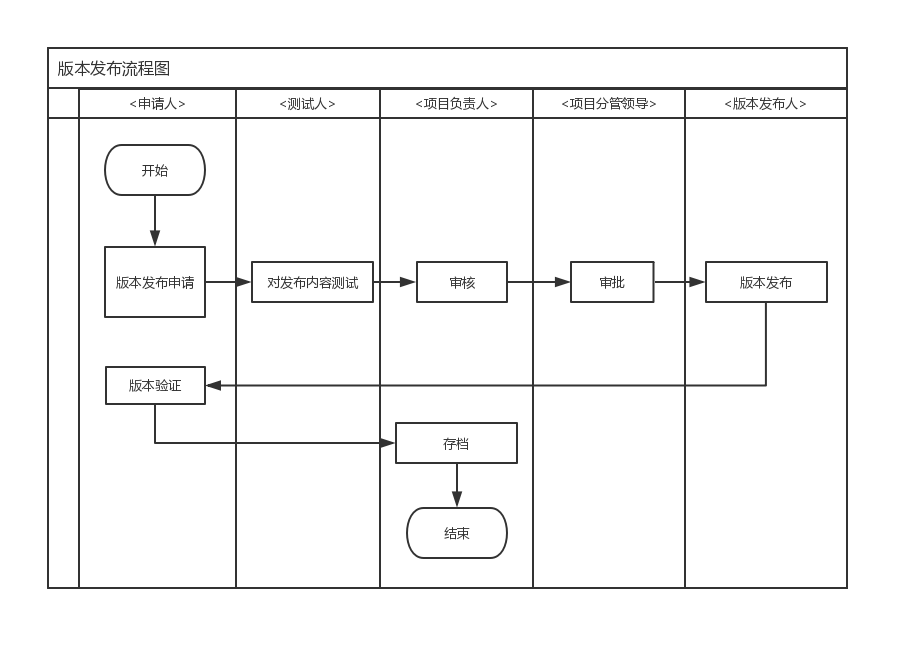
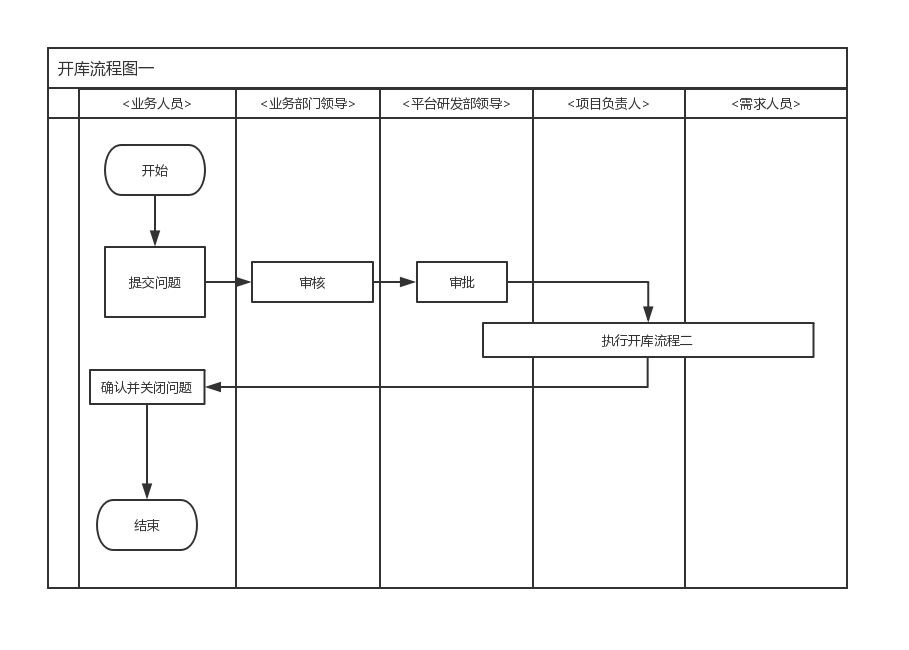
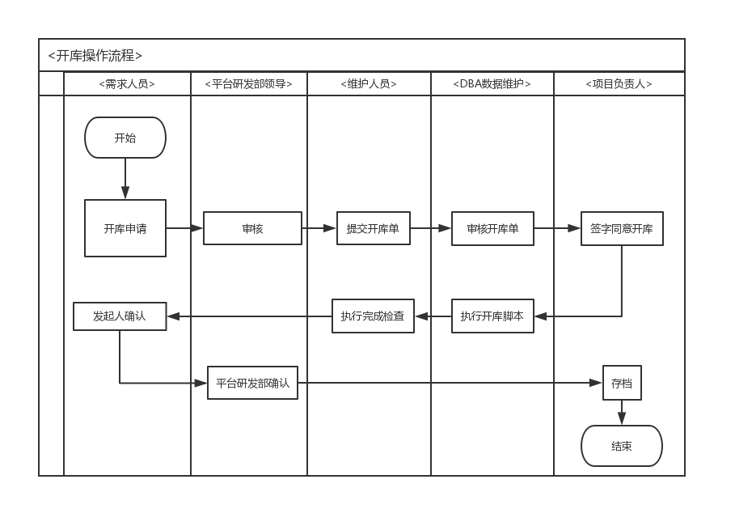
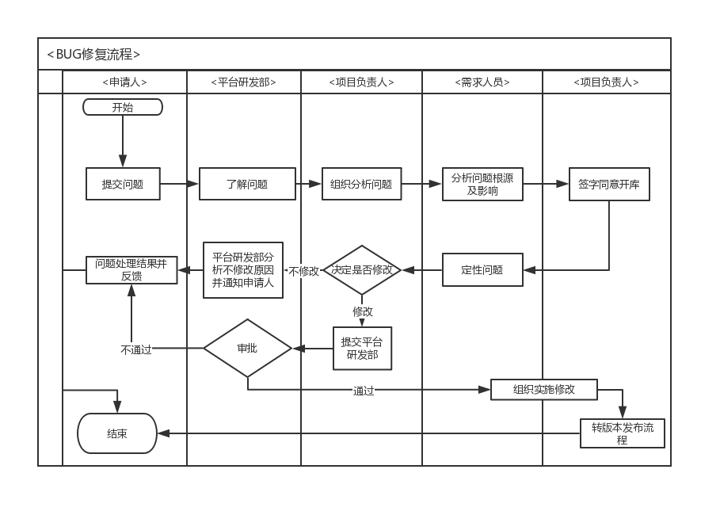

# 总则
## 目的方针

	 1. 提供专业化、标准化服务，保障关键业务高效、稳定运行。
	 2. 严格贯彻集团运维工作流程和人员行为规范，确保服务质量。

## 适用范围
	应用软件系统开发、维护人员，业务经办人员。
## 术语解释


# 运维守则

# 服务内容

- 版本发布
- 开库操作
- bug修复
- 性能优化
- 需求迭代
- 应用巡检

# 服务规范
## 版本发布流程

	开发人员提出申请（包含版本发布原因及解决的问题）
	->项目负责人指派相关人员进行测试
	->项目负责人签字同意发布->相关领导签字同意发布
	->版本发布人员进行版本发布
	->申请人员进行验证、确定

 ### 适用范围
	 软件开发人员修改程序后，需要发布新版本。
 ### 流程图
 
 ### 流程说明


 ### 时间要求
	
``` 
   每周版本发布2次，周一、周四上午下班前提交申请并固化发布版本，晚上发布，遇节假日顺延至下一工作日。
```
## 开库操作流程
### 适用范围

 - 历史数据错误。
 - 业务经办错误且通过程序回退无法解决。
 - 用户在使用过程中发现非法数据且通过前台程序无法修改。

### 流程图
```
	业务部门相关流程
```


```
     应用运维相关流程
```

### 流程说明
```
开库操作流程一
```


```
开库操作流程二
```


## bug修复流程
```
	依据gite项目管理工具 ，做好BUG修复记录（每月第一周提交上月bug清单）
```
### 适用范围
```
	任何人发现bug均可提交问题。
```
### 流程图

### 流程说明


# 日常运维工作
## 每日巡检
```
每日巡检关键项内容如下：
```


## 数据备份及清理
```
	1.数据备份脚本。
	2.数据回滚脚本。
	3.陈久数据清理脚本。
	4.编写定时任务执行脚本。
```
# 表单附件

[上线清单-项目信息表](./attachments/1584714872148.table.html)

[上线清单-项目配置信息表](./attachments/1584715013041.table.html)

[上线清单-数据库信息表](./attachments/1584715183445.table.html)

[版本发布记录表](./attachments/1584716254504.table.html)