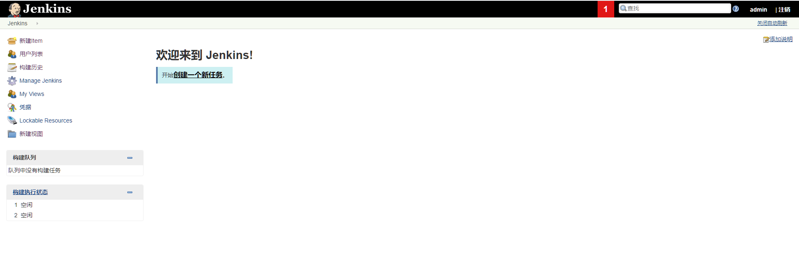
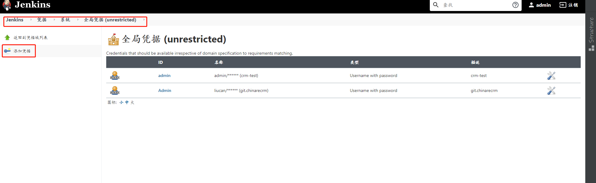

### 环境及版本
	1.Centos v7.x 及以上
	2.Jenkins v2.555 及以上
	3.git v1.8.3.1 及以上
	4.gitea v1.13.0 及以上
	5.open-jdk v1.8 及以上
	6.node v10.15.0 及以上
	7.maven v3.5.2 及以上
	
### 安装

#### 安装Jenkins
- 安装相关源
  
``` sh?linenums
wget -O /etc/yum.repos.d/jenkins.repo https://pkg.jenkins.io/redhat-stable/jenkins.repo
rpm --import https://pkg.jenkins.io/redhat-stable/jenkins.io.key
yum install java  -y //这里我安装的java-1.8.0
yum install jenkins -y 
###############################
# jenkins 相关目录
###############################
[root@jenkins ~]# rpm -ql jenkins
/etc/init.d/jenkins
/etc/logrotate.d/jenkins
/etc/sysconfig/jenkins
/usr/lib/jenkins
/usr/lib/jenkins/jenkins.war
/usr/sbin/rcjenkins
/var/cache/jenkins
/var/lib/jenkins
/var/log/jenkins
```

- 启动服务
  ``` sh?|linenums
  systemctl start jenkins
  ```
- 使用浏览器打开安装页面 (http://ip:8080)
  
  初始化操作，将/var/lib/jenkins/secrets/initialAdminPassword文件里面保存的密码，输入进去。
  
  安装插件，这里可以选择推荐插件，也可以选择自定选择插件，效果如下图。
  
  
  创建用户，我们选择不去创建，使用默认的admin用户，和初始密码。就行。所以我们选择continue as admin。
  
- 登录Jenkins
  在浏览器中输入：(http://ip:8080),填写admin用户和初始化密码就登陆进去了。
  jenkins 主界面
  
- 安装插件（git、node、maven等）
  点进去之后，点击Jenkins右侧GlobalToolConfiguration后，进去该页面进行勾选、安装。
 
 
 #### 安装open-jdk (略)
 
 #### 安装gitea
 - 安装MySQL 数据库
   安装完成后，安装MySQL，至少5.5.3版本。
 - 安装Git
   

``` sh?linenums
yum -y install git
```

 - 安装Gitea
	   最新版本下载地址：https://dl.gitea.io/gitea。

``` sh?linenums
cd /usr/local/gitea

wget -O gitea https://dl.gitea.io/gitea/1.6.0/gitea-1.6.0-linux-amd64

chmod +x gitea

./gitea web
```
	接下来打开http://ip:3000即可。
 - 域名访问
   如果想用域名访问，可以用Nginx反代。反代配置为：
   

``` sh?linenums
#在配置文件里添加

location / {

proxy_pass http://localhost:3000

proxy_redirect off;

proxy_set_header X-Real-IP $remote_addr;

proxy_set_header X-Forwarded-For $proxy_add_x_forwarded_for;

}
```

 - 使用服务来启动
   新建一个rclone.service文件：
``` sh?linenums
vi /usr/lib/systemd/system/gitea.service
#写入
[Unit]
Description=gitea

[Service]
User=root
ExecStart=/usr/local/gitea/gitea
Restart=on-abort

[Install]
WantedBy=multi-user.target
# 重载daemon，让新的服务文件生效：
systemctl daemon-reload
用systemctl来启动gitea：
systemctl start gitea
设置开机启动：
systemctl enable gitea
停止、查看状态可以用：
systemctl stop gitea

systemctl status gitea
#接下来就是打开网址去初始化gitea配置。
```
#### 项目部署、构建
- 机器互信（Jenkins服务器与目的服务器-部署项目的服务器进行互信）
  1.在客户端生成公钥私钥对
  命令：ssh-keygen -t rsa
  默认回车，系统在/root/.ssh下生成id_rsa、id_rsa.pub
  查看系统生成的公钥私钥对
  命令：ls /root/.ssh
  可以看到如下的文件
  
  3.将生成的公钥私钥对id_rsa.pub发送到其他的服务器上。
  命令：ssh-copy-id -i /root/.ssh/id_rsa.pub 192.168.137.129 
  注：命令可简单记忆为 ssh-copy-id -i 公钥私钥对文件 服务器ip地址
  
  可以看到成功将公钥私钥对发送到了其他服务器，更多服务器一样操作即可。
  4.现在可以测试连接其他服务器是否不需要密码登录，可以看到确实成功了。
  登录其他服务器命令：ssh 192.168.137.130     #ssh serverid
  
- 添加Jenkins全局凭证（该凭据用于获取对gitea服务器的相关操作：代码拉取等。所以应配置gitea服务的用户名、密码信息）
  登录Jenkins，点击左侧按钮Manage Jenkins 后选择Manage Credentials
  
  选择全局凭据，进行添加、配置
  
  
- 配置多分支pipeline项目
  1.新建item（项目名+类型）
  
  2.配置信息
  名称、描述、分支源及触发信息
  
  
  
- 配置webhook
  
  配置url（http://jenkins.test.emasapple.cn/gitea-webhook/post） 、Http方法(post)、触发条件(仓库、合并)、分支过滤（按需配置）
- 